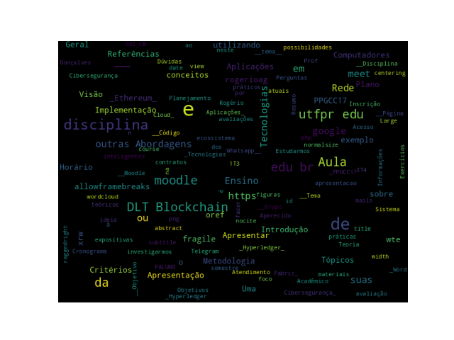

# Introdução

## Objetivos

* Uma visão geral sobre a disciplina.
* Apresentar o __tema__ da disciplina neste semestre.
* Apresentar os critérios de avaliação.
* Plano de Ensino e Planejamento das Aulas.

# Disciplina

## Disciplina {.fragile .allowframebreaks}

* __Disciplina:__ _PPGCC17 - Tópicos em Redes de Computadores e Cibersegurança_

* __Tema:__ _Tecnologias DLT: Blockchain, outras Abordagens e suas Aplicações_

* __Objetivo:__ Estudarmos conceitos teóricos e práticos sobre Tecnologias DLT, Blockchain com foco em Implementação utilizando _Ethereum_ ou _Hyperledger_. A ideia é fazer uma introdução ao ecossistema DLT/Blockchain, e investigarmos as possibilidades atuais de Implementação, por exemplo de contratos inteligentes na rede _Ethereum_ ou utilizando _Hyperledger Fabric_.

# Plano de Ensino

## Planejamento das Aulas {.fragile .allowframebreaks}

<!---->

[columns]

[column=0.5]

\includegraphics[page = 1, width=1.0\linewidth]{figuras/planejamento-de-aulas.pdf}

[column=0.5]

\includegraphics[page = 2, width=1.0\linewidth]{figuras/planejamento-de-aulas.pdf}

[/columns]

[framebreak]

[columns]

[column=0.5]

\includegraphics[page = 3, width=1.0\linewidth]{figuras/planejamento-de-aulas.pdf}

[column=0.5]

<!--\includegraphics[page = 4, width=1.0\linewidth]{figuras/planejamento-de-aulas.pdf}-->

[/columns]

# Horário

# Moodle

## Acesso à disciplina

* __Moodle:__ Informações, materiais e avaliações [http://moodle.utfpr.edu.br](http://moodle.utfpr.edu.br)
* __Página da disciplina no Moodle:__ [PPGCC17 - Tópicos em Redes de Computadores e Cibersegurança (002_CM)](https://moodle.utfpr.edu.br/course/view.php?id=22942)
* __Código de Inscrição:__ `PPGCC17-002`
* Google Meet: [https://meet.google.com/wte-oref-xrw](https://meet.google.com/wte-oref-xrw)
* __Grupo de Whatsapp__ ou Telegram.
* E-mails dos Sistema Acadêmico.

# Metodologia

## Metodologia de Ensino

* Aulas expositivas e práticas.
* Teoria (Conceitos e Exemplos) + Exercícios.

## Horário e Atendimento

* PALUNO: 3T1 e 3T2
* Podemos marcar horários extra, presencial ou remoto.

# Tecnologias DLT: Blockchain, outras Abordagens e suas Aplicações

## Tecnologias DLT: Blockchain, outras Abordagens e suas Aplicações

* DLT: _Distributed Ledgers Tecnology_
* _Blockchain_

## _Word Cloud_ 

{width=100%}

# Dúvidas

## Perguntas?

\Large
\centering

**Prof. Rogério Aparecido Gonçalves**
	
[rogerioag@utfpr.edu.br](rogerioag@utfpr.edu.br)

\raggedright

# Referências

## Referências{.fragile .allowframebreaks}
\normalsize
