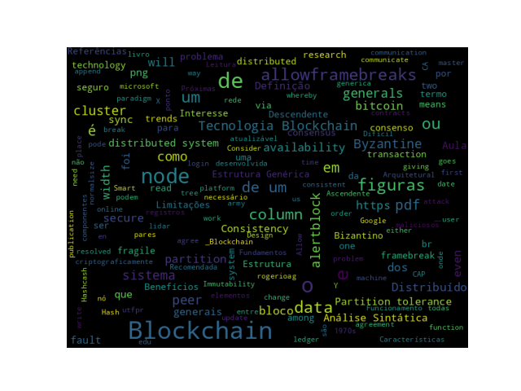

# Introdução

## Objetivos

* Descrever os fundamentos de Sistemas Distribuídos
* Definição da Tecnologia Blockchain
* Entender como a Tecnologia Blockchain foi desenvolvida
* Detalhar os elementos de uma Blockchain
* Identificar os benefícios e limitações da Tecnologia Blockchain.

# Computação Distribuída

## Computação Distribuída {.allowframebreaks .fragile}

* Um Sistema Distribuído é um paradigma da Computação onde dois ou mais nós trabalham em conjunto e maneira coordenada para alcançar um objetivo comum.
* Um Sistema Distribuído é modelado de maneira que os usuários finais veem ele como uma única plataforma lógica.
* Exemplos: _Clusters_ e _clouds_.

## Problema dos Generais Bizantinos {.allowframebreaks .fragile}

{ width=85%}

* Atacar ou recuar? O __Consenso__ é necessário para vencer.

[framebreak]

* Em $1982$, um experimento foi proposto por Lamport e outros em um artigo [@lamport1982the], __The Byzantine Generals Problem__.
<!--[https:/​/​www.​microsoft.​com/​en-​us/​research/​publication/​byzantine-generals-​problem/](https:/​/​www.​microsoft.​com/​en-​us/​research/​publication/​byzantine-generals-​problem/)-->

<!-- whereby a group of army generals who lead different parts of the Byzantine army are planning to attack or retreat from a city.
The only way of communicating among them is via a messenger. They need to agree to strike at the same time in order to win. The issue is that one or more generals might be traitors who could send a misleading message. Therefore, there is a need for a viable mechanism that allows for agreement among the generals, even in the presence of the treacherous ones, so that the attack can still take place at the same time. -->

* Como analogia a sistemas distribuídos, os generais podem ser considerado os __nós__, os traidores como __nós bizantinos__ (maliciosos), e o mensageiro pode ser pensado como um canal de comunicação entre os generais.

* O problema foi resolvido em $1999$ por Castro e Liskov, apresentaram o algoritmo _Practical Byzantine Fault Tolerance (PBFT)_ [@10.5555/296806.296824], onde o consenso é alcançado depois de um certo número de mensagens serem recebidas contendo o mesmo conteúdo assinado.

## Design de Sistemas Distribuídos {.allowframebreaks .fragile}

{ width=70% }

## Teorema CAP {.allowframebreaks .fragile}

* Ele afirma que um Sistema Distribuído pode não ter todas as três propriedades desejadas simultaneamente. Sendo elas:

   * Consistency
   * Availability
   * Partition tolerance

[framebreak]

:::: {.columns}

::: {.column width="50%"}
{width=75%}
:::

::: {.column width="50%"}
\footnotesize
__CA__ - os dados estão consistentes em todos os nós, e todos os nós estão _online_.

__CP__ - os dados estão consistentes em todos os nós, e mantém _partition tolerance_ (prevenindo dessincronizações), torna-se indisponível quando um nó fica inativo.

__AP__ - os nós permanecem _online_ mesmo que não possam se comunicar entre si. Ressincronizarão os dados assim que a partição for resolvida, mas não há garantia de que todos os nós terão os mesmos dados (durante ou após a partição).
\normalsize
:::

::::

<!--
Consistency means that data is the same across the cluster, so you can read or write from/to any node and get the same data.

Availability means the ability to access the cluster even if a node in the cluster goes down.

Partition tolerance means that the cluster continues to function even if there is a "partition" (communication break) between two nodes (both nodes are up, but can't communicate).

In order to get both availability and partition tolerance, you have to give up consistency. Consider if you have two nodes, X and Y, in a master-master setup. Now, there is a break between network communication between X and Y, so they can't sync updates. At this point you can either:

A) Allow the nodes to get out of sync (giving up consistency), or

B) Consider the cluster to be "down" (giving up availability)

All the combinations available are:

    CA - data is consistent between all nodes - as long as all nodes are online - and you can read/write from any node and be sure that the data is the same, but if you ever develop a partition between nodes, the data will be out of sync (and won't re-sync once the partition is resolved).
    CP - data is consistent between all nodes, and maintains partition tolerance (preventing data desync) by becoming unavailable when a node goes down.
    AP - nodes remain online even if they can't communicate with each other and will resync data once the partition is resolved, but you aren't guaranteed that all nodes will have the same data (either during or after the partition)

You should note that CA systems don't practically exist (even if some systems claim to be so).
-->

## Tipos de falhas em Sistemas Distribuídos

* _Fail-stop faults (crash faults)_
   * Onde os componentes falham ou param de operar
   * Mais simples de lidar

* _Byzantine faults_
   * As quais os componentes são potencialmente não confiáveis ou maliciosos
   * Difícil de lidar

# Conceitos e Fundamentos de Blockchain

## Definição de Blockchain {.allowframebreaks}

[alertblock]{Definição de Layman}

_Blockchain is an ever-growing, secure, shared recordkeeping system in which each user of the data holds a copy of the records, which can only be updated if all parties involved in a transaction agree to update._

<!-- 
Blockchain é um sistema de manutenção de registros compartilhado, seguro e em constante crescimento, no qual cada usuário dos dados detém uma cópia dos registros, que só podem ser atualizados se todas as partes envolvidas em uma transação concordarem em atualizar.
-->

[/alertblock]

[alertblock]{Definição Técnica}

_Blockchain is a peer-to-peer distributed ledger that is cryptographically-secure, append-only, immutable (extremely hard to change), and updateable only via consensus or agreement among peers._

<!-- 
Blockchain é um livro-razão distribuído ponto a ponto que é criptograficamente seguro, somente anexo, imutável (extremamente difícil de alterar) e atualizável apenas por consenso ou acordo entre os pares.
-->

[/alertblock]

[framebreak]

* _Peer-to-peer_
* _Distributed Ledger_
* _Criptograficamente Seguro_
* _Append only (Permitido anexar novos blocos)_
* _Atualizável via consenso dos pares._

## Como a Tecnologia Blockchain foi desenvolvida {.allowframebreaks}

[columns]

[column=0.5]

__1950s__ – Hash functions

__1970s__ – Merkle trees - hashes in a tree structure

__1970s__ continued – Research in distributed systems, consensus, state machine replication

__1980s__ – Hash chains for secure logins

__1990s__ – _e-Cash for e-payments_

[column=0.5]

__1991__ – Secure timestamping of digital documents.

__1992__ – Hashcash idea to combat junk emails 

__1994__ – S/KEY application for Unix login. 

__1997/2002__ – _Hashcash_

__2008/2009__ – Bitcoin (the first blockchain)

[/columns]

[framebreak]

## Interesse no termo "blockchain"

* Interesse ao longo do tempo ([Fonte: Google Trends](https://trends.google.com/trends/explore?date=2008-01-01%202022-08-16&q=blockchain)):

## Visão Arquitetural do Blockchain

## Estrutura Genérica de um Blockchain {.allowframebreaks}

{width=100%}

## Elementos Genéricos de um Blockchain {.allowframebreaks}

* Endereços
* Contas
* Transações
* Blocos
* Redes _Peer-to-peer_
* Scripting ou Linguagens de Programação
* Virtual machines
* Máquinas de Estado
* Nós (nodes)
* Contratos Inteligentes _(Smart contracts)_

## Como um Blockchain funciona {.allowframebreaks}

## Estrutura Genérica de um bloco {.allowframebreaks}

{width=60%}

## Benefícios e Limitações de um Blockchain

[columns]

[column=0.5]

__Benefícios__

Descentralização

Transparência

Confiança

Imutabilidade

Alta disponibilidade

Altamente Seguro

Simplificação de paradigmas atuais

Transações rápidas

Cost saving

[column=0.5]

__Limitações__ 

Escalabilidade

Adaptabilidade

Regulação

Tecnologia Relativamente Imatura

Privacidade

[/columns]

## Características Principais {.allowframebreaks}

* Consenso Distribuído

* Verificação de Transações

* Plataforma para _smart contracts_

* Transferência de valores entre pares

* Generação de criptomoedas

* Provedor de Segurança

* Imutabilidade

* Unicidade ou singularidade (Uniqueness)

## Atividade

[alertblock]{Leitura}

_Bitcoin paper_: [https://bitcoin.org/bitcoin.pdf](https://bitcoin.org/bitcoin.pdf)

[/alertblock]

## _Word Cloud_ 

{width=100%}

## Leitura Recomendada
\normalsize

[alertblock]{Leitura Recomendada}

__Capítulo 1: Blockchain 101__

**Livro**: [IMRAN BASHIR. Mastering Blockchain : Distributed Ledger Technology, Decentralization, and Smart Contracts Explained, 2nd Edition.](https://search.ebscohost.com/login.aspx?direct=true&db=e000xww&AN=1789486&lang=pt-br&site=eds-live&scope=site&ebv=EB&ppid=pp_8)

[/alertblock]

# Próximas Aulas

## Próximas Aulas: Tecnologia Blockchain

* Arquitetura, Benefícios e Limitações.

# Referências

## Referências{.fragile .allowframebreaks}
\normalsize
