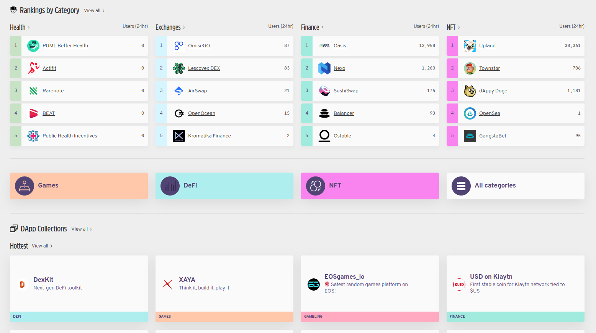
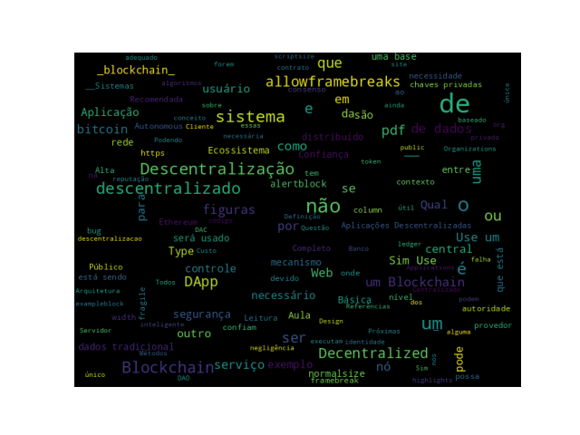

# Introdução

## Objetivos

* Definição do conceito de Descentralização no contexto de _Blockchain_.
* Aplicações Descentralizadas (DApps).

# Descentralização

## Definição de Descentralização {.allowframebreaks .fragile}

* __Sistemas Centralizados:__ São os convencionais sistemas Cliente-Servidor.
* __Sistemas Distribuídos:__ Sistemas com dados e computação espalhados/distribuídos por múltiplos nós de uma rede. Mas ainda com uma autoridade central. Orquestração de serviços, por exemplo. Banco de dados em um nó, e serviços de aplicações em outros nós.
* __Sistemas Descentralizados:__ São sistemas onde os nós não são dependentes de um nó principal _(master)_, o controle é distribuído entre os diversos nós. A inovação que tem surgido no paradigma descentralizado com aplicações descentralizadas é o __consenso descentralizado__, o que possibilita aos usuários concordarem com alguma coisa via algoritmos de consenso sem a necessidade de uma terceira parte central, confiável, intermediária provedora de serviço.

## Diferenças entre distribuído e descentralizados {.allowframebreaks}

[framebreak]

\scriptsize

|  Característica |  Centralizado   |  Descentralizado   |
|  --------    |  -----------    |  -----------       |  
|  Propriedade    |  Provedor de Serviços |  Todos os usuários |
|  Arquitetura    |  Cliente/Servidor  |  Distribuída, diferentes topologias  |
|  Segurança      |  Básica   |  Mais seguro |
|  Alta Disponibilidade | Não |  Sim   |
|  Tolerância a falhas  |  Básica, único ponto de falha  | Altamente tolerante, serviço é replicado   |
| Resistência a Conluios   |  Básica, está sobre o controle de um grupo ou de um único indivíduo   |  Alta, algoritmos de consenso garantem a defesa contra adversários  |
| Arquitetura da Aplicação |  Aplicação Única   |  Aplicação replicada em todos os nós da rede  |
|  Confiança   |  Consumidores tem que confiar no provedor do serviço   |  Confiança mútua não é necessária |
| Custo para o consumidor  |  Alto  |  Baixo |

\normalsize

## Métodos de Descentralização {.allowframebreaks}

* Dois métodos podem ser utilizados para a descentralização:
   * __Desintermediação:__ Sistema Financeiro x Bitcoin.
   * __Competição:__ Sistema que cada contrato inteligente possa escolher um provedor de dados entre vários, baseado na reputação, _score_, _reviews_ e qualidade do serviço.

* Entre os benefícios da descentralização estão: _transparência, eficiência, econonia de custos, desenvolvimento de ecossistemas confiáveis e em alguns casos privacidade e anonimato._
* Desafios: _segurança, bugs, erros humanos._

[exampleblock]{Exemplo}

Por exemplo, em um sistema descentralizado como Bitcoin ou Ethereum, onde a segurança é normalmente fornecida por chaves privadas, como podemos garantir que um ativo ou token associado a essas chaves privadas não possa ser inutilizado devido a negligência ou bugs no código?
E se as chaves privadas forem perdidas devido à negligência do usuário? E se, devido a um bug no código do contrato inteligente, o aplicativo descentralizado se tornar vulnerável a ataques?

[/exampleblock]

## É necessário utilizar um Blockchain? {.allowframebreaks .fragile}

\scriptsize

|  Questão |  Sim/Não   |  Solução Recomendada   |
|  -----------    |  ---    |  -----------       |  
|  __É necessário altas taxas de transferência de dados?__   | Sim | Use um banco de dados tradicional |
|  |  Não   | Uma base de dados central pode ainda ser útil se outros requisitos forem atendidos. Por exemplo, se os usuários confiam um nos outros, então talvez não haja necessidade de um blockchain. Entretanto, se eles não confiam ou a confiança não possa ser estabelecida por alguma razão, blockchain pode ser útil. |
|  __Atualizações são controladas centralmente?__ |  Sim   |  Use uma base de dados tradicional   |
|  |  Não   |  Pode ser investigado como uma blockchain pública ou privada pode ajudar.   |
| Usuários confiam um nos outros?   |  Sim   |  Use uma base de dados tradicional.  |
|  |  Não   |  Use um Blockchain Público  |
| Usuários são anônimos | Sim |  Use um Blockchain Público  |
|  |  Não   |  Use um Blockchain Privada  |
|  O consenso deve ser mantido dentro de um consórcio? |  Sim   | Use um Blockchain Privado. |
|  |  Não   | Use um Blockchain Público |
|  A imutabilidade estrita dos dados é necessária? |  Sim   | Use um Blockchain  |
|  | Não |  Use uma base de dados tradicional central |

\normalsize

* __Responder a todas essas questões ajuda na decisão sobre a necessidade de usar ou não um _Blockchain_.__

## Como descentralizar? {.allowframebreaks}

* O que está sendo descentralizado? 
* Que nível de descentralização é necessário? 
* Qual Blockchain será usado? 
* Qual mecanismo de segurança será usado?

[framebreak]

* **O que está sendo descentralizado?**
  * Identificação do sistema que está sendo descentralizado. Podendo ser qualquer sistema, tal como um sistema de identidade ou um sistema de negociação.
* **Que nível de descentralização é necessário?**
  * Qual o nível de descentralização necessário, pode ser uma desintermediação completa ou parcial.
* **Qual Blockchain será usado?** 
  * Determinação qual _blockchain_ é adequado para uma aplicação particular. Podendo ser um _blockchain_ do `Bitcoin`, do `Ethereum`, ou algum outro _blockchain_ que é considerado adequado para a aplicação específica.

[framebreak]

* **Qual mecanismo de segurança será usado?**
  * Questão fundamental, como a segurança de um sistema descentralizado será garantida. Um exemplo, um mecanismo baseado na atomicidade, onde as transações executam por completo ou não executam, fortalecem a integridade do sistema. Outros mecanismos podem considerar reputação, que permite variar os degraus de confiança em um sistema.

## Blockchain e Ecossistema Completo de Descentralização {.allowframebreaks}

Este modelo ilustra como um Ecossistema Completo Descentralizado poderia trabalhar:

:::: {.columns}

::: {.column width="50%"}
* Comunicação
* Armazenamento
* Poder Computacional
* Identidade e saúde
:::

::: {.column width="50%"}

:::

::::

## Aplicações Descentralizadas (DApps) {.allowframebreaks}

Aplicações Descentralizadas (DApps) pode ser categorizadas em:
 
* **Tipo 1** (Executa em seu próprio _blockchain_ dedicado). Contratos inteligentes padrão baseados em `DApps` executando sobre o *Ethereum*. Se necessário fazem uso de um *token* nativo, por exemplo, `ETH` no *blockchain* do *Ethereum*.
  * **Exemplo:** [https://ethlance.com](https://ethlance.com) é uma DApp que faz uso do `ETH` para fornecer um _job market_.
  
* **Tipo 2** (Usa um _blockchain_ público estabelecido existente). Faz uso do *blockchain* Tipo 1 e tem protocolos e *tokens* personalizados, por exemplo, `DApps` de tokenização baseados em contratos inteligentes executando no *blockchain* *Ethereum*.
  * **Exemplos:** [`DAI`](https://makerdao.com/en/) e [Golem (GNT)](https://golem.network).

[framebreak]

* **Tipo 3** (Usa protocolos das `DApps` do Tipo 2). 
  * **Exemplo:** a [*SAFE Network*](https://safenetwork.tech) utiliza o protocolo de rede `OMNI`, a [rede `OMNI`](https://www.omnilayer.org) é uma `DApps` que é uma camada de *software* construida sobre o _blockchain_, portanto do Tipo 2.
  
[framebreak]

Requisitos de uma `DApp`:

* Completamente _Open Source_.
* Operações devem ser criptograficamente segura.
* Armazenado em um livro razão público.
* _Tokens_ gerados sob um mecanismo de consenso.

## Design de uma DApp {.allowframebreaks}

## DO, DAO, DAC, DAS, DApp

* Propriedades de algumas tipos de entidades descentralizadas.
* Organizações Descentralizadas (DOs), Organizações Autônomas Descentralizadas (DAOs), Corporações Autônomas Descentralizadas (DACs), Sociedades Autônomas Descentralizadas (DASes) e DApps.

## Exemplos de DApps {.allowframebreaks}

* `KYC-Chain`: Aplicação que fornece facilidades para gerenciar dados `Know Your Customer (KYC)` com segurança e baseada em contratos inteligentes.
* `OpenBazaar`: É uma rede _peer-to-peer_ descentralizada que possibilita atividades comerciais diretamente entre vendedores e compradores, sem uma parte central. Para mais informações acesse: [`OpenBazzar`](https://openbazaar.org)
* `Lazooz`: É um equivalente ao `Uber`, descentralizado. Mais informações estão disponíveis em [http://lazooz.org](http://lazooz.org).
  
**Muitas outras `DApps` tem sido desenvolvidas sobre o *blockchain*  do `Ethereum` e são listas em [http://dapps.ethercasts.com](http://dapps.ethercasts.com).**

## Plataformas para Descentralização {.allowframebreaks}

* Existem muitas plataformas disponíveis para descentralização.
* Além disso, alguma rede de *blockchain*, tal como *Bitcoin*, *Ethereum*, *Hyperledger Fabric* ou *Quorum*, pode ser utilizada para fornecer serviços de descentralização. 
* Muitas organizações no mundo tem introduzido plataformas que prometem tornar o desenvolvimento de aplicações distribuídas fácil, acessível e seguro.

[framebreak]

* Algumas dessas plataformas:

[alertblock]{`Ethereum`}

Ethereum tops the list as being the first blockchain to introduce a Turing-complete language and the concept of a virtual machine. This is in stark contrast to the limited scripting language in Bitcoin and many other cryptocurrencies. With the availability of its Turing-complete language, Solidity, endless possibilities have opened for the development of decentralized applications. This blockchain was first proposed in 2013 by Vitalik Buterin, and it provides a public blockchain to develop smart contracts and decentralized applications. Currency tokens on Ethereum are called ethers.

[/alertblock]

[block]{`MaidSafe`}

This is a project for the decentralized Internet introduced in 2006. This is not a blockchain, but a decentralized and autonomous network. MaidSafe provides a SAFE (Secure Access for Everyone) network that is made up of unused computing resources, such as storage, processing power, and the data connections of its users. The files on the network are divided into small chunks of data, which are encrypted and distributed randomly throughout the network. This data can only be retrieved by its respective owner. One key innovation of MaidSafe is that duplicate files are automatically rejected on the network, which helps reduce the need for additional computing resources needed to manage the load. It uses Safecoin as a token to incentivize its contributors. More information on MaidSafe is available at https://maidsafe.net. 

[/block]

[exampleblock]{`Lisk`}
  
Lisk is a blockchain application development and cryptocurrency platform. It allows developers to use JavaScript to build decentralized applications and host them in their respective sidechains. Lisk uses the Delegated Proof of Stake (DPOS) mechanism for consensus, whereby 101 nodes can be elected to secure the network and propose blocks. It uses the Node.js and JavaScript backend, while the frontend allows the use of standard technologies, such as CSS3, HTML5, and JavaScript. Lisk uses LSK coin as a currency on the blockchain. Another derivative of Lisk is Rise, which is a Lisk-based DApp and digital currency platform. It offers greater focus on the security of the system.

[/exampleblock]

[alertblock]{`EOS`}
  
This is a blockchain protocol launched in January 2018, with its own cryptocurrency called EOS. EOS raised an incredible 4 billion USD in 2018 though its Initial Coin Offering (ICO). They key purpose behind EOS is, as stated by its founders, to build a decentralized operating system. Its throughput is significantly higher (approx. 3,996 transactions per second (TPS)) than other common blockchain platforms, such as Bitcoin (approx. 7 TPS) and Ethereum (approx. 15 TPS).

[/alertblock]

## Tendências {.allowframebreaks}

* Web Descentralizada
  * Web 1: A _World Wide Web_ original.
  * Web 2: the era when more service-oriented and web-hosted applications started to emerge 
  * Web 3: A visão da internet ou web descentralizada.
  
* Identidade Descentralizada
* Finanças Descentralidas (DeFi)

## _Word Cloud_ 

{width=100%}

## Leitura Recomendada
\normalsize

[alertblock]{Leitura Recomendada}

__Capítulo 2: Decentralization__

**Livro**: [IMRAN BASHIR. Mastering Blockchain : Distributed Ledger Technology, Decentralization, and Smart Contracts Explained, 2nd Edition.](https://search.ebscohost.com/login.aspx?direct=true&db=e000xww&AN=1789486&lang=pt-br&site=eds-live&scope=site&ebv=EB&ppid=pp_42)

[/alertblock]

# Próximas Aulas

## Próximas Aulas: Tecnologia Blockchain

* Criptografia

# Referências

## Referências{.fragile .allowframebreaks}
\normalsize
