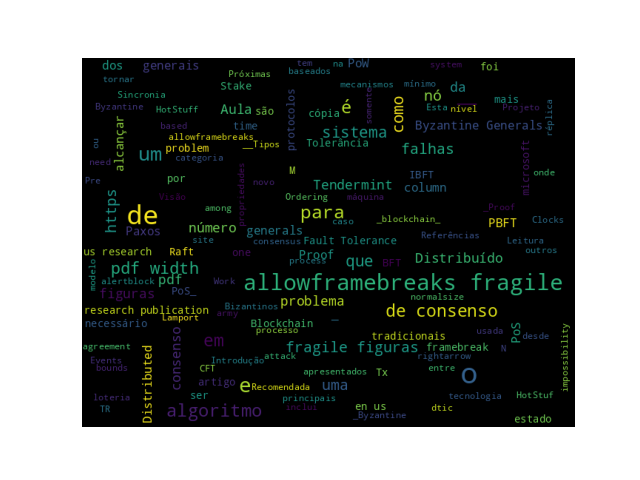

# Introdução

## Objetivos

* Apresentação dos principais Algoritmos de Consenso.

# O Problema de Consenso {.allowframebreaks}

* É um problema que tem sido estudado estensivamente na área de Sistemas Distribuídos desde o final de 1970.
* O que resultou na evolução rápida da tecnologia _blockchain_ e em mais pesquisas em novos métodos de consenso.
* Ocorrendo uma conversão dos mecanismos de consenso distribuídos tradicionais (clássicos) em suas variantes para _blockchain_.
  
## O Problema dos Generais Bizantinos {.allowframebreaks .fragile}

O famoso _Byzantine generals problem_ foi formulado por _Lamport et al._ no artigo: `Lamport, L., Shostak, R. and Pease, M., 1982. The Byzantine Generals Problem. ACM Transactions on Programming Languages and Systems, 4(3), pp.382-401.`

{ width=85%}

* Atacar ou recuar? O __Consenso__ é necessário para vencer.

[framebreak]

* Em $1982$, um experimento foi proposto por Lamport e outros em um artigo [@lamport1982the], __The Byzantine Generals Problem__.
<!--[https:/​/​www.​microsoft.​com/​en-​us/​research/​publication/​byzantine-generals-​problem/](https:/​/​www.​microsoft.​com/​en-​us/​research/​publication/​byzantine-generals-​problem/)-->

<!-- whereby a group of army generals who lead different parts of the Byzantine army are planning to attack or retreat from a city.
The only way of communicating among them is via a messenger. They need to agree to strike at the same time in order to win. The issue is that one or more generals might be traitors who could send a misleading message. Therefore, there is a need for a viable mechanism that allows for agreement among the generals, even in the presence of the treacherous ones, so that the attack can still take place at the same time. -->

* Como analogia a sistemas distribuídos, os generais podem ser considerado os __nós__, os traidores como __nós bizantinos__ (maliciosos), e o mensageiro pode ser pensado como um canal de comunicação entre os generais.

* O problema foi resolvido em $1999$ por _Castro e Liskov_, apresentaram o algoritmo _Practical Byzantine Fault Tolerance (PBFT)_ [@10.5555/296806.296824], onde o consenso é alcançado depois de um certo número de mensagens serem recebidas contendo o mesmo conteúdo assinado.

## Tolerânica a Falhas {.allowframebreaks .fragile}

__Tipos de Tolerância a falhas:__

  * _Crash Fault Tolerance (CFT)_
  * _Byzantine Fault Tolerance (BFT)_

__Como alcançar um nível de Tolerância a Falhas:__

  * __Replicação:__ Abordagem padrão para tornar um sistema tolerante a falhas. Cópias dos dados são sincronizadas entre todos os nós da rede.
    * Ativa: Cada réplica torna-se uma cópia da máquina de estados original.
    * Passiva: Existe somente uma cópia da máquina de estados no sistema, mantido como nó primário, e os outros nós ou réplicas somente mantem o estado.
  
  * __State Machine Replication (SMR):__ é uma técnica que é usada para a replicação determinística de serviços para alcançar os requisitos de tolerância a falhas em um Sistema Distribuído.
    * __Artigo:__ [_Time, Clocks and the Ordering of Events in a Distributed System_](https://www.microsoft.com/en-us/research/publication/time-clocks-ordering-events-distributed-system/)[@lamport1978time]

[framebreak]

__Limitações e Resultados:__

  * FLP impossibility [@10.1145/3149.214121]: [Fischer, M.J., Lynch, N.A. and Paterson, M.S., 1982. Impossibility of distributed consensus with one faulty process (No. MIT/LCS/TR-282)](https://apps.dtic.mil/dtic/tr/fulltext/u2/a132503.pdf)
  * Lower bounds
  * Upper bounds

## Limitações {.allowframebreaks .fragile}

* Onde $F$ = número de falhas:
   * No caso do $CFT$, no mínimo $2F + 1$ número de nós é necessário para alcançar o consenso.
   * No caso do $BFT$, no mínimo $3F + 1$ número de nós é necessário para alcançar o consenso.

## Análise e Projeto {.allowframebreaks .fragile}

Projetar e analisar mecanismos de consenso requer um modelo que possa ser usado para estudar e explorar as propriedades do sistema e tornar os projetos mais lógicos.

* O modelo envolve:
  * Processos
  * Timing assumptions
  * Sincronia
  * Assincronia
  * Sincronia parcial

## Classificação {.allowframebreaks .fragile}

Desde a invenção do _Bitcoin_, que introduziu os algoritmos de consenso baseados em loteria, existem dois tipos principais de consenso:

* Tradicional
  * Esta categoria inclui `Paxos`, Algoritmos `BFT`.
* Baseados em Loteria
  * Esta categoria inclui os modernos algoritmos de `Proof of Work (PoW)`

## Propriedades de corretude do consenso {.allowframebreaks .fragile}

* Segurança (Safety)
  * Concordância (Agreement)
  * Validade (Validity)
  * Integridade(Integrity)
 
* Liveness
  * Terminação (Termination)

## Algoritmos {.allowframebreaks .fragile}

* __CFT__
  * `Paxos`
  * `Raft`

* __BFT__
  * `PBFT`
  * `IBFT`
  * `Tendermint`'
  * `HotStuff`

* __Nakamoto and post-Nakamoto__
  * PoW
  * Proof of Stake (PoS)

## Paxos {.allowframebreaks .fragile}

{width=100%}

## Raft {.allowframebreaks .fragile}

{width=100%}

## PBFT {.allowframebreaks .fragile}

{width=100%}

## IBFT {.allowframebreaks .fragile}

{width=100%}

## Tendermint - Visão de Alto Nível {.allowframebreaks .fragile}

{width=100%}

[framebreak]

[columns]

[column=0.6]

__O processo do `Tendermint` é simples:__

| $Proposal $\rightarrow$ Pre-vote $\rightarrow$ Pre-commit$
 
[column=0.4]

{width=75%}

[/columns]

## HotStuf {.allowframebreaks .fragile}

{width=100%}

## Proof of Work (PoW) {.allowframebreaks .fragile}

Um nós que propõe um bloco tem que encontrar um _nonce_ (número) tal como:

$H(nonce || previous hash || Tx || Tx|| . . . ||Tx) < Threshold value.$

## Proof of Stake (PoS) {.allowframebreaks .fragile}

__Tipos de PoS:__

* _Chain-based PoS_
* _Committee-based PoS_
* _Delegated PoS_

Aqui, uma função de cálculo da aposta (stake) é usada para calcular o montante de fundos apostados e com base nisso, seleciona um novo proponente: 

## Escolha de algoritmo {.allowframebreaks .fragile}

* Finalidade
* Velocidade
* Desempenho
* Escalabilidade

<!-- ## Atividade

Leia o artigo do [HotStuff](https://arxiv.org/pdf/1803.05069.pdf) e descubra como a capacidade de resposta otimista (optimistic responsiveness) é alcançada.
-->

## _Word Cloud_ 

{width=100%}

## Leitura Recomendada
\normalsize

[alertblock]{Leitura Recomendada}

__Capítulo 5: Consensus Algorithms__

**Livro**: [IMRAN BASHIR. Mastering Blockchain : Distributed Ledger Technology, Decentralization, and Smart Contracts Explained, 2nd Edition.](https://search.ebscohost.com/login.aspx?direct=true&db=e000xww&AN=1789486&lang=pt-br&site=eds-live&scope=site&ebv=EB&ppid=pp_42)

[/alertblock]

# Próximas Aulas

## Próximas Aulas: Tecnologia Blockchain

* Introdução a `Bitcoin`

# Referências

## Referências{.fragile .allowframebreaks}
\normalsize
