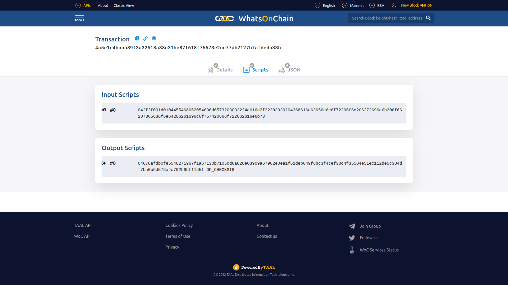
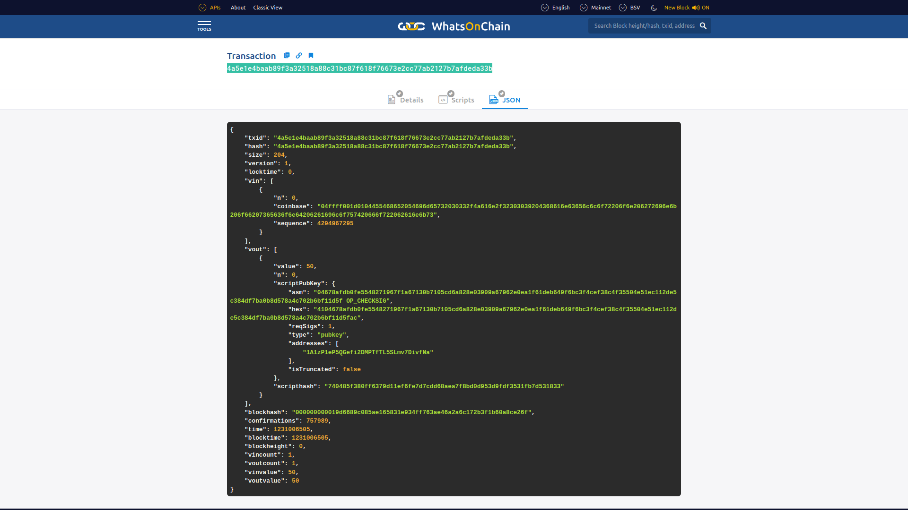
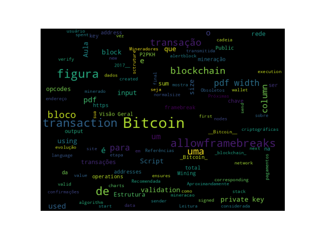

# Introdução

## Objetivos

* Apresentação de uma Visão Geral sobre __Bitcoin__.

# Bitcoin

## Bitcoin na perspectiva de usuário {.allowframebreaks}

* Passos de como enviar e receber pagamentos:
  * A transação começa com um remetente assinando a transação com sua chave privada. 
  * A transação é serializada para que possa ser transmitida pela rede.
  * A transação é transmitida para a rede.
  * Mineradores que escutam transações pegam a transação.
  * A transação é verificada quanto à sua legitimidade pelos mineradores.
  * A transação é adicionada ao bloco candidato/proposto para mineração.
  * Uma vez minerado, o resultado é transmitido para todos os nós da rede _Bitcoin_.
  * Normalmente, neste momento, os usuários aguardam até seis confirmações para serem recebidas antes que uma transação seja considerada final; no entanto, uma transação pode ser considerada final na etapa anterior.
  * As confirmações servem como um mecanismo adicional para garantir que haja probabilidade muito baixa de uma transação ser revertida, mas, caso contrário, uma vez que um bloco minerado seja finalizado e anunciado, as transações dentro desse bloco serão finais nesse ponto.  


## Chaves Criptográficas {.allowframebreaks}

[columns]

[column=0.5]

* Private keys in Bitcoin 
  * Private keys are used to digitally sign the transactions, proving ownership of the bitcoins. 
* Public keys in Bitcoin 
  * Public keys are used by nodes to verify that the transaction has indeed been signed with the corresponding private key. 
* Addresses in Bitcoin 
  * A Bitcoin address is created by taking the corresponding public key of a private key and hashing it twice, first with the SHA256 algorithm and then with RIPEMD160. 
* Bitcoin addresses are encoded using __Base58Check__ encoding

[column=0.5]


[/columns]

## Geração de Endereços no Bitcoin {.allowframebreaks}

* Para gerar um endereço no __Bitcoin__, é usado um processo de $11$ etapas:

{width=90%}

## Transações {.allowframebreaks}

* A user/sender sends a transaction using wallet software or some other interface. 
* The transaction is signed using the sender's private key. 
* The transaction is broadcasted to the Bitcoin network using a flooding algorithm. 
* Mining nodes (miners) who are listening for the transactions verify and include this transaction in the next lock to be mined.
* Next, the mining starts. 
* Finally, the confirmations start to appear in the receiver's wallet. 

## Estrutura de dados de uma Transação {.allowframebreaks}

{width=100%}

## Estrutura de dados de uma Transação – entradas e saídas {.allowframebreaks}

{width=90%}


## Script {.allowframebreaks}

* Simple stack-based language used to describe how bitcoins can be spent and transferred
* Evaluated from left to right using a Last in, First Out (LIFO) stack
* Composed of two components: elements and operations. 
* Scripts use various operations (opcodes) to define their operations.

## Opcodes {.allowframebreaks}

* Here are some examples of a few useful opcodes used in the Script language on the Bitcoin blockchain.


## P2PKH script execution  {.allowframebreaks}

* P2PKH is the most commonly used transaction type and is used to send transactions to Bitcoin addresses.


## Validação de Transações {.allowframebreaks}

During validation, the following are checked:

* That transaction inputs are previously unspent. This validation step prevents double-spending by verifying that the transaction inputs have not already been spent by someone else.

* That the sum of the transaction outputs is not more than the total sum of the transaction inputs. However, both input and output sums can be the same, or the sum of the input (total value) could be more than the total value of the outputs. This check ensures that no new bitcoins are created out of thin air. 

* That that the digital signatures are valid, which ensures that the script is valid.

## Blocos {.allowframebreaks}

* A estrutura de um Bloco Bitcoin é mostrado na tabela:

{width=100%}

[framebreak]

* A estrutura do cabeçalho de um bloco:

{width=100%}


## Uma Visualização da Blockchain do Bitcoin {.allowframebreaks}

{width=100%}

## Bloco Genesis {.allowframebreaks .fragile}

[alertblock]{Bloco Genesis}

O Bloco Genesis ou bloco $\#0$ foi _hardcoded_ (codificado) por suas características especiais: ele é o único que não aponta para nenhum bloco anterior. No seu _hash_ foi encriptado o bloco junto com a mensagem _"The Times 03/Jan/2009 Chancellor on brink of second bailout for banks"_, manchete do jornal naquele dia. Além de servir como prova datada, a manchete escolhida representa justamente uma crítica ao sistema bancário.

[/alertblock]

[framebreak]

[columns]

[column=0.5]


[column=0.5]


\scriptsize
__Fonte:__ [https://github.com/bitcoin/bitcoin/blob/master/src/chainparams.cpp](https://github.com/bitcoin/bitcoin/blob/master/src/chainparams.cpp)

[/columns]

[framebreak]

\tiny
```.c++
/**
 * Build the genesis block. Note that the output of its generation
 * transaction cannot be spent since it did not originally exist in the
 * database.
 *
 * CBlock(hash=000000000019d6, ver=1, hashPrevBlock=00000000000000, hashMerkleRoot=4a5e1e, nTime=1231006505, nBits=1d00ffff, nNonce=2083236893, vtx=1)
 *   CTransaction(hash=4a5e1e, ver=1, vin.size=1, vout.size=1, nLockTime=0)
 *     CTxIn(COutPoint(000000, -1), coinbase 04ffff001d0104455468652054696d65732030332f4a616e2f32303039204368616e63656c6c6f72206f6e206272696e6b206f66207365636f6e64206261696c6f757420666f722062616e6b73)
 *     CTxOut(nValue=50.00000000, scriptPubKey=0x5F1DF16B2B704C8A578D0B)
 *   vMerkleTree: 4a5e1e
 */
static CBlock CreateGenesisBlock(uint32_t nTime, uint32_t nNonce, uint32_t nBits, int32_t nVersion, 
const CAmount& genesisReward)
{
  const char* pszTimestamp = "The Times 03/Jan/2009 Chancellor on brink of second bailout for banks";
  const CScript genesisOutputScript = CScript() << ParseHex("04678afdb0fe5548271967f1a67130b7105cd6a828e03909a67962e0ea1f61deb649f6bc3f4cef38c4f35504e51ec112de5c384df7ba0b8d578a4c702b6bf11d5f") << OP_CHECKSIG;
  return CreateGenesisBlock(pszTimestamp, genesisOutputScript, nTime, nNonce, nBits, nVersion, genesisReward);
}
```

\normalsize

[framebreak]

## A carteira de Satoshi {.allowframebreaks}

* Carteira: [`1A1zP1eP5QGefi2DMPTfTL5SLmv7DivfNa`](https://blockchair.com/bitcoin/address/1A1zP1eP5QGefi2DMPTfTL5SLmv7DivfNa)

](figuras/carteira-satoshi.png){width=90%}


* Essa primeira transação foi incluída no __bloco \#0__, sob o _hash_ [4a5e1e4baab89f3a32518a88c31bc87f618f76673e2cc77ab2127b7afdeda33b](https://whatsonchain.com/tx/4a5e1e4baab89f3a32518a88c31bc87f618f76673e2cc77ab2127b7afdeda33b).

](figuras/blockchain-com-tx-4a5e1e4baab89f3a32518a88c31bc87f618f76673e2cc77ab2127b7afdeda33b.png){width=90%}


](figuras/carteira-de-satoshi-1A1zP1eP5QGefi2DMPTfTL5SLmv7DivfNa.png){width=90%}

[framebreak]

* Detalhes da Transação:

](figuras/block-0-transaction-4a5e1e4baab89f3a32518a88c31bc87f618f76673e2cc77ab2127b7afdeda33b.png){width=90%}

[framebreak]

* Scripts
  
{width=90%}

[framebreak]

* `JSON`

{width=90%}


## Blocos Obsoletos e Orfãos {.allowframebreaks}

* Blocos obsoletos existem em uma cadeia mais curta, a partir da qual a cadeia principal progrediu.
* Os blocos pais de blocos órfãos são desconhecidos.


## Tamanho do Blockchain do Bitcoin {.allowframebreaks}

* O _Blockchain_ do _Bitcoin_ tinha em __October 29, 2017__, aproximadamente: $139GB$

{ width=75% }

[framebreak]

* A figura mostra a evolução de __Aug 2017__ para __Jul 2020__. Aproximandamente, $286GB$.

{ width=60% }

[framebreak]

* A figura mostra a evolução de __Jan 2009__ para __Set 2022__. Aproximandamente, $426.7GB$.

{ width=75% }

* Fonte: [https://www.blockchain.com/charts/blocks-size](https://www.blockchain.com/charts/blocks-size)

## Mineração {.allowframebreaks}

[columns]

[column=0.5]

* Synchronizing with the network
* Transaction validation
* Block validation
* Create a new block
* Perform PoW
* Fetch reward

[column=0.5]


[/columns]

## Mining systems 


## Atividade

* Instalar o Bitcoin client e executar experimentos nele.

## _Word Cloud_ 

{width=100%}

## Leitura Recomendada
\normalsize

[alertblock]{Leitura Recomendada}

__Capítulo 5/6: Introduction Bitcoin__

**Livro**: [IMRAN BASHIR. Mastering Blockchain : Distributed Ledger Technology, Decentralization, and Smart Contracts Explained, 2nd Edition.](https://search.ebscohost.com/login.aspx?direct=true&db=e000xww&AN=1789486&authtype=shib&lang=pt-br&site=eds-live&scope=site&ebv=EB&ppid=pp_129)

[/alertblock]

# Próximas Aulas

## Próximas Aulas

* Pagamentos com _Bitcoin_.

# Referências

## Referências{.fragile .allowframebreaks}
\normalsize
