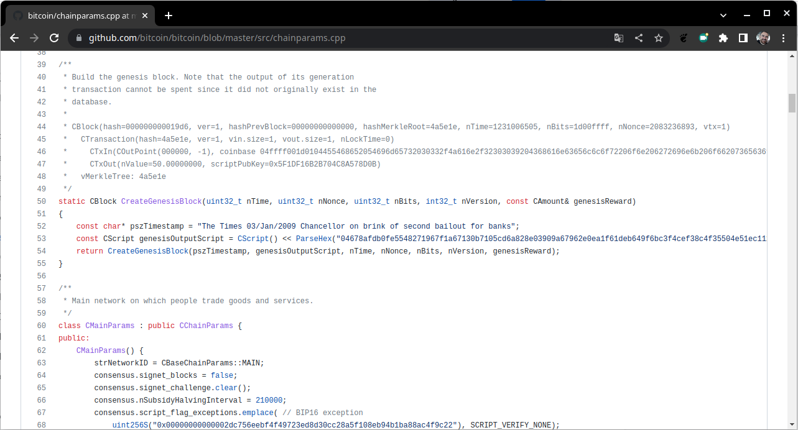
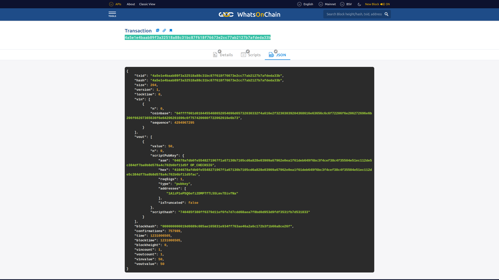

# Introdução

## Objetivos

* Apresentação de uma Visão Geral sobre rede __Bitcoin__ e pagamentos.

# Bitcoin

## Bloco Genesis {.allowframebreaks .fragile}

[alertblock]{Bloco Genesis}

O Bloco Genesis ou bloco $\#0$ foi _hardcoded_ (codificado) por suas características especiais: ele é o único que não aponta para nenhum bloco anterior. No seu _hash_ foi encriptado o bloco junto com a mensagem _"The Times 03/Jan/2009 Chancellor on brink of second bailout for banks"_, manchete do jornal naquele dia. Além de servir como prova datada, a manchete escolhida representa justamente uma crítica ao sistema bancário.

[/alertblock]

[framebreak]

[columns]

[column=0.5]


[column=0.5]



\scriptsize
__Fonte:__ [https://github.com/bitcoin/bitcoin/blob/master/src/chainparams.cpp](https://github.com/bitcoin/bitcoin/blob/master/src/chainparams.cpp)

[/columns]

[framebreak]

\tiny
```.c++
/**
 * Build the genesis block. Note that the output of its generation
 * transaction cannot be spent since it did not originally exist in the
 * database.
 *
 * CBlock(hash=000000000019d6, ver=1, hashPrevBlock=00000000000000, hashMerkleRoot=4a5e1e, nTime=1231006505, nBits=1d00ffff, nNonce=2083236893, vtx=1)
 *   CTransaction(hash=4a5e1e, ver=1, vin.size=1, vout.size=1, nLockTime=0)
 *     CTxIn(COutPoint(000000, -1), coinbase 04ffff001d0104455468652054696d65732030332f4a616e2f32303039204368616e63656c6c6f72206f6e206272696e6b206f66207365636f6e64206261696c6f757420666f722062616e6b73)
 *     CTxOut(nValue=50.00000000, scriptPubKey=0x5F1DF16B2B704C8A578D0B)
 *   vMerkleTree: 4a5e1e
 */
static CBlock CreateGenesisBlock(uint32_t nTime, uint32_t nNonce, uint32_t nBits, int32_t nVersion, 
const CAmount& genesisReward)
{
  const char* pszTimestamp = "The Times 03/Jan/2009 Chancellor on brink of second bailout for banks";
  const CScript genesisOutputScript = CScript() << ParseHex("04678afdb0fe5548271967f1a67130b7105cd6a828e03909a67962e0ea1f61deb649f6bc3f4cef38c4f35504e51ec112de5c384df7ba0b8d578a4c702b6bf11d5f") << OP_CHECKSIG;
  return CreateGenesisBlock(pszTimestamp, genesisOutputScript, nTime, nNonce, nBits, nVersion, genesisReward);
}
```

\normalsize

[framebreak]

## A carteira de Satoshi {.allowframebreaks}

* Carteira: [`1A1zP1eP5QGefi2DMPTfTL5SLmv7DivfNa`](https://blockchair.com/bitcoin/address/1A1zP1eP5QGefi2DMPTfTL5SLmv7DivfNa)

](figuras/carteira-satoshi.png){width=90%}


* Essa primeira transação foi incluída no __bloco \#0__, sob o _hash_ [4a5e1e4baab89f3a32518a88c31bc87f618f76673e2cc77ab2127b7afdeda33b](https://whatsonchain.com/tx/4a5e1e4baab89f3a32518a88c31bc87f618f76673e2cc77ab2127b7afdeda33b).

](figuras/blockchain-com-tx-4a5e1e4baab89f3a32518a88c31bc87f618f76673e2cc77ab2127b7afdeda33b.png){width=90%}


](figuras/carteira-de-satoshi-1A1zP1eP5QGefi2DMPTfTL5SLmv7DivfNa.png){width=100%}

[framebreak]

* Detalhes da Transação:

](figuras/block-0-transaction-4a5e1e4baab89f3a32518a88c31bc87f618f76673e2cc77ab2127b7afdeda33b.png){width=100%}

[framebreak]

* Scripts
  
{width=100%}

[framebreak]

* `JSON`

{width=100%}

## Transferência Inaugural {.allowframebreaks}

A transferência inaugural de Bitcoin foi feita em $12$ de Janeiro de $2009$ para _Hal Finney_, primeiro a fazer _download_ do software e minerar o bloco $170$ com $50$ BTCs de Satoshi. Finney foi escolhido em homenagem ao seu importante trabalho de criptografia _proof-of-work_.


[framebreak]

* Eles ficaram minerando sozinhos até $2010$, quando foi divulgado em um grupo de nerds de tecnologia.
* Dentro deste grupo, _Laszlo Hanyecz_ fez a primeira oferta pública para trocar $10.000$ `BTCs` por duas pizzas da Domino's. A oferta ficou no ar por $4$ dias, quando finalmente foi aceita por _Jercos_ (Jeremy Sturdivant), um garoto de $18$ anos na época.
* Então, o dia $22$ de maio de $2010$, a encomenda foi feita e a transação, realizado. _Laszlo_ publicou no fórum a mensagem: _"Só para avisar que acabei de comprar uma pizza com 10.000 Bitcoins. Obrigado, Jercos!"_. Esse dia ficou conhecido e comemorado até hoje como `Pizza Day` (Dia da Pizza).
* A partir desse momento, _Bitcoin_ passou a ser aceito como meio de pagamento por parte dos membros da comunidade em seus estágios iniciais. Desde então, lojas _on line_ e físicas começaram a cogitar a possibilidade da criptografia operar fora de suas fronteiras, tornando-se, efetivamente, dinheiro.

# Rede Bitcoin

## Tipos de Nós da Rede {.allowframebreaks}

* Tipos de Nós
  * Nós completos (Full nodes): quatro funções (wallet, mineração, armazenamento blockchain e nó de roteamento de rede).
  * SPV (Simple Payment Verification): clientes mais leves, funcionam como _wallets_ e tem funções de roteamente de rede.
  
* Pool protocols
  * _Stratum_

## Rede Bitcoin {.allowframebreaks}

* Uma rede Bitcoin é identificada por um número mágico. Esses números mágicos são usados para indicar a rede de origem da mensagem.

| __Network__   | _Magic value (in hex)_  |
|---------- |:-------------:|
| _main_      | `0xD9B4BEF9`    |
| _testnet_   | `0xDAB5BFFA`    |
| _testnet3_  | `0x0709110B`    |

## Protocolo de mensagens {.allowframebreaks}

* São $27$ tipos de mensagens de protocolo. As mais comuns:

[columns]

[column=0.5]

* Version
* Verack
* Inv
* Getdata 
* Getblocks
* Getheaders
* Tx
* Block
* Headers
* Getaddr
* Addr
* Ping
* Pong

[column=0.5]

Processo de sincronização de blocos entre dois nós em uma rede _Bitcoin_.


[/columns]

* Captura das mensagens com `Wireshark`:

{width=95%}

{width=95%}

* Quando um nó _Bitcoin core_ inicia, primeiro, ele descobre todos os seus pares da rede. Isto é alcançado consultando os _DNS seeds_ que estão _hardcoded_ no código do cliente _Bitcoin core_ e que são mantidos peloa comunidade _Bitcoin_.

* O protocolo `Bitcoin` funciona sobre o `TCP` porta $8333$ por padrão na rede principal e $18333$ para a `testnet`. 

[framebreak]

* Os endereços de `DNS` no arquivo `chainparams.cpp`:

\scriptsize

```c++
// Pieter Wuille, only supports x1, x5, x9, and xd
vSeeds.emplace_back("seed.bitcoin.sipa.be");
// Matt Corallo, only supports x9
vSeeds.emplace_back("dnsseed.bluematt.me");
// Luke Dashjr
vSeeds.emplace_back("dnsseed.bitcoin.dashjr.org");
// Christian Decker, supports x1 - xf
vSeeds.emplace_back("seed.bitcoinstats.com");
// Jonas Schnelli, only supports x1, x5, x9, and xd
vSeeds.emplace_back("seed.bitcoin.jonasschnelli.ch");
// Peter Todd, only supports x1, x5, x9, and xd
vSeeds.emplace_back("seed.btc.petertodd.org");
```

\normalsize

## Bloom filters {.allowframebreaks}

Bloom filters são usados para filtrar as transações relevantes para clientes _Bitcoin_.

* `fnv`, `murmur` e `Jenkins` são funções _hash_ comumente usadas em _bloom filters_.
* Usados em clientes _Bitcoin SPV_.
* _Bitcoin Improvement Proposal 37_, implementada no _Bitcoin_ como `BIP37`, introduziu três novos tipos de mensagem: `filterload`, `filteradd` e `filterclear`.

# Wallets 

## Wallets {.allowframebreaks}

* _Non-deterministic wallets_
* _Deterministic wallets_ 
* _Hierarchical deterministic wallets_
* _Brain wallets_
* _Paper wallets_
* _Hardware wallets_
* _Online wallets_
* _Mobile wallets_

## Pagamentos com Bitcoin {.allowframebreaks}

[columns]

[column=0.5]

* Bitcoin pode ser aceito como pagamento usando várias técnicas.
* O Bitcoin não é reconhecido como moeda legal em muitas jurisdições, mas está sendo cada vez mais aceito como método de pagamento por muitos comerciantes online e sites de comércio eletrônico. 

[column=0.5]


[/columns]

## Inovação em Bitcoin {.allowframebreaks}

* Bitcoin Improvement Proposals (BIPs) 
  * Standard BIP
  * Process BIP
  * Informational BIP
* Advanced protocols 
  * SegWit
  * Bitcoin Cash
  * Bitcoin Unlimited
  * Bitcoin Gold

## Atividade

* Instalar o _Bitcoin client_ e executar experimentos nele.

## _Word Cloud_ 

{width=100%}

## Leitura Recomendada
\normalsize

[alertblock]{Leitura Recomendada}

__Capítulo 6: Bitcoin Network and Payments__

**Livro**: [IMRAN BASHIR. Mastering Blockchain : Distributed Ledger Technology, Decentralization, and Smart Contracts Explained, 2nd Edition.](https://search.ebscohost.com/login.aspx?direct=true&db=e000xww&AN=1789486&authtype=shib&lang=pt-br&site=eds-live&scope=site&ebv=EB&ppid=pp_179)

[/alertblock]

# Próximas Aulas

## Próximas Aulas

* Pagamentos com _Bitcoin_.

# Referências

## Referências{.fragile .allowframebreaks}
\normalsize
