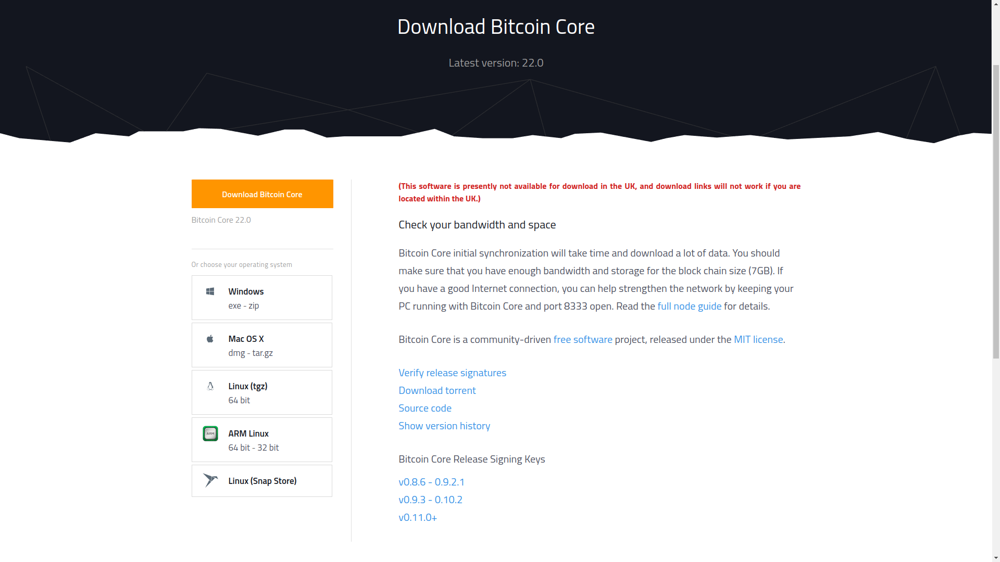

# Leitura do Capítulo 7: _Bitcoin Clients and APIs_

1. Faça a leitura do [Capítulo 7: Bitcoin Clients and APIs](https://search.ebscohost.com/login.aspx?direct=true&db=e000xww&AN=1789486&lang=pt-br&site=eds-live&scope=site&ebv=EB&ppid=pp_203)

# Instalação de Ferramentas

## Instalação do _Bitcoin Core_

O cliente para _Bitcoin Core_ pode ser instalado de <https://bitcoin.org/en/download>. Existem versões disponíveis para diferentes arquiteturas e plataformas, de `x86` Windows até `ARM` Linux:

Os elementos do cliente _Bitcoin Core_ incluem:

* `bitcoind`: Este é software _core client_ que executa como um _daemon_, e fornece uma interface `JSON-RPC`.

* `bitcoin-cli`: Este é uma ferramenta linha de comando para interagir com o _Bitcoin daemon_, que por sua vez interage com o _blockchain_.
 
* `bitcoin-qt`: _Bitcoin Core client GUI_.

## Diferentes Interfaces

O cliente _Bitcoin_ fornece três métodos para interação com o _blockchain_ do _Bitcoin_.
+ _Bitcoin command-line interface (bitcoin-cli)_
+ _JSON RPC interface_
+ _HTTP REST interface_

## Bitcoin command-line interface
## JSON RPC interface 
## HTTP REST interface
## Bitcoin programming

## Bibliotecas para Linguagens de Programação

Bibliotecas estão disponíveis para o desenvolvimento de aplicações envolvendo _Bitcoin_:
+ __Libbitcoin:__ Disponível em < https://libbitcoin.dyne.org/> e fornece utilitários e clientes poderosos.
+ __Pycoin:__ Disponível em <https://github.com/richardkiss/pycoin>, está é uma biblioteca para Python.
+ __Bitcoinj:__ É uma implementação em Java, a biblioteca está disponível em <https://bitcoinj.github.io/>.

## Atividade

Configure um nó _Bitcoin_ seguindo os passos descritos no Capítulo do Livro texto da disciplina, seção _"Setting up a Bitcoin node"_.

\normalsize

## Referências {.fragile .allowframebreaks}