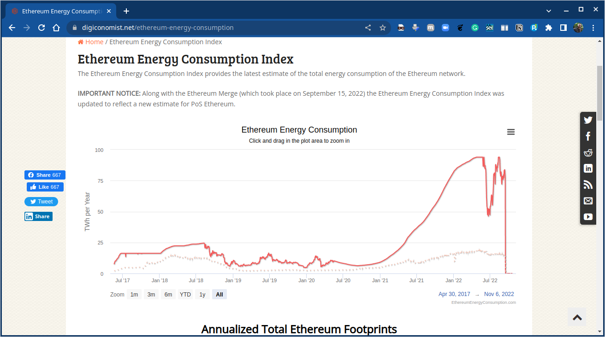

# Introdução

## Objetivos

* Apresentação de uma Visão Geral sobre rede __Ethereum__, componentes do Ecossistema _Ethereum_, a __Ethereum Virtual Machine (EVM)_ e Contratos Nativos. Além disso, uma perspectiva do usuário é apresentada, mostrando a estrutura dos blocos do _blockchain_ da _Ethereum_, _Wallets_ e _softwares_ clientes, nós e mineradores, ferramentas e `APIs`, protocolos e Linguagens de Programação Suportados.

## Ethereum – Overview {.allowframebreaks}

* Vitalik Buterin (https://vitalik.ca) conceitualizou Ethereum (https://ethereum.org) em Novembro de 2013. 
* A ideia central proposta foi o desenvolvimento de uma linguagem __Turing-completa__ para permitir o desenvolvimento de programas arbitrários (contratos inteligentes) para _blockchain_ e Aplicações Descentralizados (DApps). 
* Este conceito difere do _Bitcoin_, onde a linguagem de __script__ é limitada e permite apenas as operações necessárias.

![O [_Ethereum Yellow Paper_[^1]](https://ethereum.github.io/yellowpaper/paper.pdf)](figuras/yellow-paper.pdf)

[^1]: _Ethereum Yellow Paper_ - [https://ethereum.github.io/yellowpaper/paper.pdf](https://ethereum.github.io/yellowpaper/paper.pdf)

[framebreak]

* O [_Ethereum Yellow Paper_](https://ethereum.github.io/yellowpaper/paper.pdf) foi escrito por Dr. Gavin Wood, o fundador do _Ethereum_ e da Parity (<http://gavwood.com>), e serve como uma especificação formal do protocolo da *Ethereum*.
* Qualquer pessoa pode implementar um cliente Ethereum seguindo as especificações de protocolo definidas no artigo.

## Ethereum Releases {.allowframebreaks}

* A primeira versão da _Ethereum_, denominada __Olympic__, foi liberada em Maio de 2015. Dois meses mais tarde, a versão chamada de __Frontier__ foi liberada em Julho. Outra versão, a __Homestead__ com várias melhorias foi liberada em Março de 2016. A release chamada de __Muir Glacier__, que atrasou a __difficulty bomb__ (https://eips.ethereum.org/EIPS/eip-2384).
Um grande lançamento antes disso foi Istambul, que incluiu mudanças em torno de privacidade e dimensionamento
capacidades.

* Uma lista de todas as _releases_ anunciadas é mantida em <https://github.com/ethereum/go-ethereum/releases>.

## A Blockchain Ethereum {.allowframebreaks}

* O Ethereum, assim como qualquer outro _blockchain_, pode ser visualizado como uma máquina de estado baseada em transações.

* A ideia principal da _blockchain_ da _Ethereum_, um estado gênese é transformado em um estado final executando transações de forma incremental. A transformação final é então aceita como a versão absoluta e indiscutível do estado. A função de transição de estado _Ethereum_ é mostrada, onde a execução de uma transação resultou em uma transição de estado. 

## Ethereum – a user's perspective {.allowframebreaks}

* O caso de uso mais comum do rede _Ethereum_ é o envio e o recebimento de pagamentos.
* Para isso, o usuário assina a transação e a envia, que se propaga na rede, momento em que os mineradores a pegam, verificam e iniciam a Prova de Trabalho (PoW). 
* Se PoW for bem sucedida, o bloco com a transação é finalizado e propagado, e um novo bloco é adicionado à cadeia
* Para enviar e receber transações, um software de carteira é usado: por exemplo, carteiras são usadas em dispositivos móveis.

## Arquitetura de Alto Nível da Ethereum {.allowframebreaks}

## Rede Ethereum {.allowframebreaks}

A rede _Ethereum_ é uma rede _peer-to-peer_ onde os nós participantes mantem a _blockchain_ e contribuem para o mecanismo de consenso. As redes podem ser divididas em três tipos, com base nos requisitos e uso.

[block]{A mainnet}

A __mainnet__ é a atual rede _Ethereum_. Seu ID de rede é $1$ e seu ID de cadeia (_chain_) é também $1$. Os IDs de rede e de cadeia são usados para identificar a rede. Um explorador de blocos que mostra informações detalhadas sobre blocos e outras métricas relevantes estão disponíveis em <https://etherscan.io>, que pode ser usado para explorar a blockchain Ethereum.

[/block]

[alertblock]{Testnets}

Existem um número de redes de testes (testnets) disponíveis para _Ethereum_. 
Elas tem como objetivo fornecer um ambiente de testes para contratos inteligentes e DApps antes de serem implantados para produção na rede _blockchain_. Além disso, sendo redes de teste, elas permitem experimentos e pesquisa.
A principal testnet é chamada `Ropsten`, que contém todas as características de outras redes de propósito especial menores que foram criados para fins específicos. 
Por exemplo, outras redes de teste incluem `Kovan` e `Rinkeby`, que foram desenvolvidos para testar as versões do __Byzantium__. As mudanças que foram implementados nessas redes de teste menores também foram implementados em `Ropsten`. Agora
a rede de teste `Ropsten` contém todas as propriedades de `Kovan` e `Rinkeby`.

[/alertblock]

[exampleblock]{Redes Privadas}

As _private nets_ são redes privadas que podem ser criadas gerando-se um novo _genesis block_. Este é geralmente o caso em redes _blockchain_ privadas, onde um grupo privado de entidades iniciam sua rede _blockchain_ e a usam como uma blockchain autorizada ou de consórcio.

[/exampleblock]

## Elementos do Ecossistema Ethereum {.allowframebreaks}

* Chaves e Endereços
* Contas
* Transações e mensagens
* Criptomoeda/Tokens Ether
* A Ethereum Virtual Machine (EVM) 
* Smart contracts e contratos nativos.

## Tipos de contas {.allowframebreaks}

* **EOAs:** _Externally Owned Accounts_. Contas de usuários representadas por um endereço.
* **CAs:** *Contract accounts*. Criadas como resultado do _deployment_ de um contrato inteligente, também representado por um endereço.

## Transações e Árvore de Transações (trie) {.allowframebreaks}

[alertblock]{Transações}

Uma transação no _Ethereum_ consiste em vários campos, como mostrado aqui, junto com a _transaction trie_. O diagrama também mostra a relação entre a tentativa de transação e o cabeçalho do bloco.

[/alertblock]

## Tipos de Transações {.allowframebreaks}

* Existem três tipo de transações:
  * Criação de Contrato
  * _Call_
  * Transferência de Valor

O diagrama mostra a criação do contrato e as transações de chamada de mensagem, com campos obrigatórios.

## Estado da conta e armazenamento na trie {.allowframebreaks}

O diagrama mostra os campos contidos no estado da conta e como os vários elementos estão contidos no _world state_ trie:
* World state trie
  * State root 
  * Account state
    * Account storage trie 

## Recibos de Transações {.allowframebreaks}

* Recibos de Transações (transaction receipts) são gerados como resultado da execução de transações.
* Logs também são atualizados em conformidade.
* Ambas as estruturas de dados contêm vários campos, conforme mostrado abaixo:

## The Ethereum Virtual Environment (EVM) {.allowframebreaks}

* Stack size based on LIFO queue: Last In, First Out.
* 1024 stack depth limit
* Turing complete but limited by gas, making it quasi-Turing complete
* Big-endian design
* Storage available to EVM
  * Memory 
  * Storage
  * Stack

## EVM operation design {.allowframebreaks}

## Execution environment {.allowframebreaks}

[columns]

[column=0.5]

O ambiente de execução do _Ethereum_ consiste em vários elementos, como mostrado:

[column=0.5]

{width=50%}

[/columns]

## Machine State {.allowframebreaks}

Uma Máquina de Estado ou _Machine state_ é uma tupla compreendendo vários campos, como mostrado em:

## Contratos Nativos {.allowframebreaks}

Existem nove contratos pré-compilados ou contratos nativos na versão Ethereum Istanbul:
* *The elliptic curve public key recovery function*
* *The SHA-256-bit hash function* 
* *The RIPEMD-160-bit hash function* 
* *The identity/datacopy function* 
* *Big mod exponentiation function* 
* *Elliptic curve point addition function* 
* *Elliptic curve scalar multiplication* 
* *Elliptic curve pairing* 
* *Blake2 compression function 'F'* 

# Um pouco mais de Ethereum

## Outline {.allowframebreaks}

* Blocos e _Blockchain_
* Wallets e Software Clientes
* Nós e Mineradores
* APIs e ferramentas
* Protocolos suportados
* Linguagens de Programação

## Blocks e Blockchain {.allowframebreaks}

[columns]

[column=0.5]

Um bloco _Ethereum_ consiste em vários campos, conforme diagrama.
_State root, transaction root_ e _receipts root_ são _root hashes_ de suas respectivas árvores.

[column=0.5]

[/columns]

## Mecanismo de Validação de Blocos {.allowframebreaks}

The Ethereum block validation mechanism checks the following conditions:
  * If it is consistent with uncles and transactions. This means that all ommers satisfy the property that they are indeed uncles, and also if the Proof of Work (PoW) for uncles is valid. 
  * If the previous block (parent) exists and is valid. 
  * If the timestamp of the block is valid. This means that the current block's timestamp must be higher than the parent block's timestamp. Also, it should be less than 15 minutes into the future. All block times are calculated in epoch time (Unix time). 

If any of these checks fails, the block will be rejected. A list of errors for which the block can be rejected is presented here: 
  * The timestamp is older than the parent 
  * There are too many, or duplicate uncles   
  * The uncle is an ancestor, or the uncle’s parent is not an ancestor
  * There is non-positive difficulty 
  * There is an invalid mix digest or PoW

## Finalização de Bloco {.allowframebreaks}

Block finalization is a process that is run by miners to validate the contents of the block and apply rewards. It results in four steps being executed. These steps are described here:

1. __Ommers (uncles) validation.__ In the case of mining, determine ommers. The validation process of the headers of stale blocks checks whether the header is valid and whether the relationship between the uncle and the current block satisfies the maximum depth of six blocks. A block can contain a maximum of two uncles.

2. **Transaction validation.** In the case of mining, determine transactions. This process involves checking whether the total gas used in the block is equal to the final gas consumption after the final transaction, in other words, the cumulative gas used by the transactions included in the block.
   
3. **Reward application.** Apply rewards, which means updating the beneficiary's account with a reward balance. In Ethereum, a reward is also given to miners for stale blocks, which is 1/32 of the block reward. Uncles that are included in the blocks also receive 7/8 of the total block reward. The current block reward is 2 ether. It was reduced first from 5 ether to 3 with the Byzantium release of Ethereum. Later, in the Constantinople release (https://blog.ethereum.org/2019/02/22/ethereum-constantinople-st-petersburg-upgrade-announcement/), it was reduced further to 2 ether. A block can have a maximum of two uncles.
   
4. **State and nonce validation.** Verify the state and block nonce. In the case of mining, compute a valid state and block nonce.

## Mecanismo de Block difficulty {.allowframebreaks}

O mecanismo de dificuldade do bloco é representado pela fórmula abaixo, que garante que os blocos sejam produzidos a uma taxa constante:

$block\_diff = parent\_diff + parent\_diff //' 2048 * max(1 - (block\_timestamp - parent\_timestamp) // 10, -99) + int(2**((block.number // 100000) - 2))$

O _gas cost_ de uma transação pode ser calculado usando esta fórmula:

$Total cost = gasUsed * gasPrice$

## Consumo de Energia {.allowframebreaks}

* Com a última atualização `Merge` que trocaram a _Proof of Work_ (PoW) pela _Proof of Stake_ (PoS) tendo como uma das motivações a questão ambiental. Houve um grande impacto no consumo de energia.

## Wallets e Software Clientes {.allowframebreaks}

* Wallets 
* Light clients 
* Existem três tipos de sincronização de clientes:
  * **Full:** Nesse modo de sincronização, o cliente `Geth` faz um _download_ completo da *blockchain* para o nó local. Isso significa que ele obtém todos os cabeçalhos e corpos dos blocos e valida todas as transações e blocos desde o bloco _genesis_. No início de 2020, o tamanho do _blockchain_ Ethereum era de aproximadamente $210GB$, e baixar e manter isso pode ser um problema.
  * Hoje, 18 de outubro de 2022 o tamanho chega a $966.06GB$, segundo <https://ycharts.com/indicators/ethereum_chain_full_sync_data_size>.
  
  * **Fast:** Neste modo é feito o _download_ completo, mas somente recupera e verifica somente os $64$ blocos anteriores ao bloco corrente. Depois disso, ele verifica os novos blocos na íntegra. Não reproduz e verifica todas as transações históricas desde o bloco _genesis_, em vez disso, ele só faz os _downloads_ de estado. Isso também reduz significativamente o tamanho do disco do banco de dados _blockchain_. Este é o modo padrão de sincronização do cliente `Geth`.
  
  * **Light:** Este é o modo mais rápido e apenas baixa e armazena o estado atual. Nesse modo, o cliente não baixa nenhum bloco histórico e processa apenas os blocos mais novos.

## Ethereum keystore: Key decryption process {.allowframebreaks}

Os arquivos de chave pública e privada são armazenados no diretório keystore. Os arquivos de keystore Ethereum são arquivos JSON, cujo conteúdo se parece com o script abaixo.

[framebreak]

Key decryption process:

## MetaMask {.allowframebreaks}

`MetaMask` é uma carteira de criptomoedas e uma interface para redes _blockchain_ sem exigir a instalação de um nó local.

[columns]

[column=0.5]

[column=0.5]

[/columns]

## Nós e Mineradores {.allowframebreaks}

A mineração é o processo pelo qual novos blocos são selecionados por meio de um mecanismo de consenso e adicionados ao _blockchain_. O processo segue os seguintes passos:
* It listens for the transactions broadcasted on the Ethereum network and determines the transactions to be processed. 
* It determines stale ommer blocks and includes them in the blockchain. 
* It updates the account balance with the reward earned from successfully mining the block.
* Finally, a valid state is computed and the block is finalized, which defines the result of all state transitions. 

## Ethash {.allowframebreaks}

`Ethash` é o nome do algoritmo de `Proof of Work` usado no `Ethereum`.
1. First, the header from the previous block and a 32-bit random nonce is combined using Keccak-256. 
2. This produces a 128-bit structure called `mix`. 
3. `mix` determines which data is to be picked up from the DAG. 
4. Once the data is fetched from the DAG, it is "mixed" with the mix to produce the next mix, which is then again used to fetch data from the DAG and subsequently mixed. This process is repeated 64 times. 
5. Eventually, the 64th mix is run through a digest function to produce a 32-byte sequence. 
6. This sequence is compared with the difficulty target. If it is less than the difficulty target, the nonce is valid, and the PoW is solved. As a result, the block is mined. If not, then the algorithm repeats with a new nonce. 

## Mineração {.allowframebreaks}

* **CPU:** Mining using a computer’s built in CPU.
* **GPU:** Mining using graphical processing units, which provide better performance as compared to CPUs.
* **ASICs:** Specialized hardware—Application-Specific Integrated Circuit designed solely to run mining algorithms. These are currently the most efficient mining tools.
* Mining pools: In mining pools, resources are shared between miners and rewards are split accordingly.

## Protocolos Suportados {.allowframebreaks}

Dois principais protocolos de suporte, `Swarm` e `Whisper`, são usados para fornecer armazenamento e mensagens descentralizadas, a fim de criar um ecossistema descentralizado completo.

## Linguagens de Programação {.allowframebreaks}

* **Solidity** is one of the high-level languages that has been developed for Ethereum. It uses JavaScript-like syntax to write code for smart contracts. Once the code is written, it is compiled into bytecode that's understandable by the EVM using the Solidity compiler called solc. 
* **LLL** is another language that is used to write smart contract code. 
* **Serpent** is a Python-like, high-level language that can be used to write smart contracts for Ethereum. 
* **Vyper** is a newer language that has been developed from scratch to achieve a secure, simple, and auditable language.

## Atividade

* Leitura do `Ethereum yellow paper`: <https://ethereum.github.io/yellowpaper/paper.pdf>
* Instalação do `Geth` e executar ele com a `Kovan testnet`.

## _Word Cloud_ 

{width=100%}

## Leitura Recomendada
\normalsize

[alertblock]{Leitura Recomendada}

__Capítulo 11: Ethereum 101__

**Livro**: [IMRAN BASHIR. Mastering Blockchain : Distributed Ledger Technology, Decentralization, and Smart Contracts Explained, 2nd Edition.](https://search.ebscohost.com/login.aspx?direct=true&db=e000xww&AN=1789486&authtype=shib&lang=pt-br&site=eds-live&scope=site&ebv=EB&ppid=pp_276)

__Capítulo 12: Futher Ethereum__

**Livro**: [IMRAN BASHIR. Mastering Blockchain : Distributed Ledger Technology, Decentralization, and Smart Contracts Explained, 2nd Edition.](https://search.ebscohost.com/login.aspx?direct=true&db=e000xww&AN=1789486&authtype=shib&lang=pt-br&site=eds-live&scope=site&ebv=EB&ppid=pp_310)

[/alertblock]

# Próximas Aulas

## Próximas Aulas

* Ambientes de Desenvolvimento e Ferramentas.

# Referências

## Referências{.fragile .allowframebreaks}
\normalsize
