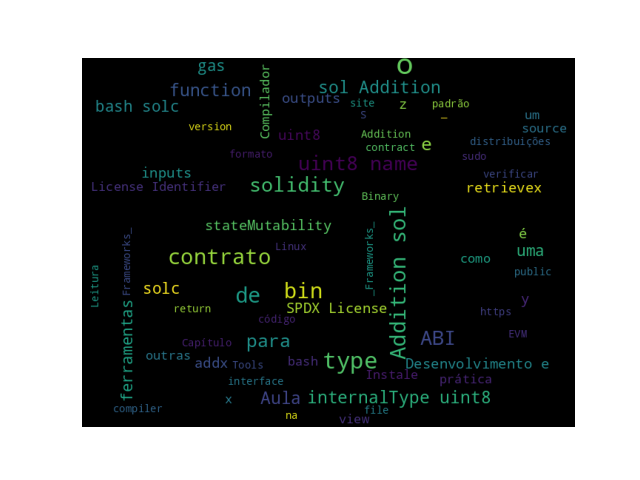

# Leitura do _Capítulo 14: Development Tools and Frameworks_

1. Faça a leitura do [Capítulo 14: __Development Tools and Frameworks__](https://search.ebscohost.com/login.aspx?direct=true&db=e000xww&AN=1789486&authtype=shib&lang=pt-br&site=eds-live&scope=site&ebv=EB&ppid=pp_431)

# Instalação das Ferramentas
   
2. Instale o Compilador `Solidity` (`solc`). O `solc` converte código de alto nível escrito na linguagem `Solidity` para _bytecode_ da _Ethereum Virtual Machine (EVM)_.

Para distribuições `Ubuntu` ou derivados do `Debian`:

```bash
$ sudo apt-get install solc
```

Outras distribuições como o `Manjaro Linux`, instale o pacote `solidity`:

```bash
$ sudo pacman -S solidity
```

Feita a instalação, para verificar a versão instalada execute o comando:

```bash
$ solc --version
solc, the solidity compiler commandline interface
Version: 0.8.17+commit.8df45f5f.Linux.g++
```

Para verificar o funcionamento e algumas funcionalidades vamos criar um contrato simples, com o nome `Addition.sol` e com o seguinte conteúdo:

```solidity
pragma solidity ^0.8.17;

contract Addition {
   uint8 x;

   function addx(uint8 y, uint8 z ) public {
      x = y + z;
   }
   function retrievex() view public returns (uint8) {
      return x;
   }
}
```

Verificando o formato binário do contrato:

```bash
$ solc --bin Addition.sol
Warning: SPDX license identifier not provided in source file. Before publishing, consider adding a comment containing "SPDX-License-Identifier: <SPDX-License>" to each source file. Use "SPDX-License-Identifier: UNLICENSED" for non-open-source code. Please see https://spdx.org for more information.
--> Addition.sol


======= Addition.sol:Addition =======
Binary:
608060405234801561001057600080fd5b506101f6806100206000396000f3fe608060405234801561001057
600080fd5b50600436106100365760003560e01c806336718d801461003b578063ac04e0a014610057575b60
0080fd5b610055600480360381019061005091906100f2565b610075565b005b61005f61009e565b60405161
006c9190610141565b60405180910390f35b8082610081919061018b565b6000806101000a81548160ff0219
16908360ff1602179055505050565b60008060009054906101000a900460ff16905090565b600080fd5b6000
60ff82169050919050565b6100cf816100b9565b81146100da57600080fd5b50565b6000813590506100ec81
6100c6565b92915050565b60008060408385031215610109576101086100b4565b5b60006101178582860161
00dd565b9250506020610128858286016100dd565b9150509250929050565b61013b816100b9565b82525050
565b60006020820190506101566000830184610132565b92915050565b7f4e487b7100000000000000000000
000000000000000000000000000000000000600052601160045260246000fd5b6000610196826100b9565b91
506101a1836100b9565b9250828201905060ff8111156101ba576101b961015c565b5b9291505056fea26469
70667358221220e0ec16eaf684603f4f7c74f327a27e4a1a981dfac0cb258479ffe452abda2e4964736f6c63
430008110033
```

Estimando o `gas`. Como uma taxa de `gas` é cobrada para cada operação que o EVM executa, é uma boa prática estimar `gas` antes de implantar um contrato em uma rede ativa.

```bash
$ solc --gas Addition.sol
======= Addition.sol:Addition =======
Gas estimation:
construction:
   147 + 100400 = 100547
external:
   addx(uint8,uint8):   infinite
   retrievex(): 2479
```

Gerando a `ABI` do contrato. A _Application Binary Interface (ABI)_ é uma forma padrão de interagir com os contratos.

```bash
$ solc --abi Addition.sol
======= Addition.sol:Addition =======
Contract JSON ABI
[{"inputs":[{"internalType":"uint8","name":"y","type":"uint8"},{"internalType":"uint8",
"name":"z","type":"uint8"}],"name":"addx","outputs":[],"stateMutability":"nonpayable",
"type":"function"},{"inputs":[],"name":"retrievex","outputs":[{"internalType":"uint8",
"name":"","type":"uint8"}],"stateMutability":"view","type":"function"}]
```

Compilando um contrato:

```bash
$ solc --bin --abi -o bin Addition.sol
Compiler run successful. Artifact(s) can be found in directory "bin".
```
Se erros ocorrerem serão mostrados no console, caso contrário o compilador irá mostrar uma mensagem de sucesso. Serão gerados os arquivos no diretório `bin`:

* Addition.abi: Contém a ABI do contrato no formato JSON.
* Addition.bin: Contém a representação binária do código do contrato.

```bash
$ cat bin/Addition.bin
608060405234801561001057600080fd5b506101f6806100206000396000f3fe608060405234801561001057
600080fd5b50600436106100365760003560e01c806336718d801461003b578063ac04e0a014610057575b60
0080fd5b610055600480360381019061005091906100f2565b610075565b005b61005f61009e565b60405161
006c9190610141565b60405180910390f35b8082610081919061018b565b6000806101000a81548160ff0219
16908360ff1602179055505050565b60008060009054906101000a900460ff16905090565b600080fd5b6000
60ff82169050919050565b6100cf816100b9565b81146100da57600080fd5b50565b6000813590506100ec81
6100c6565b92915050565b60008060408385031215610109576101086100b4565b5b60006101178582860161
00dd565b9250506020610128858286016100dd565b9150509250929050565b61013b816100b9565b82525050
565b60006020820190506101566000830184610132565b92915050565b7f4e487b7100000000000000000000
000000000000000000000000000000000000600052601160045260246000fd5b6000610196826100b9565b91
506101a1836100b9565b9250828201905060ff8111156101ba576101b961015c565b5b9291505056fea26469
70667358221220e0ec16eaf684603f4f7c74f327a27e4a1a981dfac0cb258479ffe452abda2e4964736f6c63
430008110033

$ cat bin/Addition.abi 
[{"inputs":[{"internalType":"uint8","name":"y","type":"uint8"},{"internalType":"uint8",
"name":"z","type":"uint8"}],"name":"addx","outputs":[],"stateMutability":"nonpayable",
"type":"function"},{"inputs":[],"name":"retrievex","outputs":[{"internalType":"uint8",
"name":"","type":"uint8"}],"stateMutability":"view","type":"function"}]
```

3. Instale as outras ferramentas: `Node.js`, `Ganache` e `Ganache-CLI`, `Truffle`, `Drizzle`, `Embark` e outras ferramentas indicadas no capítulo. 

\normalsize

# Próximas Aulas

## Próximas Aulas

* Ambientes de Desenvolvimento e Ferramentas.

# Referências

## _Word Cloud_

{ width=100% }

## Referências{.fragile .allowframebreaks}
\normalsize