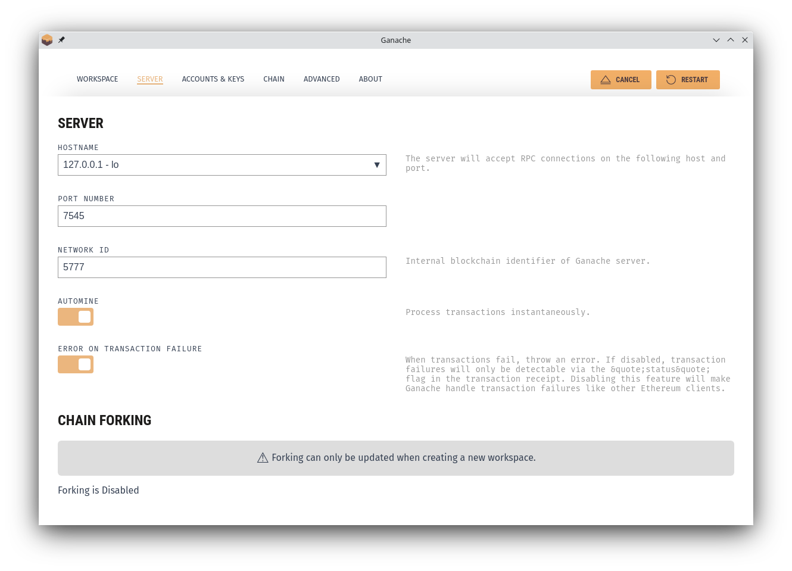

# Introdução

## Objetivos

* Apresentação de Ferramentas de Desenvolvimento e _Frameworks_.
* Explorar a biblioteca `Web3` com o cliente `Geth`, desenvolvimento de contratos, interação com contratos via _frontends_.

## Explorando Web3 com Geth {.allowframebreaks}

* `Web3` é uma biblioteca `JavaScript` que pode ser usada na comunicação com um Nó _Ethereum_ via comunicação `RPC`. `Web3` expõe métodos que o acesso está disponível sobre `RPC`.
* A interação com o cliente `Geth` é possível via _Geth JavaScript Console_, que expõe vários métodos de consulta e gerenciamento do blockchain.
* Vimos os comandos para execução do `Geth` e do Console JavaScript na __Aula 021 - Prática sobre Ethereum: Ambiente de Desenvolvimento__.

[framebreak]

* Iniciar o Nó `Geth` com suporte ao `web3`:

\tiny

```bash
$ geth --datadir ~/.etherprivate/ --allow-insecure-unlock --networkid 786 --http --http.addr 127.0.0.1 --http.port 8559 --http.api "eth,net,web3,personal,engine,admin,debug" --keystore ~/.etherprivate/keystore --authrpc.addr localhost --authrpc.port 8551 --authrpc.vhosts localhost --authrpc.jwtsecret ~/.etherprivate/geth/jwtsecret --nodiscover --maxpeers 15
```

\normalsize

[framebreak]

* Iniciar um console para a interação com a execução:

\tiny

```bash
$ geth attach ~/.etherprivate/geth.ipc
Welcome to the Geth JavaScript console!

instance: Geth/v1.10.26-stable-e5eb32ac/linux-amd64/go1.19.3
coinbase: 0xedbc36d74d5a1cd64db36e53798bd1781f0c4955
at block: 0 (Wed Dec 31 1969 21:00:00 GMT-0300 (-03))
 datadir: /home/rag/.etherprivate
 modules: admin:1.0 debug:1.0 engine:1.0 eth:1.0 ethash:1.0 miner:1.0 net:1.0 personal:1.0 rpc:1.0 txpool:1.0 web3:1.0

To exit, press ctrl-d or type exit
```

\normalsize
* Verificando se os recursos `web3` estão disponíveis:

```bash
> web3.version
{
  api: "0.20.1",
  ethereum: undefined,
  network: "786",
  node: "Geth/v1.10.26-stable-e5eb32ac/linux-amd64/go1.19.3",
  whisper: undefined,
  getEthereum: function(callback),
  getNetwork: function(callback),
  getNode: function(callback),
  getWhisper: function(callback)
}
> 
```

\normalsize

## Web3 deployment {.allowframebreaks}

* Faremos um _deploy_ usando o _Geth console_.
* O passo a passo pode ser visto no livro e iremos reproduzir aqui, seguindo a sequência de passos:
  * Executar o _Geth client_.
  * Criar um script de _deployment_, usando a `ABI` e o _bytecode_, e algum código `JavaScript`.
  * Faremos o _deploy_ do contrato via linha de comando pelo _Geth console_.
  * Interagir com o contrato via um _frontend_ web.

## Web3 deployment: Executar o _Geth client_ {.allowframebreaks}

\def\checkmark{\tikz\fill[scale=0.4](0,.35) -- (.25,0) -- (1,.7) -- (.25,.15) -- cycle;} 
\def\scalecheck{\resizebox{\widthof{\checkmark}*\ratio{\widthof{x}}{\widthof{\normalsize x}}}{!}{\checkmark}}

* Executar o _Geth client_. [\scalecheck]
* Executar o _Geth console_. [\scalecheck]

## Web3 deployment: Criar um script de _deployment_ {.allowframebreaks}

* Compile o contrato com o `solc` ou utilizando o `Remix IDE`, gerando o binário e a `ABI`:

```bash
$  solc --bin --abi -o bin ValueChecker.sol
$ ls
bin  deploy.js  ValueChecker.sol
$ cd bin
$ ls
valueChecker.abi  valueChecker.bin
$ cat valueChecker.bin
6080604052600a60005534801561001557600080fd5b5061018b806100256000396000f3fe60806040523480
1561001057600080fd5b506004361061002b5760003560e01c8063f9d55e2114610030575b600080fd5b6100
4a600480360381019061004591906100f2565b610060565b604051610057919061013a565b60405180910390
f35b600080548260ff16106100ae577f3eb1a229ff7995457774a4bd31ef7b13b6f4491ad1ebb8961af120b8
b4b6239c600160405161009d919061013a565b60405180910390a1600190506100af565b5b919050565b6000
80fd5b600060ff82169050919050565b6100cf816100b9565b81146100da57600080fd5b50565b6000813590
506100ec816100c6565b92915050565b600060208284031215610108576101076100b4565b5b600061011684
8285016100dd565b91505092915050565b60008115159050919050565b6101348161011f565b82525050565b
600060208201905061014f600083018461012b565b9291505056fea264697066735822122088a7e63726327b
857c0d0a6d073976f05d5073826c629671c857a375db35d51c64736f6c63430008110033

$ cat valueChecker.abi 
[{"anonymous":false,"inputs":[{"indexed":false,"internalType":"bool","name":"returnValue",
"type":"bool"}],"name":"valueEvent","type":"event"},{"inputs":[{"internalType":"uint8",
"name":"x","type":"uint8"}],"name":"Matcher","outputs":[{"internalType":"bool",
"name":"","type":"bool"}],"stateMutability":"nonpayable","type":"function"}]

```

* Preparação do código _JavaScript_:

```javascript
var valuecheckerContract = web3.eth.contract([{ "anonymous": false, "inputs": [{ "indexed": false, "internalType": "bool", "name": "returnValue", "type": "bool" }], "name": "valueEvent", "type": "event" }, { "inputs": [{ "internalType": "uint8", "name": "x", "type": "uint8" }], "name": "Matcher", "outputs": [{ "internalType": "bool", "name": "", "type": "bool" }], "stateMutability": "nonpayable", "type": "function" }]);
var valuechecker = valuecheckerContract.new({
    from: web3.eth.accounts[0],
    data: '0x6080604052600a60005534801561001557600080fd5b5061010d806100256000396000f3006080
          60405260043610603f576000357c0100000000000000000000000000000000000000000000000000
          000000900463ffffffff168063f9d55e21146044575b600080fd5b348015604f57600080fd5b5060
          6f600480360381019080803560ff1690602001909291905050506089565b60405180821515151581
          5260200191505060405180910390f35b600080548260ff1610151560db577f3eb1a229ff79954577
          74a4bd31ef7b13b6f4491ad1ebb8961af120b8b4b6239c6001604051808215151515815260200191
          505060405180910390a16001905060dc565b5b9190505600a165627a7a723058209ff756514f1ef4
          6f5650d800506c4eb6be2d8d71c0e2c8b0ca50660fde82c7680029', gas: '4700000'
},
    function (e, contract) {
        console.log(e, contract);
        if (typeof contract.address !== 'undefined') {
            console.log('Contract mined! address: ' + contract.address + 'transactionHash: ' + contract.transactionHash);
        }
    })
```

## Web3 deployment: Fazendo o _deploy_ pelo _Geth console_ {.allowframebreaks}

* No _Geth console_ dê um _unclock_ na conta:

```bash
>  personal.listAccounts[0]
"0xedbc36d74d5a1cd64db36e53798bd1781f0c4955"
>  personal.unlockAccount(personal.listAccounts[0])
Unlock account 0xedbc36d74d5a1cd64db36e53798bd1781f0c4955
Passphrase: 
true
>
```

* Cole o código `JavaScript` para fazer o _deploy_:

```bash
> var valuecheckerContract = web3.eth.contract([{ "anonymous": false, "inputs": [{ "indexed": false, "internalType": "bool", "name": "returnValue", "type": "bool" }], "name": "valueEvent", "type": "event" }, { "inputs": [{ "internalType": "uint8", "name": "x", "type": "uint8" }], "name": "Matcher", "outputs": [{ "internalType": "bool", "name": "", "type": "bool" }], "stateMutability": "nonpayable", "type": "function" }]);
undefined
> var valuechecker = valuecheckerContract.new({
......from: web3.eth.accounts[0],
......data: '0x6080604052600a60005534801561001557600080fd5b5061010d806100256000396000f30060806040
5260043610603f576000357c0100000000000000000000000000000000000000000000000000000000900463f
fffffff168063f9d55e21146044575b600080fd5b348015604f57600080fd5b50606f60048036038101908080
3560ff1690602001909291905050506089565b604051808215151515815260200191505060405180910390f35
b600080548260ff1610151560db577f3eb1a229ff7995457774a4bd31ef7b13b6f4491ad1ebb8961af120b8b4
b6239c6001604051808215151515815260200191505060405180910390a16001905060dc565b5b9190505600a
165627a7a723058209ff756514f1ef46f5650d800506c4eb6be2d8d71c0e2c8b0ca50660fde82c7680029', 
gas: '4700000'
...... },
...     function (e, contract) {
......         console.log(e, contract);
......         if (typeof contract.address !== 'undefined') {
.........             console.log('Contract mined! address: ' + contract.address + 'transactionHash: ' + contract.transactionHash);
.........         }
......     })
Error: insufficient funds for gas * price + value undefined
undefined
> miner.start()
null
>
```
* Na execução do _deploy_ deu uma mensagem de erro `Error: insufficient funds for gas * price + value undefined`, pois a carteira da conta selecionada não tem saldo suficiente. É necessário minerar para ganhar algum saldo:

```bash
> miner.start()
null
> miner.stop()
> null
```

* Repetindo o processo de _deploy_:

```bash
> personal.unlockAccount(personal.listAccounts[0])
Unlock account 0xedbc36d74d5a1cd64db36e53798bd1781f0c4955
Passphrase: 
true
> var valuecheckerContract = web3.eth.contract([{ "anonymous": false, "inputs": [{ "indexed": false, "internalType": "bool", "name": "returnValue", "type": "bool" }], "name": "valueEvent", "type": "event" }, { "inputs": [{ "internalType": "uint8", "name": "x", "type": "uint8" }], "name": "Matcher", "outputs": [{ "internalType": "bool", "name": "", "type": "bool" }], "stateMutability": "nonpayable", "type": "function" }]);
undefined
> var valuechecker = valuecheckerContract.new({
......     from: web3.eth.accounts[0],
......data: '0x6080604052600a60005534801561001557600080fd5b5061010d806100256000396000f30060806040
5260043610603f576000357c0100000000000000000000000000000000000000000000000000000000900463f
fffffff168063f9d55e21146044575b600080fd5b348015604f57600080fd5b50606f60048036038101908080
3560ff1690602001909291905050506089565b604051808215151515815260200191505060405180910390f35
b600080548260ff1610151560db577f3eb1a229ff7995457774a4bd31ef7b13b6f4491ad1ebb8961af120b8b4
b6239c6001604051808215151515815260200191505060405180910390a16001905060dc565b5b9190505600a
165627a7a723058209ff756514f1ef46f5650d800506c4eb6be2d8d71c0e2c8b0ca50660fde82c7680029', 
gas: '4700000'
...... },
...     function (e, contract) {
......         console.log(e, contract);
......         if (typeof contract.address !== 'undefined') {
.........             console.log('Contract mined! address: ' + contract.address + 'transactionHash: ' + contract.transactionHash);
.........         }
......     })
null [object Object]
undefined
```
* Nos logs do Nó `Geth` irá aparecer a mensagem de que o contrato foi submetido:

```bash
INFO [11-24|12:44:17.115] Submitted contract creation              hash=0x975501f4b6c24a46d13ead5840f40bc03460c6be4139cbd6c3d902e73790796c from=0xeDBc36d74d5a1Cd64DB36E53798bd1781f0C4955 nonce=1 contract=0xfbe4899126470AF8dd4d37e878f0De486a6CFA71 value=0
```

* Iniciando a mineração o contrato será minerado:

```bash
> miner.start()
null
> null [object Object]
Contract mined! address: 0xfbe4899126470af8dd4d37e878f0de486a6cfa71 transactionHash: 0x975501f4b6c24a46d13ead5840f40bc03460c6be4139cbd6c3d902e73790796c
> miner.stop()
```

## Web3 deployment: Interagindo com o contrato {.allowframebreaks}

* Interagir com o contrato via _Geth console_
  * Após o _deployment_ através da sua `ABI` o contrato estará disponível no _console_:

```bash
> valuechecker.
valuechecker.Matcher         valuechecker.address         valuechecker.transactionHash 
valuechecker._eth            valuechecker.allEvents       valuechecker.valueEvent      
valuechecker.abi             valuechecker.constructor     
> valuechecker.address
"0xfbe4899126470af8dd4d37e878f0de486a6cfa71"
> valuechecker.transactionHash
"0x975501f4b6c24a46d13ead5840f40bc03460c6be4139cbd6c3d902e73790796c"
```

Percebam o mesmo _address_ e _transactionHash_ que foram devolvidos no processo de _deploy_.

* A `ABI` do `valuechecker` está disponível:

```bash
> valuechecker.abi
[{
    anonymous: false,
    inputs: [{
        indexed: false,
        internalType: "bool",
        name: "returnValue",
        type: "bool"
    }],
    name: "valueEvent",
    type: "event"
}, {
    inputs: [{
        internalType: "uint8",
        name: "x",
        type: "uint8"
    }],
    name: "Matcher",
    outputs: [{
        internalType: "bool",
        name: "",
        type: "bool"
    }],
    stateMutability: "nonpayable",
    type: "function"
}]
> 
```

* A função `Matcher` pode ser invocada para a verificação de valores:

```bash
> eth.getBalance(valuechecker.address)
0
> valuechecker.Matcher.call(12)
true
> valuechecker.Matcher.call(10)
true
> valuechecker.Matcher.call(5)
false
> 
```
  
* Interagir com o contrato via um _frontend_ web.

* _POST requests_
É possível interagir com o `Geth` via `JSON RPC` sobre o `HTTP`. Para esse teste utilizaremos o [`curl`](https://curl.haxx.se/). Lembrando que a porta utilizando foi a $8559$.

* __Recuperando a lista de contas:__ A lista de contas pode ser obtida utilizando o método `personal_listAccounts`, conforme o comando:

```bash
$ curl --request POST --data '{"jsonrpc":"2.0","method":"personal_listAccounts","params": [],"id":4}' localhost:8559 -H "Content-Type: application/json"
{"jsonrpc":"2.0","id":4,"result":["0xedbc36d74d5a1cd64db36e53798bd1781f0c4955",
"0x1478d95f8754b3ba7127100dd0bb46578fe7d22a"]}

```
Um objeto `JSON` é retornado com a lista de contas.
No comando `curl`, o parâmetro `--request` é usado para especificar que o comando é uma requisição do tipo `POST` e `--data` é usado para especificar os parâmetros e valores. Finalmente, o `localhost:8559` é usando para indicar o endereço que o `HTTP endpoint` do `Geth` está aberto.

## Interagindo com contratos via frontends web  {.allowframebreaks}

* A interação com _smart contracts_ como parte de uma `DApps` é normalmente feito usando uma interface web desenvolvida utilizando `HTML/JS/CSS`. Algumas bibliotecas e _frameworks_ como `React`, `Redux`, e `Drizzle`, podem também ser usadas.


## Biblioteca Javascript Web3.js {.allowframebreaks}

* Se ainda não instalou a biblioteca `web3.js`, pode instalá-la via `npm` com o comando:

```bash
$ npm install web3
```

A biblioteca `Web.js` disponibiliza alguns módulos, sendo eles:

* __web3-eth:__ Ethereum blockchain e smart contracts.
  
* __web3-shh:__ Protocolo `Whisper` (Comunicação e _broadcast_ P2P).
  
* __web3-bzz:__ Protocolo `Swarm`, que fornece armazenamento descentralizado.
  
* __web3-utils:__ Fornece funções úteis para o desenvolvimento de `DApps`.

* Criando um servidor http para testar a app.
  
```bash
# Python 3.x
python3 -m http.server 7777
# If Python version returned above is 2.X
python -m SimpleHTTPServer 7777
```


## Development frameworks {.allowframebreaks}

* Installing and initializing Truffle
  * Truffle initialization is perfumed using the Truffle init command, which generates a skeleton structure for a project

* Compiling, testing, and migrating using Truffle 
  * Several commands available in Truffle can be used to compile, test and deploy smart contracts

## Configuração do Ganache {.allowframebreaks}

* We can use Ganache as a local blockchain to provide the RPC interface.



## Interagindo com um contrato {.allowframebreaks}

* O console do `Truffle` expõe vários métodos que podem ser usados para interagir com contratos.


## Developing a proof of idea project {.allowframebreaks}


## Creating the ideap project {.allowframebreaks}

The necessary steps to create a proof of idea project, as detailed in the core Mastering Blockchain book, are as follows:

* Write the ideap smart contract
* Compile and test it in the Remix IDE
* Deploy to Ganache using Truffle
* Deploy to your network of choice (this is optional)
* Build a web frontend using Drizzle
* Run the DApp!

## Patent DApp {.allowframebreaks}

This is the resulting interactive frontend of the proof of idea DApp.


## IPFS {.allowframebreaks}

* Traditionally, storage is centralized.
* In order to decentralize the entire blockchain ecosystem, storage services should also be decentralized, and serve as decentralized storage layer of the blockchain. 
* DApps can benefit from decentralized storage, where backend data can be stored without fear of censorship or centralized control.
  
## Atividade {.allowframebreaks}

* Instalar as ferramentas do Capítulo e implementar os projetinhos de exemplos.
* Utilizando o `Truffle` baixar o exemplo de projeto `MetaCoin` e fazer o `deploy` no `Ganache`.

## Leitura Recomendada
\normalsize

[alertblock]{Leitura Recomendada}

__Capítulo 15: Introducing Web3__

**Livro**: [IMRAN BASHIR. Mastering Blockchain : Distributed Ledger Technology, Decentralization, and Smart Contracts Explained, 2nd Edition.](https://search.ebscohost.com/login.aspx?direct=true&db=e000xww&AN=1789486&authtype=shib&lang=pt-br&site=eds-live&scope=site&ebv=EB&ppid=pp_463)

[/alertblock]

# Próximas Aulas

## Próximas Aulas

* Desenvolvimento do Projeto.

# Referências

## Referências{.fragile .allowframebreaks}
\normalsize
