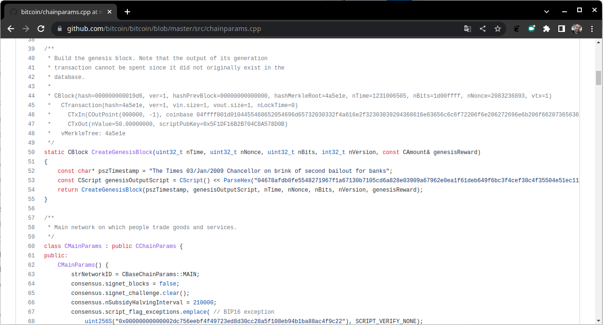
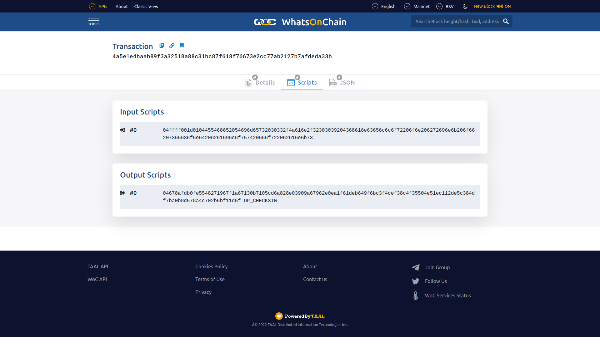
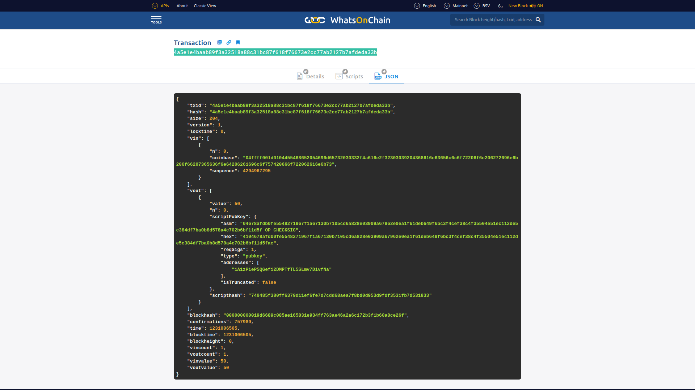
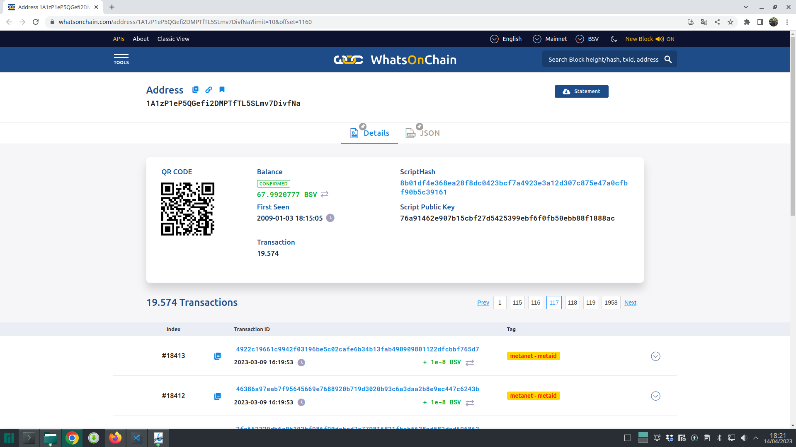
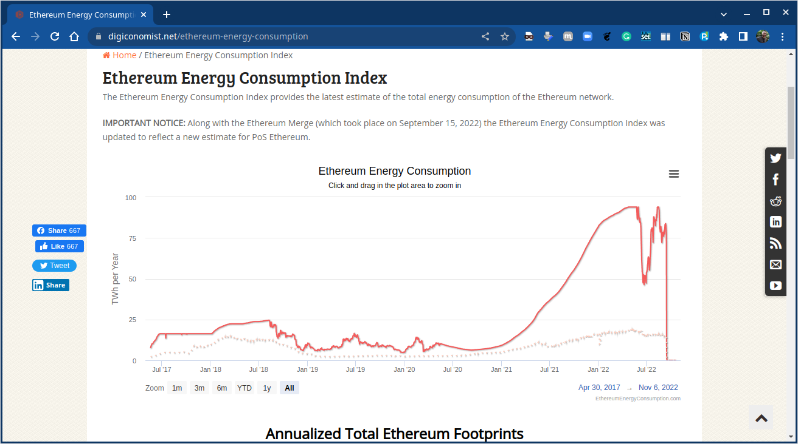
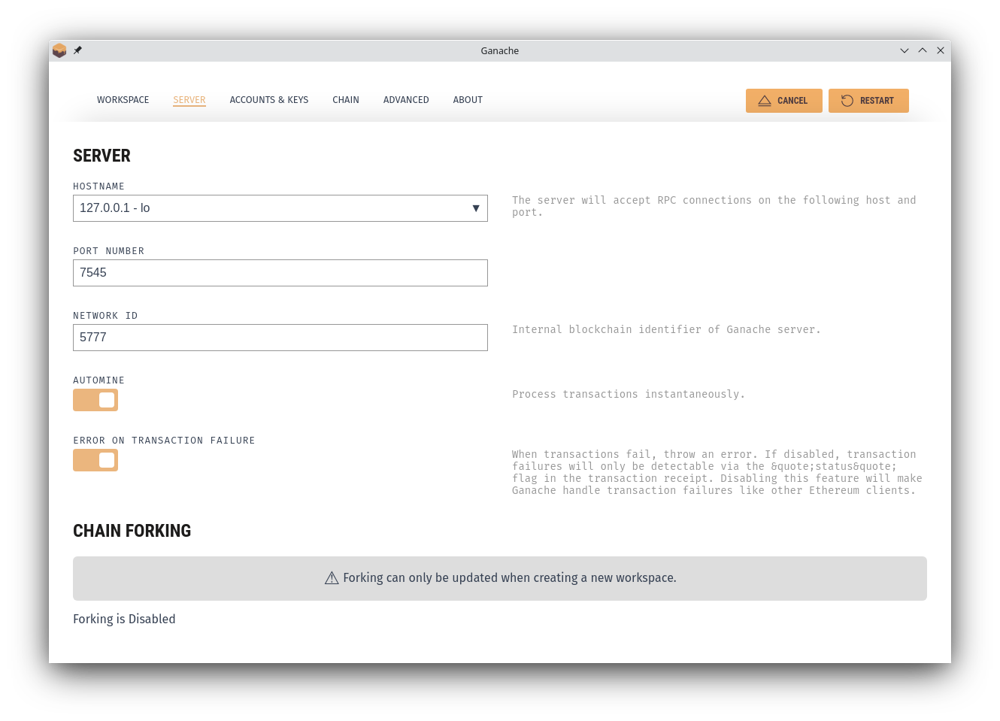
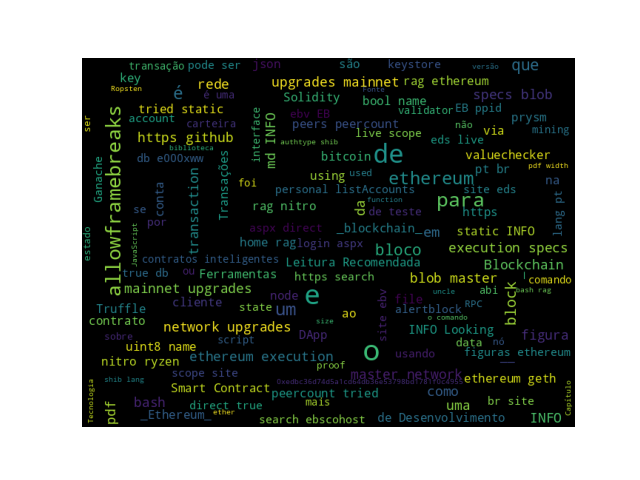

# Introdução

## Ministrante

[columns]

[column=0.4]

{width=70%}

[column=0.6]

Doutor em Ciência da Computação, é professor na UTFPR - Campus Campo Mourão. É revisor do journal Springer Computing e de algumas conferências. 
__Interesse em:__ Arquitetura de Computadores, Computação Paralela, Computação Heterogênea, Compiladores e Runtimes e Tecnologias Blockchain.

[/columns]

## Curso

[exampleblock]{Ementa}

Introdução às Tecnologias Blockchain. Smart Contracts. Ethereum e Solidity. Ferramentas de Desenvolvimento e Frameworks. Redes de Testes e Clientes. Introdução a Web3. Tokenização.

[/exampleblock]

[alertblock]{Pré-requisitos}

Saber um pouco de Java Script.

[/alertblock]

## Objetivos

* Apresentação de uma Visão Geral sobre o Ecossistema de Tecnologias relacionadas a __Blockchain__. Surgimento e contexto histórico vinculado ao _Bitcoin_. Mas o foco principal está na rede __Ethereum__ e componentes do seu Ecossistema. Falaremos um pouco sobre a __Ethereum Virtual Machine (EVM)_ e Contratos Nativos. Além disso, uma perspectiva do usuário é apresentada, mostrando a estrutura dos blocos do _blockchain_ da _Ethereum_, _Wallets_ e _softwares_ clientes, nós e mineradores, ferramentas e `APIs`, protocolos e Linguagens de Programação Suportados.

# Conceitos e Fundamentos de Blockchain

## Definição de Blockchain {.allowframebreaks .fragile}

[alertblock]{Definição de Layman}

_Blockchain is an ever-growing, secure, shared recordkeeping system in which each user of the data holds a copy of the records, which can only be updated if all parties involved in a transaction agree to update._

<!-- 
Blockchain é um sistema de manutenção de registros compartilhado, seguro e em constante crescimento, no qual cada usuário dos dados detém uma cópia dos registros, que só podem ser atualizados se todas as partes envolvidas em uma transação concordarem em atualizar.
-->

[/alertblock]

[alertblock]{Definição Técnica}

_Blockchain is a peer-to-peer distributed ledger that is cryptographically-secure, append-only, immutable (extremely hard to change), and updateable only via consensus or agreement among peers._

<!-- 
Blockchain é um livro-razão distribuído ponto a ponto que é criptograficamente seguro, somente anexo, imutável (extremamente difícil de alterar) e atualizável apenas por consenso ou acordo entre os pares.
-->

[/alertblock]

[framebreak]

* _Peer-to-peer_
* _Distributed Ledger_
* _Criptograficamente Seguro_
* _Append only (Permitido anexar novos blocos)_
* _Atualizável via consenso dos pares._

## Como a Tecnologia Blockchain foi desenvolvida {.allowframebreaks}

[columns]

[column=0.5]

__1950s__ – Hash functions

__1970s__ – Merkle trees - hashes in a tree structure

__1970s__ continued – Research in distributed systems, consensus, state machine replication

__1980s__ – Hash chains for secure logins

__1990s__ – _e-Cash for e-payments_

[column=0.5]

__1991__ – Secure timestamping of digital documents.

__1992__ – Hashcash idea to combat junk emails 

__1994__ – S/KEY application for Unix login. 

__1997/2002__ – _Hashcash_

__2008/2009__ – Bitcoin (the first blockchain)

[/columns]


## Interesse no termo "blockchain"

* Interesse ao longo do tempo ([Fonte: Google Trends](https://trends.google.com/trends/explore?date=2008-01-01%202023-04-14&q=blockchain&hl=pt-BR)):

{width=75%}


## Visão Arquitetural do Blockchain


## Estrutura Genérica de um Blockchain {.allowframebreaks}

{width=100%}


## Elementos Genéricos de um Blockchain {.allowframebreaks}

* Endereços
* Contas
* Transações
* Blocos
* Redes _Peer-to-peer_
* Scripting ou Linguagens de Programação
* Virtual machines
* Máquinas de Estado
* Nós (nodes)
* Contratos Inteligentes _(Smart contracts)_

## Como um Blockchain funciona {.allowframebreaks}


## Estrutura Genérica de um bloco {.allowframebreaks}

{width=60%}

<!--
## Benefícios e Limitações de um Blockchain

[columns]

[column=0.5]

__Benefícios__

Descentralização

Transparência

Confiança

Imutabilidade

Alta disponibilidade

Altamente Seguro

Simplificação de paradigmas atuais

Transações rápidas

Cost saving

[column=0.5]

__Limitações__ 

Escalabilidade

Adaptabilidade

Regulação

Tecnologia Relativamente Imatura

Privacidade

[/columns]

## Características Principais {.allowframebreaks}

* Consenso Distribuído

* Verificação de Transações

* Plataforma para _smart contracts_

* Transferência de valores entre pares

* Generação de criptomoedas

* Provedor de Segurança

* Imutabilidade

* Unicidade ou singularidade (Uniqueness)

## Atividade

[alertblock]{Leitura}

_Bitcoin paper_: [https://bitcoin.org/bitcoin.pdf](https://bitcoin.org/bitcoin.pdf)

[/alertblock]
-->

## Leitura Recomendada
\normalsize

[alertblock]{Leitura Recomendada}

__Capítulo 1: Blockchain 101__

**Livro**: [IMRAN BASHIR. Mastering Blockchain : Distributed Ledger Technology, Decentralization, and Smart Contracts Explained, 2nd Edition.](https://search.ebscohost.com/login.aspx?direct=true&db=e000xww&AN=1789486&lang=pt-br&site=eds-live&scope=site&ebv=EB&ppid=pp_8)

[/alertblock]

# Bitcoin

## Bitcoin na perspectiva de usuário {.allowframebreaks .fragile}

* Passos de como enviar e receber pagamentos:
  * A transação começa com um remetente assinando a transação com sua chave privada. 
  * A transação é serializada para que possa ser transmitida pela rede.
  * A transação é transmitida para a rede.
  * Mineradores que escutam transações pegam a transação.
  * A transação é verificada quanto à sua legitimidade pelos mineradores.
  * A transação é adicionada ao bloco candidato/proposto para mineração.
  * Uma vez minerado, o resultado é transmitido para todos os nós da rede _Bitcoin_.
  * Normalmente, neste momento, os usuários aguardam até seis confirmações para serem recebidas antes que uma transação seja considerada final; no entanto, uma transação pode ser considerada final na etapa anterior.
  * As confirmações servem como um mecanismo adicional para garantir que haja probabilidade muito baixa de uma transação ser revertida, mas, caso contrário, uma vez que um bloco minerado seja finalizado e anunciado, as transações dentro desse bloco serão finais nesse ponto.  

## Chaves Criptográficas {.allowframebreaks}

[columns]

[column=0.5]

* Private keys in Bitcoin 
  * Private keys are used to digitally sign the transactions, proving ownership of the bitcoins. 
* Public keys in Bitcoin 
  * Public keys are used by nodes to verify that the transaction has indeed been signed with the corresponding private key. 
* Addresses in Bitcoin 
  * A Bitcoin address is created by taking the corresponding public key of a private key and hashing it twice, first with the SHA256 algorithm and then with RIPEMD160. 
* Bitcoin addresses are encoded using __Base58Check__ encoding

[column=0.5]


[/columns]

## Geração de Endereços no Bitcoin {.allowframebreaks}

* Para gerar um endereço no __Bitcoin__, é usado um processo de $11$ etapas:

{width=90%}

## Transações {.allowframebreaks}

* A user/sender sends a transaction using wallet software or some other interface. 
* The transaction is signed using the sender's private key. 
* The transaction is broadcasted to the Bitcoin network using a flooding algorithm. 
* Mining nodes (miners) who are listening for the transactions verify and include this transaction in the next lock to be mined.
* Next, the mining starts. 
* Finally, the confirmations start to appear in the receiver's wallet. 

## Estrutura de dados de uma Transação {.allowframebreaks}

{width=100%}

## Estrutura de dados de uma Transação – entradas e saídas {.allowframebreaks}

{width=90%}


## Script {.allowframebreaks}

* Simple stack-based language used to describe how bitcoins can be spent and transferred
* Evaluated from left to right using a Last in, First Out (LIFO) stack
* Composed of two components: elements and operations. 
* Scripts use various operations (opcodes) to define their operations.

## Opcodes {.allowframebreaks}

* Here are some examples of a few useful opcodes used in the Script language on the Bitcoin blockchain.


## P2PKH script execution  {.allowframebreaks}

* P2PKH is the most commonly used transaction type and is used to send transactions to Bitcoin addresses.


## Validação de Transações {.allowframebreaks}

During validation, the following are checked:

* That transaction inputs are previously unspent. This validation step prevents double-spending by verifying that the transaction inputs have not already been spent by someone else.

* That the sum of the transaction outputs is not more than the total sum of the transaction inputs. However, both input and output sums can be the same, or the sum of the input (total value) could be more than the total value of the outputs. This check ensures that no new bitcoins are created out of thin air. 

* That that the digital signatures are valid, which ensures that the script is valid.

## Blocos {.allowframebreaks}

* A estrutura de um Bloco Bitcoin é mostrado na tabela:

{width=100%}

[framebreak]

* A estrutura do cabeçalho de um bloco:

{width=100%}


## Uma Visualização da Blockchain do Bitcoin {.allowframebreaks}

{width=100%}

## Bloco Genesis {.allowframebreaks .fragile}

[alertblock]{Bloco Genesis}

O Bloco Genesis ou bloco $\#0$ foi _hardcoded_ (codificado) por suas características especiais: ele é o único que não aponta para nenhum bloco anterior. No seu _hash_ foi encriptado o bloco junto com a mensagem _"The Times 03/Jan/2009 Chancellor on brink of second bailout for banks"_, manchete do jornal naquele dia. Além de servir como prova datada, a manchete escolhida representa justamente uma crítica ao sistema bancário.

[/alertblock]

[framebreak]

[columns]

[column=0.5]


[column=0.5]



\scriptsize
__Fonte:__ [https://github.com/bitcoin/bitcoin/blob/master/src/chainparams.cpp](https://github.com/bitcoin/bitcoin/blob/master/src/chainparams.cpp)

[/columns]

[framebreak]

\tiny
```.c++
/**
 * Build the genesis block. Note that the output of its generation
 * transaction cannot be spent since it did not originally exist in the
 * database.
 *
 * CBlock(hash=000000000019d6, ver=1, hashPrevBlock=00000000000000, hashMerkleRoot=4a5e1e, nTime=1231006505, nBits=1d00ffff, nNonce=2083236893, vtx=1)
 *   CTransaction(hash=4a5e1e, ver=1, vin.size=1, vout.size=1, nLockTime=0)
 *     CTxIn(COutPoint(000000, -1), coinbase 04ffff001d0104455468652054696d65732030332f4a616e2f32303039204368616e63656c6c6f72206f6e206272696e6b206f66207365636f6e64206261696c6f757420666f722062616e6b73)
 *     CTxOut(nValue=50.00000000, scriptPubKey=0x5F1DF16B2B704C8A578D0B)
 *   vMerkleTree: 4a5e1e
 */
static CBlock CreateGenesisBlock(uint32_t nTime, uint32_t nNonce, uint32_t nBits, int32_t nVersion, 
const CAmount& genesisReward)
{
  const char* pszTimestamp = "The Times 03/Jan/2009 Chancellor on brink of second bailout for banks";
  const CScript genesisOutputScript = CScript() << ParseHex("04678afdb0fe5548271967f1a67130b7105cd6a828e03909a67962e0ea1f61deb649f6bc3f4cef38c4f35504e51ec112de5c384df7ba0b8d578a4c702b6bf11d5f") << OP_CHECKSIG;
  return CreateGenesisBlock(pszTimestamp, genesisOutputScript, nTime, nNonce, nBits, nVersion, genesisReward);
}
```

\normalsize

[framebreak]

## A carteira de Satoshi {.allowframebreaks}

* Carteira: [`1A1zP1eP5QGefi2DMPTfTL5SLmv7DivfNa`](https://blockchair.com/bitcoin/address/1A1zP1eP5QGefi2DMPTfTL5SLmv7DivfNa)

](figuras/carteira-satoshi.png){width=90%}


* Essa primeira transação foi incluída no __bloco \#0__, sob o _hash_ [4a5e1e4baab89f3a32518a88c31bc87f618f76673e2cc77ab2127b7afdeda33b](https://whatsonchain.com/tx/4a5e1e4baab89f3a32518a88c31bc87f618f76673e2cc77ab2127b7afdeda33b).

](figuras/blockchain-com-tx-4a5e1e4baab89f3a32518a88c31bc87f618f76673e2cc77ab2127b7afdeda33b.png){width=90%}


](figuras/carteira-de-satoshi-1A1zP1eP5QGefi2DMPTfTL5SLmv7DivfNa.png){width=90%}

[framebreak]

* Detalhes da Transação:

](figuras/block-0-transaction-4a5e1e4baab89f3a32518a88c31bc87f618f76673e2cc77ab2127b7afdeda33b.png){width=90%}

[framebreak]

* Scripts
  
{width=90%}

[framebreak]

* `JSON`

{width=90%}

[framebreak]


{width=90%}

](figuras/carteira-satoshi-14-04-2023-02.png){width=90%}

## Quem é Satoshi Nakamoto? {.allowframebreaks .fragile}

](figuras/elon-musk-not-satoshi.png)

](figuras/dorian-nakamoto.png)

](figuras/linus-satoshi-01.png)

](figuras/linus-satoshi-02.png)

](figuras/steve-jobs-satoshi.png)


<!--
## Blocos Obsoletos e Orfãos {.allowframebreaks}

* Blocos obsoletos existem em uma cadeia mais curta, a partir da qual a cadeia principal progrediu.
* Os blocos pais de blocos órfãos são desconhecidos.


-->

## Tamanho do Blockchain do Bitcoin {.allowframebreaks}

* O _Blockchain_ do _Bitcoin_ tinha em __October 29, 2017__, aproximadamente: $139GB$

{ width=75% }

[framebreak]

* A figura mostra a evolução de __Aug 2017__ para __Jul 2020__. Aproximandamente, $286 GB$.

{ width=60% }

[framebreak]

* A figura mostra a evolução de __Jan 2009__ para __Set 2022__. Aproximandamente, $426.7 GB$.

{ width=75% }

* Fonte: [https://www.blockchain.com/charts/blocks-size](https://www.blockchain.com/charts/blocks-size)


* Tamanho em 14/04/2023: $472.9 GB$

](figuras/bitcoin-blockchain-size-14-04-2023.png)


## Mineração {.allowframebreaks}

[columns]

[column=0.5]

* Sincronização com a rede
* Validação de Transações
* Validação de Bloco
* Criação de novo bloco
* Executar a _Proof of Work (PoW)_
* Buscar Recompensa

[column=0.5]


[/columns]

## Mining systems 


## Leitura Recomendada
\normalsize

[alertblock]{Leitura Recomendada}

__Capítulo 5/6: Introduction Bitcoin__: [IMRAN BASHIR. Mastering Blockchain : Distributed Ledger Technology, Decentralization, and Smart Contracts Explained, 2nd Edition.](https://search.ebscohost.com/login.aspx?direct=true&db=e000xww&AN=1789486&authtype=shib&lang=pt-br&site=eds-live&scope=site&ebv=EB&ppid=pp_129)

[/alertblock]


# Smart Contracts (Contratos Inteligentes)

## Contratos Inteligentes {.allowframebreaks .fragile}

* Colocar definição
* Falar o que são
* Uso e utilidade
* Citando o artigo original
* Artigo Seminal

## Leitura Recomendada
\normalsize

[alertblock]{Leitura Recomendada}

[Capítulo 9/10: Smart Contracts](https://search.ebscohost.com/login.aspx?direct=true&db=e000xww&AN=1789486&lang=pt-br&site=eds-live&scope=site&ebv=EB&ppid=pp_261)

[/alertblock]


# Ethereum

## Ethereum – Overview {.allowframebreaks}

* Vitalik Buterin (https://vitalik.ca) conceitualizou Ethereum (https://ethereum.org) em Novembro de 2013. 
* A ideia central proposta foi o desenvolvimento de uma linguagem __Turing-completa__ para permitir o desenvolvimento de programas arbitrários (contratos inteligentes) para _blockchain_ e Aplicações Descentralizados (DApps). 
* Este conceito difere do _Bitcoin_, onde a linguagem de __script__ é limitada e permite apenas as operações necessárias.

![O [_Ethereum Yellow Paper_[^1]](https://ethereum.github.io/yellowpaper/paper.pdf)](figuras/yellow-paper.pdf)

[^1]: _Ethereum Yellow Paper_ - [https://ethereum.github.io/yellowpaper/paper.pdf](https://ethereum.github.io/yellowpaper/paper.pdf)

[framebreak]

* O [_Ethereum Yellow Paper_](https://ethereum.github.io/yellowpaper/paper.pdf) foi escrito por Dr. Gavin Wood, o fundador do _Ethereum_ e da Parity (<http://gavwood.com>), e serve como uma especificação formal do protocolo da *Ethereum*.
* Qualquer pessoa pode implementar um cliente Ethereum seguindo as especificações de protocolo definidas no artigo.


## Ethereum Releases {.allowframebreaks}

* A primeira versão da _Ethereum_, denominada __Olympic__, foi liberada em Maio de 2015. 
* Dois meses mais tarde, a versão chamada de __Frontier__ foi liberada em Julho. 
* Outra versão, a __Homestead__ com várias melhorias foi liberada em Março de 2016. 
* A release chamada de __Muir Glacier__, que atrasou a __difficulty bomb__ (<https://eips.ethereum.org/EIPS/eip-2384>).
* Um grande lançamento antes disso foi __Istambul__, que incluiu mudanças em torno de privacidade e dimensionamento
capacidades.
* Uma lista completa com todas as _releases_ anunciadas é mantida em <https://github.com/ethereum/go-ethereum/releases>.

## A Blockchain Ethereum {.allowframebreaks}

* O Ethereum, assim como qualquer outro _blockchain_, pode ser visualizado como uma máquina de estado baseada em transações.


* A ideia principal da _blockchain_ da _Ethereum_, um estado gênese é transformado em um estado final executando transações de forma incremental. 

* A transformação final é então aceita como a versão absoluta e indiscutível do estado. 
* A função de transição de estado _Ethereum_ é mostrada, onde a execução de uma transação resultou em uma transição de estado. 


## Ethereum – a user's perspective {.allowframebreaks}

* O caso de uso mais comum do rede _Ethereum_ é o envio e o recebimento de pagamentos.
* Para isso, o usuário assina a transação e a envia, que se propaga na rede, momento em que os mineradores a pegam, verificam e iniciam a Prova de Trabalho (PoW). 
* Se PoW for bem sucedida, o bloco com a transação é finalizado e propagado, e um novo bloco é adicionado à cadeia
* Para enviar e receber transações, um software de carteira é usado: por exemplo, carteiras são usadas em dispositivos móveis.

## Arquitetura de Alto Nível da Ethereum {.allowframebreaks}


## Rede Ethereum {.allowframebreaks}

A rede _Ethereum_ é uma rede _peer-to-peer_ onde os nós participantes mantem a _blockchain_ e contribuem para o mecanismo de consenso. As redes podem ser divididas em três tipos, com base nos requisitos e uso.


[block]{A mainnet}

A __mainnet__ é a atual rede _Ethereum_. Seu ID de rede é $1$ e seu ID de cadeia (_chain_) é também $1$. Os IDs de rede e de cadeia são usados para identificar a rede. Um explorador de blocos que mostra informações detalhadas sobre blocos e outras métricas relevantes estão disponíveis em <https://etherscan.io>, que pode ser usado para explorar a blockchain Ethereum.

[/block]

[alertblock]{Testnets}

Existem um número de redes de testes (testnets) disponíveis para _Ethereum_. 
Elas tem como objetivo fornecer um ambiente de testes para contratos inteligentes e DApps antes de serem implantados para produção na rede _blockchain_. Além disso, sendo redes de teste, elas permitem experimentos e pesquisa.
A principal testnet é chamada `Ropsten`, que contém todas as características de outras redes de propósito especial menores que foram criados para fins específicos. 
Por exemplo, outras redes de teste incluem `Kovan` e `Rinkeby`, que foram desenvolvidos para testar as versões do __Byzantium__. As mudanças que foram implementados nessas redes de teste menores também foram implementados em `Ropsten`. Agora
a rede de teste `Ropsten` contém todas as propriedades de `Kovan` e `Rinkeby`.

[/alertblock]

[exampleblock]{Redes Privadas}

As _private nets_ são redes privadas que podem ser criadas gerando-se um novo _genesis block_. Este é geralmente o caso em redes _blockchain_ privadas, onde um grupo privado de entidades iniciam sua rede _blockchain_ e a usam como uma blockchain autorizada ou de consórcio.

[/exampleblock]

## Elementos do Ecossistema Ethereum {.allowframebreaks}

* Chaves e Endereços
* Contas
* Transações e mensagens
* Criptomoeda/Tokens Ether
* A Ethereum Virtual Machine (EVM) 
* Smart contracts e contratos nativos.

## Tipos de contas {.allowframebreaks}

* **EOAs:** _Externally Owned Accounts_. Contas de usuários representadas por um endereço.
* **CAs:** *Contract accounts*. Criadas como resultado do _deployment_ de um contrato inteligente, também representado por um endereço.

## Transações e Árvore de Transações (trie) {.allowframebreaks}

[alertblock]{Transações}

Uma transação no _Ethereum_ consiste em vários campos, como mostrado aqui, junto com a _transaction trie_. O diagrama também mostra a relação entre a tentativa de transação e o cabeçalho do bloco.

[/alertblock]


## Tipos de Transações {.allowframebreaks}

* Existem três tipo de transações:
  * Criação de Contrato
  * _Call_
  * Transferência de Valor


O diagrama mostra a criação do contrato e as transações de chamada de mensagem, com campos obrigatórios.


## Estado da conta e armazenamento na trie {.allowframebreaks}

O diagrama mostra os campos contidos no estado da conta e como os vários elementos estão contidos no _world state_ trie:
* World state trie
  * State root 
  * Account state
    * Account storage trie 


## Recibos de Transações {.allowframebreaks}

* Recibos de Transações (transaction receipts) são gerados como resultado da execução de transações.
* Logs também são atualizados em conformidade.
* Ambas as estruturas de dados contêm vários campos, conforme mostrado abaixo:


## The Ethereum Virtual Environment (EVM) {.allowframebreaks}

* Stack size based on LIFO queue: Last In, First Out.
* 1024 stack depth limit
* Turing complete but limited by gas, making it quasi-Turing complete
* Big-endian design
* Storage available to EVM
  * Memory 
  * Storage
  * Stack

## EVM operation design {.allowframebreaks}


## Execution environment {.allowframebreaks}

[columns]

[column=0.5]

O ambiente de execução do _Ethereum_ consiste em vários elementos, como mostrado:

[column=0.5]

{width=50%}

[/columns]

## Machine State {.allowframebreaks}

Uma Máquina de Estado ou _Machine state_ é uma tupla compreendendo vários campos, como mostrado em:


## Contratos Nativos {.allowframebreaks}

Existem nove contratos pré-compilados ou contratos nativos na versão Ethereum Istanbul:
* *The elliptic curve public key recovery function*
* *The SHA-256-bit hash function* 
* *The RIPEMD-160-bit hash function* 
* *The identity/datacopy function* 
* *Big mod exponentiation function* 
* *Elliptic curve point addition function* 
* *Elliptic curve scalar multiplication* 
* *Elliptic curve pairing* 
* *Blake2 compression function 'F'* 

# Um pouco mais de Ethereum

## Outline {.allowframebreaks}

* Blocos e _Blockchain_
* Wallets e Software Clientes
* Nós e Mineradores
* APIs e ferramentas
* Protocolos suportados
* Linguagens de Programação

## Blocks e Blockchain {.allowframebreaks}

[columns]

[column=0.5]

Um bloco _Ethereum_ consiste em vários campos, conforme diagrama.
_State root, transaction root_ e _receipts root_ são _root hashes_ de suas respectivas árvores.

[column=0.5]


[/columns]


## Mecanismo de Validação de Blocos {.allowframebreaks}

The Ethereum block validation mechanism checks the following conditions:
  * If it is consistent with uncles and transactions. This means that all ommers satisfy the property that they are indeed uncles, and also if the Proof of Work (PoW) for uncles is valid. 
  * If the previous block (parent) exists and is valid. 
  * If the timestamp of the block is valid. This means that the current block's timestamp must be higher than the parent block's timestamp. Also, it should be less than 15 minutes into the future. All block times are calculated in epoch time (Unix time). 

If any of these checks fails, the block will be rejected. A list of errors for which the block can be rejected is presented here: 
  * The timestamp is older than the parent 
  * There are too many, or duplicate uncles   
  * The uncle is an ancestor, or the uncle’s parent is not an ancestor
  * There is non-positive difficulty 
  * There is an invalid mix digest or PoW

## Finalização de Bloco {.allowframebreaks}

Block finalization is a process that is run by miners to validate the contents of the block and apply rewards. It results in four steps being executed. These steps are described here:

1. __Ommers (uncles) validation.__ In the case of mining, determine ommers. The validation process of the headers of stale blocks checks whether the header is valid and whether the relationship between the uncle and the current block satisfies the maximum depth of six blocks. A block can contain a maximum of two uncles.

2. **Transaction validation.** In the case of mining, determine transactions. This process involves checking whether the total gas used in the block is equal to the final gas consumption after the final transaction, in other words, the cumulative gas used by the transactions included in the block.
   
3. **Reward application.** Apply rewards, which means updating the beneficiary's account with a reward balance. In Ethereum, a reward is also given to miners for stale blocks, which is 1/32 of the block reward. Uncles that are included in the blocks also receive 7/8 of the total block reward. The current block reward is 2 ether. It was reduced first from 5 ether to 3 with the Byzantium release of Ethereum. Later, in the Constantinople release (https://blog.ethereum.org/2019/02/22/ethereum-constantinople-st-petersburg-upgrade-announcement/), it was reduced further to 2 ether. A block can have a maximum of two uncles.
   
4. **State and nonce validation.** Verify the state and block nonce. In the case of mining, compute a valid state and block nonce.

## Mecanismo de Block difficulty {.allowframebreaks}

O mecanismo de dificuldade do bloco é representado pela fórmula abaixo, que garante que os blocos sejam produzidos a uma taxa constante:

$block\_diff = parent\_diff + parent\_diff //' 2048 * max(1 - (block\_timestamp - parent\_timestamp) // 10, -99) + int(2**((block.number // 100000) - 2))$

O _gas cost_ de uma transação pode ser calculado usando esta fórmula:

$Total cost = gasUsed * gasPrice$


## Consumo de Energia {.allowframebreaks}

* Com a última atualização `Merge` que trocaram a _Proof of Work_ (PoW) pela _Proof of Stake_ (PoS) tendo como uma das motivações a questão ambiental. Houve um grande impacto no consumo de energia.



## Wallets e Software Clientes {.allowframebreaks}

* Wallets 
* Light clients 
* Existem três tipos de sincronização de clientes:
  * **Full:** Nesse modo de sincronização, o cliente `Geth` faz um _download_ completo da *blockchain* para o nó local. Isso significa que ele obtém todos os cabeçalhos e corpos dos blocos e valida todas as transações e blocos desde o bloco _genesis_. No início de 2020, o tamanho do _blockchain_ Ethereum era de aproximadamente $210GB$, e baixar e manter isso pode ser um problema.
  * Hoje, 18 de outubro de 2022 o tamanho chega a $966.06GB$, segundo <https://ycharts.com/indicators/ethereum_chain_full_sync_data_size>.
  
  * **Fast:** Neste modo é feito o _download_ completo, mas somente recupera e verifica somente os $64$ blocos anteriores ao bloco corrente. Depois disso, ele verifica os novos blocos na íntegra. Não reproduz e verifica todas as transações históricas desde o bloco _genesis_, em vez disso, ele só faz os _downloads_ de estado. Isso também reduz significativamente o tamanho do disco do banco de dados _blockchain_. Este é o modo padrão de sincronização do cliente `Geth`.
  
  * **Light:** Este é o modo mais rápido e apenas baixa e armazena o estado atual. Nesse modo, o cliente não baixa nenhum bloco histórico e processa apenas os blocos mais novos.

## Ethereum keystore: Key decryption process {.allowframebreaks}

Os arquivos de chave pública e privada são armazenados no diretório keystore. Os arquivos de keystore Ethereum são arquivos JSON, cujo conteúdo se parece com o script abaixo.


[framebreak]

Key decryption process:


## MetaMask {.allowframebreaks}

`MetaMask` é uma carteira de criptomoedas e uma interface para redes _blockchain_ sem exigir a instalação de um nó local.

[columns]

[column=0.5]


[column=0.5]


[/columns]

## REMIX IDE {.allowframebreaks}

Ver Capítulo 13.

## Nós e Mineradores {.allowframebreaks}

A mineração é o processo pelo qual novos blocos são selecionados por meio de um mecanismo de consenso e adicionados ao _blockchain_. O processo segue os seguintes passos:
* It listens for the transactions broadcasted on the Ethereum network and determines the transactions to be processed. 
* It determines stale ommer blocks and includes them in the blockchain. 
* It updates the account balance with the reward earned from successfully mining the block.
* Finally, a valid state is computed and the block is finalized, which defines the result of all state transitions. 

## Ethash {.allowframebreaks}

`Ethash` é o nome do algoritmo de `Proof of Work` usado no `Ethereum`.
1. First, the header from the previous block and a 32-bit random nonce is combined using Keccak-256. 
2. This produces a 128-bit structure called `mix`. 
3. `mix` determines which data is to be picked up from the DAG. 
4. Once the data is fetched from the DAG, it is "mixed" with the mix to produce the next mix, which is then again used to fetch data from the DAG and subsequently mixed. This process is repeated 64 times. 
5. Eventually, the 64th mix is run through a digest function to produce a 32-byte sequence. 
6. This sequence is compared with the difficulty target. If it is less than the difficulty target, the nonce is valid, and the PoW is solved. As a result, the block is mined. If not, then the algorithm repeats with a new nonce. 

## Mineração {.allowframebreaks}

* **CPU:** Mining using a computer’s built in CPU.
* **GPU:** Mining using graphical processing units, which provide better performance as compared to CPUs.
* **ASICs:** Specialized hardware—Application-Specific Integrated Circuit designed solely to run mining algorithms. These are currently the most efficient mining tools.
* Mining pools: In mining pools, resources are shared between miners and rewards are split accordingly.

## Protocolos Suportados {.allowframebreaks}

Dois principais protocolos de suporte, `Swarm` e `Whisper`, são usados para fornecer armazenamento e mensagens descentralizadas, a fim de criar um ecossistema descentralizado completo.


## Linguagens de Programação {.allowframebreaks}

* **Solidity** is one of the high-level languages that has been developed for Ethereum. It uses JavaScript-like syntax to write code for smart contracts. Once the code is written, it is compiled into bytecode that's understandable by the EVM using the Solidity compiler called solc. 
* **LLL** is another language that is used to write smart contract code. 
* **Serpent** is a Python-like, high-level language that can be used to write smart contracts for Ethereum. 
* **Vyper** is a newer language that has been developed from scratch to achieve a secure, simple, and auditable language.

## Atividade

* Leitura do `Ethereum yellow paper`: <https://ethereum.github.io/yellowpaper/paper.pdf>
* Instalação do `Geth` e executar ele com a `Kovan testnet`.

## Leitura Recomendada
\normalsize

[alertblock]{Leitura Recomendada}

__Capítulo 11: Ethereum 101__

**Livro**: [IMRAN BASHIR. Mastering Blockchain : Distributed Ledger Technology, Decentralization, and Smart Contracts Explained, 2nd Edition.](https://search.ebscohost.com/login.aspx?direct=true&db=e000xww&AN=1789486&authtype=shib&lang=pt-br&site=eds-live&scope=site&ebv=EB&ppid=pp_276)

__Capítulo 12: Futher Ethereum__

**Livro**: [IMRAN BASHIR. Mastering Blockchain : Distributed Ledger Technology, Decentralization, and Smart Contracts Explained, 2nd Edition.](https://search.ebscohost.com/login.aspx?direct=true&db=e000xww&AN=1789486&authtype=shib&lang=pt-br&site=eds-live&scope=site&ebv=EB&ppid=pp_310)

[/alertblock]


# Prática sobre Ethereum

## Prática sobre Ethereum {.allowframebreaks .fragile}

# Leitura do Capítulo 12: _Futher Ethereum_

1. Faça a leitura do [Capítulo 12: _Futher Ethereum_](https://search.ebscohost.com/login.aspx?direct=true&db=e000xww&AN=1789486&authtype=shib&lang=pt-br&site=eds-live&scope=site&ebv=EB&ppid=pp_310)
   
2. Instalar as ferramentas e testar os comandos apresentados no capítulo.
   
O cliente padrão `Geth` pode ser instalado em sistema derivados do Ubuntu:

```bash
$ sudo apt-get install -y software-properties-common
$ sudo add-apt-repository -y ppa:ethereum/ethereum
$ sudo apt-get update
$ sudo apt-get install -y ethereum
```

Em outros Sistemas como o `Manjaro`:

```bash
[rag@nitro-ryzen ~]$ sudo pacaur -Ss ethereum
community/go-ethereum 1.10.25-1 [instalado]
    Official Go implementation of the Ethereum protocol
[rag@nitro-ryzen ~]$ sudo pacaur -S go-ethereum
[rag@nitro-ryzen ~]$ pacaur -S go-ethereum
resolvendo dependencias...
procurando pacotes conflitantes...

Pacotes (1) go-ethereum-1.10.25-1

Tamanho total instalado:  197,38 MiB
Alteração no tamanho:       0,00 MiB

:: Continuar a instalação? [S/n]
```

Instruções para outros Sistemas Operacionais podem ser encontradas no site oficial da documentação do `Ethereum` <https://geth.ethereum.org/docs/install-and-build/installing-geth>.

Executando o `Geth` diretamente ele irá sincronizar com a rede principal do `Ethereum`, a `mainnet`.


```bash
[rag@nitro-ryzen ~]$ geth
INFO [10-20|21:07:12.911] Starting Geth on Ethereum mainnet... 
INFO [10-20|21:07:12.912] Bumping default cache on mainnet         provided=1024 updated=4096
INFO [10-20|21:07:12.914] Maximum peer count                       ETH=50 LES=0 total=50
INFO [10-20|21:07:12.915] Smartcard socket not found, disabling    err="stat /run/pcscd/pcscd.comm: no such file or directory"
INFO [10-20|21:07:12.920] Set global gas cap                       cap=50,000,000
INFO [10-20|21:07:12.922] Allocated trie memory caches             clean=614.00MiB dirty=1024.00MiB
INFO [10-20|21:07:12.923] Allocated cache and file handles         database=/home/rag/.ethereum/geth/chaindata cache=2.00GiB handles=262,144
INFO [10-20|21:07:12.946] Opened ancient database                  database=/home/rag/.ethereum/geth/chaindata/ancient/chain readonly=false
INFO [10-20|21:07:12.950]  
INFO [10-20|21:07:12.950] -----------------------------------------------------------------------------------
INFO [10-20|21:07:12.950] Chain ID:  1 (mainnet) 
INFO [10-20|21:07:12.950] Consensus: Beacon (proof-of-stake), merged from Ethash (proof-of-work) 
INFO [10-20|21:07:12.950]  
INFO [10-20|21:07:12.950] Pre-Merge hard forks: 
INFO [10-20|21:07:12.950]  - Homestead:                   1150000  (https://github.com/ethereum/execution-specs/blob/master/network-upgrades/mainnet-upgrades/homestead.md) 
INFO [10-20|21:07:12.950]  - DAO Fork:                    1920000  (https://github.com/ethereum/execution-specs/blob/master/network-upgrades/mainnet-upgrades/dao-fork.md) 
INFO [10-20|21:07:12.950]  - Tangerine Whistle (EIP 150): 2463000  (https://github.com/ethereum/execution-specs/blob/master/network-upgrades/mainnet-upgrades/tangerine-whistle.md) 
INFO [10-20|21:07:12.950]  - Spurious Dragon/1 (EIP 155): 2675000  (https://github.com/ethereum/execution-specs/blob/master/network-upgrades/mainnet-upgrades/spurious-dragon.md) 
INFO [10-20|21:07:12.950]  - Spurious Dragon/2 (EIP 158): 2675000  (https://github.com/ethereum/execution-specs/blob/master/network-upgrades/mainnet-upgrades/spurious-dragon.md) 
INFO [10-20|21:07:12.950]  - Byzantium:                   4370000  (https://github.com/ethereum/execution-specs/blob/master/network-upgrades/mainnet-upgrades/byzantium.md) 
INFO [10-20|21:07:12.950]  - Constantinople:              7280000  (https://github.com/ethereum/execution-specs/blob/master/network-upgrades/mainnet-upgrades/constantinople.md) 
INFO [10-20|21:07:12.950]  - Petersburg:                  7280000  (https://github.com/ethereum/execution-specs/blob/master/network-upgrades/mainnet-upgrades/petersburg.md) 
INFO [10-20|21:07:12.950]  - Istanbul:                    9069000  (https://github.com/ethereum/execution-specs/blob/master/network-upgrades/mainnet-upgrades/istanbul.md) 
INFO [10-20|21:07:12.950]  - Muir Glacier:                9200000  (https://github.com/ethereum/execution-specs/blob/master/network-upgrades/mainnet-upgrades/muir-glacier.md) 
INFO [10-20|21:07:12.950]  - Berlin:                      12244000 (https://github.com/ethereum/execution-specs/blob/master/network-upgrades/mainnet-upgrades/berlin.md) 
INFO [10-20|21:07:12.950]  - London:                      12965000 (https://github.com/ethereum/execution-specs/blob/master/network-upgrades/mainnet-upgrades/london.md) 
INFO [10-20|21:07:12.950]  - Arrow Glacier:               13773000 (https://github.com/ethereum/execution-specs/blob/master/network-upgrades/mainnet-upgrades/arrow-glacier.md) 
INFO [10-20|21:07:12.950]  - Gray Glacier:                15050000 (https://github.com/ethereum/execution-specs/blob/master/network-upgrades/mainnet-upgrades/gray-glacier.md) 
INFO [10-20|21:07:12.950]  
INFO [10-20|21:07:12.950] Merge configured: 
INFO [10-20|21:07:12.950]  - Hard-fork specification:    https://github.com/ethereum/execution-specs/blob/master/network-upgrades/mainnet-upgrades/paris.md 
INFO [10-20|21:07:12.950]  - Network known to be merged: true 
INFO [10-20|21:07:12.950]  - Total terminal difficulty:  58750000000000000000000 
INFO [10-20|21:07:12.950]  - Merge netsplit block:       <nil> 
INFO [10-20|21:07:12.950] --------------------------------------------------------------------------------------
INFO [10-20|21:07:12.950]  
INFO [10-20|21:07:12.952] Disk storage enabled for ethash caches   dir=/home/rag/.ethereum/geth/ethash count=3
INFO [10-20|21:07:12.952] Disk storage enabled for ethash DAGs     dir=/home/rag/.ethash               count=2
INFO [10-20|21:07:12.952] Initialising Ethereum protocol           network=1 dbversion=8
INFO [10-20|21:07:12.963] Loaded most recent local header          number=0 hash=d4e567..cb8fa3 td=17,179,869,184 age=53y6mo3w
INFO [10-20|21:07:12.963] Loaded most recent local full block      number=0 hash=d4e567..cb8fa3 td=17,179,869,184 age=53y6mo3w
INFO [10-20|21:07:12.963] Loaded most recent local fast block      number=0 hash=d4e567..cb8fa3 td=17,179,869,184 age=53y6mo3w
INFO [10-20|21:07:12.964] Loaded local transaction journal         transactions=0 dropped=0
INFO [10-20|21:07:12.964] Regenerated local transaction journal    transactions=0 accounts=0
INFO [10-20|21:07:12.965] Chain post-merge, sync via beacon client 
INFO [10-20|21:07:12.965] Gasprice oracle is ignoring threshold set threshold=2
WARN [10-20|21:07:12.965] Engine API enabled                       protocol=eth
INFO [10-20|21:07:12.966] Starting peer-to-peer node               instance=Geth/v1.10.25-stable-69568c55/linux-amd64/go1.19.1
INFO [10-20|21:07:12.991] New local node record                    seq=1,665,519,113,919 id=da440578e33a2ce7 ip=127.0.0.1 udp=30303 tcp=30303
INFO [10-20|21:07:12.992] Started P2P networking                   self=enode://9ae8fcdad4a7243d1bd2308a159c5800ec170e588862be110152627c9ed3fa67376ef8c7526d7a56e9bb72da729cf792c7bef86c095471995cc352f9e353acfc@127.0.0.1:30303
INFO [10-20|21:07:12.993] IPC endpoint opened                      url=/home/rag/.ethereum/geth.ipc
INFO [10-20|21:07:12.993] Loaded JWT secret file                   path=/home/rag/.ethereum/geth/jwtsecret crc32=0xdeccafe4
INFO [10-20|21:07:12.994] WebSocket enabled                        url=ws://127.0.0.1:8551
INFO [10-20|21:07:12.994] HTTP server started                      endpoint=127.0.0.1:8551 auth=true prefix= cors=localhost vhosts=localhost
INFO [10-20|21:07:16.251] New local node record                    seq=1,665,519,113,920 id=da440578e33a2ce7 ip=187.95.110.26 udp=2770  tcp=30303
INFO [10-20|21:07:22.992] Looking for peers                        peercount=0 tried=2 static=0
INFO [10-20|21:07:32.994] Looking for peers                        peercount=0 tried=3 static=0
INFO [10-20|21:07:43.205] Looking for peers                        peercount=0 tried=9 static=0
WARN [10-20|21:07:47.967] Post-merge network, but no beacon client seen. Please launch one to follow the chain! 
INFO [10-20|21:07:53.281] Looking for peers                        peercount=0 tried=13 static=0
INFO [10-20|21:08:03.346] Looking for peers                        peercount=0 tried=9  static=0
```

Criando uma nova conta:

```bash
[rag@nitro-ryzen ~]$ geth account new
INFO [10-20|21:13:44.948] Maximum peer count                       ETH=50 LES=0 total=50
INFO [10-20|21:13:44.949] Smartcard socket not found, disabling    err="stat /run/pcscd/pcscd.comm: no such file or directory"
Your new account is locked with a password. Please give a password. Do not forget this password.
Password: 
Repeat password: 

Your new key was generated

Public address of the key:   0x668a07cAf4f4b2A5939051d25DA2334a4c425599
Path of the secret key file: /home/rag/.ethereum/keystore/UTC--2022-10-21T00-14-13.552574058Z--668a07caf4f4b2a5939051d25da2334a4c425599

- You can share your public address with anyone. Others need it to interact with you.
- You must NEVER share the secret key with anyone! The key controls access to your funds!
- You must BACKUP your key file! Without the key, it's impossible to access account funds!
- You must REMEMBER your password! Without the password, it's impossible to decrypt the key!

[rag@nitro-ryzen ~]$ 

```
As contas existentes ou que foram criadas podem ser listadas com o comando:

```bash
[rag@nitro-ryzen ~]$ geth account list
INFO [10-20|21:15:41.981] Maximum peer count                       ETH=50 LES=0 total=50
INFO [10-20|21:15:41.982] Smartcard socket not found, disabling    err="stat /run/pcscd/pcscd.comm: no such file or directory"
INFO [10-20|21:15:41.982] Set global gas cap                       cap=50,000,000
Account #0: {668a07caf4f4b2a5939051d25da2334a4c425599} keystore:///home/rag/.ethereum/keystore/UTC--2022-10-21T00-14-13.552574058Z--668a07caf4f4b2a5939051d25da2334a4c425599
[rag@nitro-ryzen ~]$
```

A documentação, bem como comandos e parâmetros podem ser acessados em <https://geth.ethereum.org/docs>

Executando com opção de responder a comandos via `RPC`. A documentação desta parte está disponível em <https://geth.ethereum.org/docs/rpc/server>.

```bash
[rag@nitro-ryzen ~]$ geth --mainnet --syncmode snap --http --http.addr 127.0.0.1 --http.port 8559 --http.api "eth,net,web3,personal"
INFO [10-20|21:57:05.774] Starting Geth on Ethereum mainnet... 
INFO [10-20|21:57:05.775] Bumping default cache on mainnet         provided=1024 updated=4096
INFO [10-20|21:57:05.777] Maximum peer count                       ETH=50 LES=0 total=50
INFO [10-20|21:57:05.779] Smartcard socket not found, disabling    err="stat /run/pcscd/pcscd.comm: no such file or directory"
INFO [10-20|21:57:05.784] Set global gas cap                       cap=50,000,000
INFO [10-20|21:57:05.815] Allocated trie memory caches             clean=614.00MiB dirty=1024.00MiB
INFO [10-20|21:57:05.815] Allocated cache and file handles         database=/home/rag/.ethereum/geth/chaindata cache=2.00GiB handles=262,144
INFO [10-20|21:57:05.840] Opened ancient database                  database=/home/rag/.ethereum/geth/chaindata/ancient/chain readonly=false
INFO [10-20|21:57:06.054]  
INFO [10-20|21:57:06.055] --------------------------------------------------------------------------------------
INFO [10-20|21:57:06.055] Chain ID:  1 (mainnet) 
INFO [10-20|21:57:06.055] Consensus: Beacon (proof-of-stake), merged from Ethash (proof-of-work) 
INFO [10-20|21:57:06.055]  
INFO [10-20|21:57:06.055] Pre-Merge hard forks: 
INFO [10-20|21:57:06.055]  - Homestead:                   1150000  (https://github.com/ethereum/execution-specs/blob/master/network-upgrades/mainnet-upgrades/homestead.md) 
INFO [10-20|21:57:06.055]  - DAO Fork:                    1920000  (https://github.com/ethereum/execution-specs/blob/master/network-upgrades/mainnet-upgrades/dao-fork.md) 
INFO [10-20|21:57:06.055]  - Tangerine Whistle (EIP 150): 2463000  (https://github.com/ethereum/execution-specs/blob/master/network-upgrades/mainnet-upgrades/tangerine-whistle.md) 
INFO [10-20|21:57:06.055]  - Spurious Dragon/1 (EIP 155): 2675000  (https://github.com/ethereum/execution-specs/blob/master/network-upgrades/mainnet-upgrades/spurious-dragon.md) 
INFO [10-20|21:57:06.055]  - Spurious Dragon/2 (EIP 158): 2675000  (https://github.com/ethereum/execution-specs/blob/master/network-upgrades/mainnet-upgrades/spurious-dragon.md) 
INFO [10-20|21:57:06.055]  - Byzantium:                   4370000  (https://github.com/ethereum/execution-specs/blob/master/network-upgrades/mainnet-upgrades/byzantium.md) 
INFO [10-20|21:57:06.055]  - Constantinople:              7280000  (https://github.com/ethereum/execution-specs/blob/master/network-upgrades/mainnet-upgrades/constantinople.md) 
INFO [10-20|21:57:06.055]  - Petersburg:                  7280000  (https://github.com/ethereum/execution-specs/blob/master/network-upgrades/mainnet-upgrades/petersburg.md) 
INFO [10-20|21:57:06.055]  - Istanbul:                    9069000  (https://github.com/ethereum/execution-specs/blob/master/network-upgrades/mainnet-upgrades/istanbul.md) 
INFO [10-20|21:57:06.055]  - Muir Glacier:                9200000  (https://github.com/ethereum/execution-specs/blob/master/network-upgrades/mainnet-upgrades/muir-glacier.md) 
INFO [10-20|21:57:06.055]  - Berlin:                      12244000 (https://github.com/ethereum/execution-specs/blob/master/network-upgrades/mainnet-upgrades/berlin.md) 
INFO [10-20|21:57:06.055]  - London:                      12965000 (https://github.com/ethereum/execution-specs/blob/master/network-upgrades/mainnet-upgrades/london.md) 
INFO [10-20|21:57:06.055]  - Arrow Glacier:               13773000 (https://github.com/ethereum/execution-specs/blob/master/network-upgrades/mainnet-upgrades/arrow-glacier.md) 
INFO [10-20|21:57:06.055]  - Gray Glacier:                15050000 (https://github.com/ethereum/execution-specs/blob/master/network-upgrades/mainnet-upgrades/gray-glacier.md) 
INFO [10-20|21:57:06.055]  
INFO [10-20|21:57:06.055] Merge configured: 
INFO [10-20|21:57:06.055]  - Hard-fork specification:    https://github.com/ethereum/execution-specs/blob/master/network-upgrades/mainnet-upgrades/paris.md 
INFO [10-20|21:57:06.055]  - Network known to be merged: true 
INFO [10-20|21:57:06.055]  - Total terminal difficulty:  58750000000000000000000 
INFO [10-20|21:57:06.055]  - Merge netsplit block:       <nil> 
INFO [10-20|21:57:06.055] --------------------------------------------------------------------------------------
INFO [10-20|21:57:06.055]  
INFO [10-20|21:57:06.055] Disk storage enabled for ethash caches   dir=/home/rag/.ethereum/geth/ethash count=3
INFO [10-20|21:57:06.055] Disk storage enabled for ethash DAGs     dir=/home/rag/.ethash               count=2
INFO [10-20|21:57:06.056] Initialising Ethereum protocol           network=1 dbversion=8
INFO [10-20|21:57:06.068] Loaded most recent local header          number=0 hash=d4e567..cb8fa3 td=17,179,869,184 age=53y6mo3w
INFO [10-20|21:57:06.068] Loaded most recent local full block      number=0 hash=d4e567..cb8fa3 td=17,179,869,184 age=53y6mo3w
INFO [10-20|21:57:06.068] Loaded most recent local fast block      number=0 hash=d4e567..cb8fa3 td=17,179,869,184 age=53y6mo3w
INFO [10-20|21:57:06.069] Loaded local transaction journal         transactions=0 dropped=0
INFO [10-20|21:57:06.069] Regenerated local transaction journal    transactions=0 accounts=0
INFO [10-20|21:57:06.069] Chain post-merge, sync via beacon client 
INFO [10-20|21:57:06.069] Gasprice oracle is ignoring threshold set threshold=2
WARN [10-20|21:57:06.070] Engine API enabled                       protocol=eth
INFO [10-20|21:57:06.073] Starting peer-to-peer node               instance=Geth/v1.10.25-stable-69568c55/linux-amd64/go1.19.1
INFO [10-20|21:57:06.095] New local node record                    seq=1,665,519,113,934 id=da440578e33a2ce7 ip=127.0.0.1 udp=30303 tcp=30303
INFO [10-20|21:57:06.096] Started P2P networking                   self=enode://9ae8fcdad4a7243d1bd2308a159c5800ec170e588862be110152627c9ed3fa67376ef8c7526d7a56e9bb72da729cf792c7bef86c095471995cc352f9e353acfc@127.0.0.1:30303
INFO [10-20|21:57:06.097] IPC endpoint opened                      url=/home/rag/.ethereum/geth.ipc
INFO [10-20|21:57:06.098] Loaded JWT secret file                   path=/home/rag/.ethereum/geth/jwtsecret crc32=0xdeccafe4
INFO [10-20|21:57:06.098] HTTP server started                      endpoint=127.0.0.1:8559 auth=false prefix= cors= vhosts=localhost
INFO [10-20|21:57:06.099] WebSocket enabled                        url=ws://127.0.0.1:8551
INFO [10-20|21:57:06.099] HTTP server started                      endpoint=127.0.0.1:8551 auth=true  prefix= cors=localhost vhosts=localhost
INFO [10-20|21:57:15.361] New local node record                    seq=1,665,519,113,935 id=da440578e33a2ce7 ip=187.95.110.26 udp=32871 tcp=30303
INFO [10-20|21:57:16.097] Looking for peers                        peercount=0 tried=2 static=0
INFO [10-20|21:57:26.262] Looking for peers                        peercount=0 tried=9 static=0
INFO [10-20|21:57:36.278] Looking for peers                        peercount=1 tried=6 static=0
WARN [10-20|21:57:41.071] Post-merge network, but no beacon client seen. Please launch one to follow the chain! 
INFO [10-20|21:57:46.410] Looking for peers                        peercount=1 tried=13 static=0
INFO [10-20|21:57:56.453] Looking for peers                        peercount=1 tried=11 static=0
WARN [10-20|21:57:57.257] Snapshot extension registration failed   peer=88f932f1 err="peer connected on snap without compatible eth support"
INFO [10-20|21:58:06.562] Looking for peers                        peercount=1 tried=12 static=0
INFO [10-20|21:58:16.663] Looking for peers                        peercount=1 tried=18 static=0
INFO [10-20|21:58:26.782] Looking for peers                        peercount=1 tried=13 static=0
INFO [10-20|21:58:36.839] Looking for peers                        peercount=1 tried=8  static=0
INFO [10-20|21:58:46.845] Looking for peers                        peercount=1 tried=7  static=0
INFO [10-20|21:58:56.920] Looking for peers                        peercount=1 tried=17 static=0
INFO [10-20|21:59:06.974] Looking for peers                        peercount=1 tried=9  static=0
INFO [10-20|21:59:16.997] Looking for peers                        peercount=1 tried=8  static=0
INFO [10-20|21:59:27.042] Looking for peers                        peercount=1 tried=11 static=0
INFO [10-20|21:59:37.100] Looking for peers                        peercount=1 tried=10 static=0
INFO [10-20|21:59:47.102] Looking for peers                        peercount=1 tried=4  static=0
INFO [10-20|21:59:57.232] Looking for peers                        peercount=1 tried=15 static=0
INFO [10-20|22:00:07.251] Looking for peers                        peercount=1 tried=5  static=0
INFO [10-20|22:00:17.284] Looking for peers                        peercount=1 tried=8  static=0
INFO [10-20|22:00:27.336] Looking for peers                        peercount=1 tried=11 static=0
```

Executando o console JavaScript:

O console `Javascript` pode também ser conectado ao nó `Geth` usando `IPC`. Quando o `Geth` é iniciado, um arquivo `geth.ipc` é criado automaticamente e salvo no diretório de dados. Este arquivo ou um caminho customizado para um arquivo IPC pode ser passado para o `Geth` usando o parâmetro `attach`:

```bash
[rag@nitro-ryzen ~]$ geth attach /home/rag/.ethereum/geth.ipc
Welcome to the Geth JavaScript console!

instance: Geth/v1.10.25-stable-69568c55/linux-amd64/go1.19.1
coinbase: 0x668a07caf4f4b2a5939051d25da2334a4c425599
at block: 0 (Wed Dec 31 1969 21:00:00 GMT-0300 (-03))
 datadir: /home/rag/.ethereum
 modules: admin:1.0 debug:1.0 engine:1.0 eth:1.0 ethash:1.0 miner:1.0 net:1.0 personal:1.0 rpc:1.0 txpool:1.0 web3:1.0

To exit, press ctrl-d or type exit
>
```

O comando verifica se a rede está funcionando:

```bash
[rag@nitro-ryzen ~]$ geth attach /home/rag/.ethereum/geth.ipc
Welcome to the Geth JavaScript console!

instance: Geth/v1.10.25-stable-69568c55/linux-amd64/go1.19.1
coinbase: 0x668a07caf4f4b2a5939051d25da2334a4c425599
at block: 0 (Wed Dec 31 1969 21:00:00 GMT-0300 (-03))
 datadir: /home/rag/.ethereum
 modules: admin:1.0 debug:1.0 engine:1.0 eth:1.0 ethash:1.0 miner:1.0 net:1.0 personal:1.0 rpc:1.0 txpool:1.0 web3:1.0

To exit, press ctrl-d or type exit
> net.listening
true

```

A mesma verificação pode ser feita via `RPC` `JSON`:

```bash
[rag@nitro-ryzen ~]$ curl -X POST --insecure -H "Content-Type: application/json" --data '{"jsonrpc":"2.0", "method":"net_listening","params":[], "id":64}' http://localhost:8559
{"jsonrpc":"2.0","id":64,"result":true}

```

```bash
curl -X POST --insecure --header "Content-Type: application/json" --data '{"jsonrpc":"2.0", "method":"net_listening","params":[], "id":64}' --location http://localhost:8559
{"jsonrpc":"2.0","id":64,"result":true}

```


### Listar as Contas

A lista de contas (_personal_listAccounts: eturns all the Ethereum account addresses of all keys in the key store_), pode ser obtida através dos comandos no console `personal.listAccounts`e por `RPC` `{"method": "personal_listAccounts", "params": []}`.

```bash
[rag@nitro-ryzen ~]$ geth attach /home/rag/.ethereum/geth.ipc
Welcome to the Geth JavaScript console!

instance: Geth/v1.10.25-stable-69568c55/linux-amd64/go1.19.1
coinbase: 0x668a07caf4f4b2a5939051d25da2334a4c425599
at block: 0 (Wed Dec 31 1969 21:00:00 GMT-0300 (-03))
 datadir: /home/rag/.ethereum
 modules: admin:1.0 debug:1.0 engine:1.0 eth:1.0 ethash:1.0 miner:1.0 net:1.0 personal:1.0 rpc:1.0 txpool:1.0 web3:1.0

To exit, press ctrl-d or type exit
> personal.listAccounts
["0x668a07caf4f4b2a5939051d25da2334a4c425599"]
> 
```

O comando para listar as contas em `RPC`:

```bash
[rag@nitro-ryzen ~]$ curl -X POST --insecure -H "Content-Type: application/json" --data '{"jsonrpc":"2.0","method":"eth_accounts","params":[], "id":64}' http://localhost:8559
{"jsonrpc":"2.0","id":64,"result":["0x668a07caf4f4b2a5939051d25da2334a4c425599"]}
```

Outros comandos podem ser executados da mesma maneira via console ou invocação `RPC`.

```bash
curl -X POST --insecure  --header "Content-Type: application/json"  --data '{"jsonrpc":"2.0","method":"web3_version","params":[],"id":67}' --location http://localhost:8559
{"jsonrpc":"2.0","id":67,"error":{"code":-32601,"message":"the method web3_version does not exist/is not available"}}

```

#########

Colocar esse link da API RPC: <https://ethereum.org/en/developers/docs/apis/json-rpc/>

[rogerio@ryzen-nitro ~]$ curl -X POST --insecure  --header "Content-Type: application/json" --data '{"jsonrpc":"2.0","method":"web3_clientVersion","params":[],"id":67}' --location http://localhost:8559
{"jsonrpc":"2.0","id":67,"result":"Geth/v1.11.5-stable-a38f4108/linux-amd64/go1.20.2"}


Versão da Rede:

The full list of current network IDs is available at <chainlist.org>. Some common ones are: 1: Ethereum Mainnet 2: Morden testnet (now deprecated) 3: Ropsten testnet 4: Rinkeby testnet 5: Goerli testnet

[rogerio@ryzen-nitro ~]$ curl -X POST --header "Content-Type: application/json"  --data '{"jsonrpc":"2.0","method":"net_version","params":[],"id":67}' --location http://localhost:8559
{"jsonrpc":"2.0","id":67,"result":"5"}

Tem uma figura do site.


# Ambiente e Ferramentas de Desenvolvimento

* Apresentação do Ambiente de Desenvolvimento para _Ethereum_.

## Ethereum – Redes de Teste {.allowframebreaks}

| Parâmetro   | Descrição |
| :--        |    :------  |
| `--testnet` | O livro indica que para as redes de teste deve ser usado o parâmetro `--testnet` para acessar a rede `ropsten` por padrão ou fornecer o nome da rede, como `--testnet rinkeby`. Na versão atual os parâmetros são os seguintes.
| `--ropsten`   | Ropsten network: pre-configured Proof of Work test network  |
| `--rinkeby`   | Rinkeby network: pre-configured Proof of Authority test network |
| `--goerli`    | Görli network: pre-configured Proof of Authority test network |
| `--kiln`      | Kiln network: pre-configured proof-of-work to proof-of-stake test network |
| `--sepolia`   | Sepolia network: pre-configured proof-of-work test network  |


* Testando a execução:

\scriptsize

```bash
rag@blocker$ geth --ropsten --syncmode snap --http --http.addr 127.0.0.1 --http.port 8559 --http.api "eth,net,web3,personal" --keystore ~/.ethereum/keystore
INFO [10-25|16:24:31.929] Starting Geth on Ropsten testnet... 
```

\normalsize


* Estava dando o seguinte _Warning_:

```bash
WARN [10-25|17:23:25.126] Post-merge network, but no beacon client seen. Please launch one to follow the chain!
```

Pesquisando na Internet: __Post-merge network, but no beacon client seen. Please launch one to follow the chain!__

* Encontrei essa solução na internet:

[https://github.com/ethereum/go-ethereum/issues/25791](https://github.com/ethereum/go-ethereum/issues/25791#issuecomment-1249553882)

* Indicando a documentação do _Ethereum_ sobre [_Consensus Clients_](https://geth.ethereum.org/docs/interface/consensus-clients)

* Mostra como `geth` deve ser iniciado, com conexão `RPC` autenticada usando um arquivo `jwtsecret`.
* Por padrão esse arquivo está em `~/.ethereum/geth/jwtsecret`.

```bash
geth --ropsten --syncmode snap --http --http.addr 127.0.0.1 --http.port 8559 --http.api "eth,net,web3,personal" --keystore ~/.ethereum/keystore --authrpc.addr localhost --authrpc.port 8551 --authrpc.vhosts localhost --authrpc.jwtsecret ~/.ethereum/geth/jwtsecret 
INFO [10-25|16:24:31.929] Starting Geth on Ropsten testnet... 

```

* Note que estou executando na rede de testes `Ropsten`, opção na minha versão do `geth` é diferente do livro. No livro ele diz para usar o parâmetro `--testnet` que por padrão usa a rede de testes `Ropsten`, na minha instalação tem o parâmetro `--ropsten`, como tem o `--mainnet` e outras redes de testes.

## Clientes de Consenso

Existem atualmente cinco clientes de consenso que podem ser executado em conjunto com o `Geth`: 

[Lighthouse](https://lighthouse-book.sigmaprime.io/): escrito em `Rust`

[Nimbus](https://nimbus.team/): escrito em `Nim`

[Prysm](https://docs.prylabs.network/docs/install/install-with-script): escrito em `Go`

[Teku](https://pegasys.tech/teku): escrito em `Java`

[Lodestar](https://github.com/ChainSafe/lodestar): escrito em `Typescript`


* Testei o `Prysm` por ser escrito em `Go`, assim como o `Geth`.
* `Prysm` é uma implementação da especificação do consenso `proof-of-stake` do `Ethereum`.
* Este link apresenta como configurar o `Prism`: <https://docs.prylabs.network/docs/install/install-with-script>
* O material ensina a usar o `Prysm` para executar um nó _Ethereum_, portanto resolver o problema apresentado após a atualização do `Merge` e opcionalmente como um validador _(validator)_.

## Step 2: Instalando o Prysm[#](https://docs.prylabs.network/docs/install/install-with-script#step-2-install-prysm)

* Crie no diretório `~/.ethereum`, duas subpastas: `consensus` e `execution`:

* Acesse o diretório `consensus` e execute o comando para baixar o cliente `Prysm` e transformá-lo em executável:

```bash
$ mkdir prysm && cd prysm
$ curl https://raw.githubusercontent.com/prysmaticlabs/prysm/master/prysm.sh --output prysm.sh && chmod +x prysm.sh
```

## Gerando um arquivo _JWT Secret_

* A conexão HTTP entre seu nó beacon e seu nó de execução precisa ser autenticada usando um _token_ `JWT`. Existem diversas formas de gerar este _token_:

  * Usando um gerado _on line_ como [este](https://seanwasere.com/generate-random-hex/). Copie e cole o valor gerado dentro do arquivo `jwt.hex`.
  * Usando `OpenSSL` para criar o _token_ via comando: `openssl rand -hex 32 | tr -d "\n" > "jwt.hex"`.
  * Usar o que foi gerado pelo cliente de execução `geth`: `~/.ethereum/geth/jwtsecret`.
  * Usar o próprio `Prysm` para gerar o `jwt.hex`:

```bash
## Optional. This command is necessary only if you've previously configured USE_PRYSM_VERSIONUSE_PRYSM_VERSION=v3.1.1

## Required
../prysm.sh beacon-chain generate-auth-secret
```

* Neste caso o `Prysm` irá mostrar o caminho onde o arquivo `jwt.hex` foi gerado.

## Step 3: Executando um Cliente de Execução[#](https://docs.prylabs.network/docs/install/install-with-script#step-3-run-an-execution-client)

* Nesta etapa, você instalará um cliente de camada de execução (geth), se ainda não instalou, ao qual o nó beacon do `Prysm` se conectará.

* Baixe e execute o a última versão `64-bit` estável do **Geth installer** para seu Sistema Operacional do site [Geth downloads page](https://geth.ethereum.org/downloads/).

* Note que `Geth 1.10.22` contém uma regressão. Atualize para [v1.10.23+](https://github.com/ethereum/go-ethereum/releases) se você já não tiver uma mais nova.

* Tenho instalado a versão `1.10.25-stable`:

```bash
$ geth version
Geth
Version: 1.10.25-stable
Git Commit: 69568c554880b3567bace64f8848ff1be27d084d
Git Commit Date: 20220915
Architecture: amd64
Go Version: go1.19.1
Operating System: linux
GOPATH=
GOROOT=
$ 
```

* Navegue até o diretório `execution` e execute o comando para inicial o nó de execução.

* Comando padrão da documentação:

```bash
$ geth --http --http.api "eth,net,engine,admin" --authrpc.jwtsecret /path/to/jwt.hex 
```

* Comando que estou utilizando neste exemplo:

```bash
$ geth --ropsten --syncmode=snap --http --http.addr 127.0.0.1 --http.port 8559 --http.api "eth,net,web3,personal,engine,admin" --keystore ~/.ethereum/keystore --authrpc.addr localhost --authrpc.port 8551 --authrpc.vhosts localhost --authrpc.jwtsecret ~/.ethereum/geth/jwtsecret
```

* Veja as [Opções de linha de comando do Geth](https://geth.ethereum.org/docs/interface/command-line-options) para a definição de parâmetros.

* Dependendo das opções a Sincronização pode levar um longo tempo, de horas até dias.

* Enquanto sincroniza, pode ir fazendo o próximo passo.

[alertblock]{Congratulations}

Você está agora executando um **nó de execução** na camada de execução da _Ethereum_.

[/alertblock]

## Step 4: Executando um nó beacon usando Prysm[#](https://docs.prylabs.network/docs/install/install-with-script#step-4-run-a-beacon-node-using-prysm)

* Use o comando para iniciar um nó beacon que conecta no seu nó de execução local:

```bash
./prysm.sh beacon-chain --execution-endpoint=http://localhost:8551 --jwt-secret=path/to/jwt.hex --suggested-fee-recipient=0x01234567722E6b0000012BFEBf6177F1D2e9758D9
```

* Alterei o comando padrão para o conter o _hash_ de uma das minhas contas:

##### Esse comando funciona para a mainnet

```bash
./prysm.sh beacon-chain --execution-endpoint=http://localhost:8551 --jwt-secret=~/.ethereum/geth/jwtsecret --suggested-fee-recipient=<hash da minha conta>
```

15/04/2023

./prysm.sh beacon-chain --execution-endpoint=http://localhost:8551 --jwt-secret=~/.ethereum/geth/jwtsecret --suggested-fee-recipient=0x43B5b06925E7803F6666f4fd1D2EAb6ab6A7dCd5


Goerli:

[rogerio@ryzen-nitro execution]$ geth --goerli --syncmode full --http --http.addr 127.0.0.1 --http.port 8559 --http.api "eth,net,web3,personal,engine,admin" --keystore ~/.ethereum/goerli/keystore --authrpc.addr localhost --authrpc.port 8551 --authrpc.vhosts localhost --authrpc.jwtsecret ~/.ethereum/goerli/geth/jwtsecret 

Prysm: Goerli usando o --prater para Validação. É necessário baixar o arquivo `--genesis-state=genesis.ssz` para evitar o erro de que o bloco genesis não existe no banco de dados.

./prysm.sh beacon-chain --execution-endpoint=http://localhost:8551 --prater --jwt-secret=~/.ethereum/goerli/geth/jwtsecret --genesis-state=genesis.ssz --suggested-fee-recipient=0xc4d51e4424c6d1e67f61742c63f0f42c1c3b1fb3

<https://docs.prylabs.network/docs/install/install-with-script#step-3-run-an-execution-client>


* As contas podem ser listadas com o comando:

```bash
$ geth account list
```

* If you're running a validator, specifying a `suggested-fee-recipient` wallet address will allow you to earn what were previously miner transaction fee tips. See [How to configure Fee Recipient](https://docs.prylabs.network/docs/execution-node/fee-recipient) for more information about this feature.

* Your beacon node will now begin syncing. This usually takes a couple days,  but it can take longer depending on your network and hardware specs.

* Congratulations - you’re now running a **full, Merge-ready Ethereum node**. To check the status of your node, visit [Check node and validator status](https://docs.prylabs.network/docs/monitoring/checking-status).


VER: https://docs.prylabs.network/docs/install/install-with-script#step-3-run-an-execution-client

## Step 5: Executando um validator usando Prysm[#](https://docs.prylabs.network/docs/install/install-with-script#step-5-run-a-validator-using-prysm)

* Next, we'll create your validator keys with the [Ethereum Staking Deposit CLI](https://github.com/ethereum/staking-deposit-cli).

* Download the latest stable version of the deposit CLI from the [Staking Deposit CLI Releases page](https://github.com/ethereum/staking-deposit-cli/releases).

* Run the following command to create your mnemonic phrase and keys:

```bash
./deposit new-mnemonic --num_validators=1 --mnemonic_language=english
```

* Follow the CLI prompts to generate your keys. This will give you the following artifacts:

1. A **new mnemonic seed phrase**. This is **highly sensitive** and should never be exposed to other people or networked hardware.

2. A 

   ```
   validator_keys
   ```

  folder. This folder will contain two files:

   1. `deposit_data-*.json` - contains deposit data that you’ll later upload to the Ethereum launchpad.
   2. `keystore-m_*.json` - contains your public key and encrypted private key.

Copy the `validator_keys` folder to your primary machine's `consensus` folder. Run the following command to import your keystores, replacing `<YOUR_FOLDER_PATH>` with the full path to your `consensus/validator_keys` folder:


```bash
./prysm.sh validator accounts import --keys-dir=<YOUR_FOLDER_PATH>
```

```bash
./prysm.sh validator accounts import --keys-dir=<YOUR_FOLDER_PATH>
```

* You’ll be prompted to specify a wallet directory twice. Provide the path to your `consensus` folder for both prompts. You should see `Successfully imported 1 accounts, view all of them by running accounts list` when your account has been successfully imported into Prysm.

* Next, go to the [Mainnet Launchpad’s deposit data upload page](https://launchpad.ethereum.org/en/upload-deposit-data) and upload your `deposit_data-*.json` file. You’ll be prompted to connect your wallet.

* You can then deposit 32 ETH into the Mainnet deposit contract via the Launchpad page. Exercise extreme caution throughout 

## Congratulations! 

* You’re now running a **full Ethereum node** and a **validator**.

* It can a long time (from days to months) for your validator to become  fully activated. To learn more about the validator activation process,  see [Deposit Process](https://kb.beaconcha.in/ethereum-2.0-depositing). See [Check node and validator status](https://docs.prylabs.network/docs/monitoring/checking-status) for detailed status monitoring guidance.

* You can leave your **execution client**, **beacon node**, and **validator client** terminal windows open and running. Once your validator is activated, it will automatically begin proposing and validating blocks.

## Atividade

* Leitura do Capítulo 13.

## Leitura Recomendada
\normalsize

[alertblock]{Leitura Recomendada}

__Capítulo 11: Ethereum 101__

**Livro**: [IMRAN BASHIR. Mastering Blockchain : Distributed Ledger Technology, Decentralization, and Smart Contracts Explained, 2nd Edition.](https://search.ebscohost.com/login.aspx?direct=true&db=e000xww&AN=1789486&authtype=shib&lang=pt-br&site=eds-live&scope=site&ebv=EB&ppid=pp_276)

__Capítulo 12: Futher Ethereum__

**Livro**: [IMRAN BASHIR. Mastering Blockchain : Distributed Ledger Technology, Decentralization, and Smart Contracts Explained, 2nd Edition.](https://search.ebscohost.com/login.aspx?direct=true&db=e000xww&AN=1789486&authtype=shib&lang=pt-br&site=eds-live&scope=site&ebv=EB&ppid=pp_310)

[/alertblock]

# Prática sobre _Ethereum_: 

## Ambiente de Desenvolvimento {.allowframebreaks .fragile}

* Leitura do Capítulo 12: _Futher Ethereum_

1. Faça a leitura do [Capítulo 12: _Futher Ethereum_](https://search.ebscohost.com/login.aspx?direct=true&db=e000xww&AN=1789486&authtype=shib&lang=pt-br&site=eds-live&scope=site&ebv=EB&ppid=pp_310)
   
2. Criar a rede privada local:
   1. Criar um diretório `mkdir ~/.etherprivate`
   2. Criar um arquivo `privategenesis.json` em `~/.etherprivate` com o conteúdo:

```json
{
"nonce": "0x0000000000000042",
"timestamp": "0x00",
"parentHash": "0x0000000000000000000000000000000000000000000000000000000000000000",
"extraData": "0x00",
"gasLimit": "0x8000000",
"difficulty": "0x0400",
"mixhash": "0x0000000000000000000000000000000000000000000000000000000000000000",
"coinbase": "0x3333333333333333333333333333333333333333",
"alloc": {
},
"config": {
"chainId": 786,
"homesteadBlock": 0,
"eip150Block": 0,
"eip155Block": 0,
"eip158Block": 0
}
}

```
   3. Execute o `geth` indicando o diretório de dados e o _genesis_ file:

```bash
[rag@nitro-ryzen ~]$  geth --datadir ~/.etherprivate init ~/.etherprivate/privategenesis.json
INFO [10-27|19:59:19.049] Maximum peer count                       ETH=50 LES=0 total=50
INFO [10-27|19:59:19.051] Smartcard socket not found, disabling    err="stat /run/pcscd/pcscd.comm: no such file or directory"
INFO [10-27|19:59:19.053] Set global gas cap                       cap=50,000,000
INFO [10-27|19:59:19.054] Allocated cache and file handles         database=/home/rag/.etherprivate/geth/chaindata cache=16.00MiB handles=16
INFO [10-27|19:59:19.068] Opened ancient database                  database=/home/rag/.etherprivate/geth/chaindata/ancient/chain readonly=false
INFO [10-27|19:59:19.068] Writing custom genesis block 
INFO [10-27|19:59:19.068] Persisted trie from memory database      nodes=0 size=0.00B time="8.101us" gcnodes=0 gcsize=0.00B gctime=0s livenodes=1 livesize=0.00B
INFO [10-27|19:59:19.069] Successfully wrote genesis state         database=chaindata                              hash=6650a0..b5c158
INFO [10-27|19:59:19.069] Allocated cache and file handles         database=/home/rag/.etherprivate/geth/lightchaindata cache=16.00MiB handles=16
INFO [10-27|19:59:19.080] Opened ancient database                  database=/home/rag/.etherprivate/geth/lightchaindata/ancient/chain readonly=false
INFO [10-27|19:59:19.081] Writing custom genesis block 
INFO [10-27|19:59:19.081] Persisted trie from memory database      nodes=0 size=0.00B time="7.613us" gcnodes=0 gcsize=0.00B gctime=0s livenodes=1 livesize=0.00B
INFO [10-27|19:59:19.082] Successfully wrote genesis state         database=lightchaindata                         hash=6650a0..b5c158
[rag@nitro-ryzen ~]$ 

```

   4. Inicie a execução:

```bash
$ geth --datadir ~/.etherprivate/ --allow-insecure-unlock --networkid 786 --http --http.addr 127.0.0.1 --http.port 8559 --http.api "eth,net,web3,personal,engine,admin,debug" --keystore ~/.etherprivate/keystore --authrpc.addr localhost --authrpc.port 8551 --authrpc.vhosts localhost --authrpc.jwtsecret ~/.etherprivate/geth/jwtsecret --nodiscover --maxpeers 15

```

* Iniciar um console para a interação com a execução:

```bash
$ geth attach ~/.etherprivate/geth.ipc
```

* Criar duas contas, caso não tenha:

```bash
> personal.newAccount("admin1234")
"0xedbc36d74d5a1cd64db36e53798bd1781f0c4955"

> eth.accounts
["0xedbc36d74d5a1cd64db36e53798bd1781f0c4955"]

>  personal.newAccount("admin1234")

"0x1478d95f8754b3ba7127100dd0bb46578fe7d22a"

> eth.accounts
["0xedbc36d74d5a1cd64db36e53798bd1781f0c4955", "0x1478d95f8754b3ba7127100dd0bb46578fe7d22a"]

```

* Desbloquear as contas:

```bash
> eth.accounts
["0xedbc36d74d5a1cd64db36e53798bd1781f0c4955", "0x1478d95f8754b3ba7127100dd0bb46578fe7d22a"]
> personal.unlockAccount("0xedbc36d74d5a1cd64db36e53798bd1781f0c4955")
Unlock account 0xedbc36d74d5a1cd64db36e53798bd1781f0c4955
Passphrase: 
true
> personal.unlockAccount("0x1478d95f8754b3ba7127100dd0bb46578fe7d22a")
Unlock account 0x1478d95f8754b3ba7127100dd0bb46578fe7d22a
Passphrase: 
true
```

* Verificação dos valores em cada carteira:

```bash
> web3.fromWei(eth.getBalance("0xedbc36d74d5a1cd64db36e53798bd1781f0c4955"), "ether")
320
> web3.fromWei(eth.getBalance("0x1478d95f8754b3ba7127100dd0bb46578fe7d22a"), "ether")
0
> web3.fromWei(eth.getBalance(eth.coinbase), "ether")
320
```

* Enviar 100 ethers da primeira para a segunda carteira:

```bash
> eth.sendTransaction({from: "0xedbc36d74d5a1cd64db36e53798bd1781f0c4955", to: "0x1478d95f8754b3ba7127100dd0bb46578fe7d22a", value: 100})

> eth.sendTransaction({from: "0xedbc36d74d5a1cd64db36e53798bd1781f0c4955", to: "0x1478d95f8754b3ba7127100dd0bb46578fe7d22a", value:web3.toWei(100, "ether") })

SyntaxError: SyntaxError: (anonymous): Line 1:73 Unexpected identifier (and 6 more errors)
```

* Estava ocorrendo esse erro: `SyntaxError: SyntaxError: (anonymous): Line 1:73 Unexpected identifier (and 6 more errors)` quando tentava enviar uma transação.


```bash
> personal.unlockAccount(personal.listAccounts[0])
Unlock account 0xedbc36d74d5a1cd64db36e53798bd1781f0c4955
Passphrase: 
true
> personal.unlockAccount(personal.listAccounts[1])
Unlock account 0x1478d95f8754b3ba7127100dd0bb46578fe7d22a
Passphrase: 
true
> eth.sendTransaction({from: personal.listAccounts[0], to: personal.listAccounts[1], value: 100})
"0x797c2a303974e365bf48ac1620da9d3a1e8ad0d53138c3ba06a4cddbe19e67b2"
> eth.sendTransaction({from: "0xedbc36d74d5a1cd64db36e53798bd1781f0c4955", to: "0x1478d95f8754b3ba7127100dd0bb46578fe7d22a", value:100})
SyntaxError: SyntaxError: (anonymous): Line 1:73 Unexpected identifier (and 6 more errors)

> personal.unlockAccount(personal.listAccounts[0])

Unlock account 0xedbc36d74d5a1cd64db36e53798bd1781f0c4955
Passphrase: 
true
> eth.sendTransaction({from: "0xedbc36d74d5a1cd64db36e53798bd1781f0c4955" to: "0x1478d95f8754b3ba7127100dd0bb46578fe7d22a", value:100})
SyntaxError: SyntaxError: (anonymous): Line 1:73 Unexpected identifier (and 6 more errors)

> personal.unlockAccount(personal.listAccounts[1])
Unlock account 0x1478d95f8754b3ba7127100dd0bb46578fe7d22a
Passphrase: 
true
> eth.sendTransaction({from: "0xedbc36d74d5a1cd64db36e53798bd1781f0c4955" to: "0x1478d95f8754b3ba7127100dd0bb46578fe7d22a", value:100})
SyntaxError: SyntaxError: (anonymous): Line 1:73 Unexpected identifier (and 6 more errors)

> eth.sendTransaction({from: personal.listAccounts[0], to: personal.listAccounts[1], value: 100})
"0x5c599cc300072c38544fa2a8869cf9928b17345b2d75ab43e6a3f23d4b6c0458"
> 
```

* Usando `personal.unlockAccount(personal.listAccounts[1])` para desbloquear funcionou o envio de transações.

* Verificando os valores nas carteiras:

```bash
> web3.fromWei(eth.getBalance("0xedbc36d74d5a1cd64db36e53798bd1781f0c4955"), "ether")
9709.9999999999999998
> web3.fromWei(eth.getBalance("0x1478d95f8754b3ba7127100dd0bb46578fe7d22a"), "ether")
2e-16
```

* Recuperar o recibo da transação: 

```bash
eth.getTransactionReceipt("0x797c2a303974e365bf48ac1620da9d3a1e8ad0d53138c3ba06a4cddbe19e67b2")
{
  blockHash: "0x91b7b138aa7ef8aa992e306925e2184cc463fcba65fa92c6fd0cbaa2664f4c53",
  blockNumber: 1834,
  contractAddress: null,
  cumulativeGasUsed: 21000,
  effectiveGasPrice: 1000000000,
  from: "0xedbc36d74d5a1cd64db36e53798bd1781f0c4955",
  gasUsed: 21000,
  logs: [],
  logsBloom: "0x00000000000000000000000000000000000000000000000000000000000000000000000000000000000000000000000000000000000000000000000000000000000000000000000000000000000000000000000000000000000000000000000000000000000000000000000000000000000000000000000000000000000000000000000000000000000000000000000000000000000000000000000000000000000000000000000000000000000000000000000000000000000000000000000000000000000000000000000000000000000000000000000000000000000000000000000000000000000000000000000000000000000000000000000000000000",
  root: "0x88f4bb6124fcad882474efa2a914483871fb900ba52b1147ff284da424bb4630",
  to: "0x1478d95f8754b3ba7127100dd0bb46578fe7d22a",
  transactionHash: "0x797c2a303974e365bf48ac1620da9d3a1e8ad0d53138c3ba06a4cddbe19e67b2",
  transactionIndex: 0,
  type: "0x0"
}
```


# Ferramentas de Desenvolvimento e Frameworks

## Objetivos

* Apresentação de Ferramentas de Desenvolvimento e _Frameworks_.
* Linguagens, Compiladores, Ferramentas e Bibliotecas, _Frameworks_, Desenvolvimento e implantação de contratos e Linguagem Solidity.

## Taxonomia do Ecossistema de Componentes de Desenvolvimento Ethereum {.allowframebreaks}


## Linguagens {.allowframebreaks}

* __Solidity:__ Tem se tornado a linguagem padrão para escrever contratos para _Ethereum_. O código precisa ser compilado e transformado em _bytecode_, é necessário utilizar o compilador `solc`.
* __Vyper:__ Essa linguagem é uma linguagem experimental semelhante ao Python que está sendo desenvolvida para trazer segurança, simplicidade e auditabilidade ao desenvolvimento de contratos inteligentes.
* __Yul:__ Esta é uma linguagem intermediária que tem a capacidade de compilar para diferentes back-ends, como EVM e eWasm. Os objetivos de projeto do Yul incluem principalmente legibilidade, fluxo de controle fácil, otimização, verificação formal e simplicidade.
* __Mutan:__ Esta é uma linguagem de estilo Go, que foi descontinuada no início de 2015 e não é mais usada.
* __LLL:__ Linguagem semelhante ao _Low-Level Lisp-Like_, daí o nome `LLL`, também não é mais usada.
* __Serpent:__ Esta é uma linguagem simples e limpa parecida com Python. Ela não é mais usado para desenvolvimento de contratos e não é suportado pela comunidade.
* Leia mais sobre Solidity e Recursos de Desenvolvimento de `DApps` em [DAPP DEVELOPMENT FRAMEWORKS[^1]](http://ethdocs.org/en/latest/contracts-and-transactions/developer-tools.html#developer-tools)

[^1]:<http://ethdocs.org/en/latest/contracts-and-transactions/developer-tools.html#developer-tools>

## Compiladores {.allowframebreaks}

* O compilador `Solidity` (solc)
* Compilador usado para compilar código de contratos inteligentes e converter eles para _bytecode_.

## Ferramentas e Bibliotecas {.allowframebreaks}

* `Ganache`
  * Simula um Blockchain Ethereum pessoal com uma interface com usuário (UI), comumente usada no desenvolvimento e testes.
* `Ganache-cli`
  * Versão linha de comando do `Ganache` tem como pre-requisito `NodeJS`.


## Plugin para Solidity {.allowframebreaks .fragile}

The preceding screenshot displays a Visual Studio Code window that comprises a file explorer
on the left-hand side and a code editor window. Due to syntax highlighting and IntelliSense
being enabled by the Solidity plugin, it becomes easy to write smart contract code. The Solidity
plugin for Visual Studio is available in the Visual Studio marketplace at https://marketplace.
visualstudio.com/items?itemName=JuanBlanco.solidity.


## Frameworks {.allowframebreaks}

* __Truffle__
  * Framework de desenvolvimento para _Ethereum_ com recursos para implantação, teste e depuração.


* __Drizzle__
  * Um conjunto de bibliotecas de _frontend_ para o desenvolvimento de interfaces _web_.
  * Torna o desenvolvimento _frontend_ para `DApps` fácil.
  * Tem o NodeJS como pré-requisito.
  * Baseado no _Redux store_.
  * Mantém uma biblioteca de componentes `React`.

## Outras Ferramentas {.allowframebreaks}

* __Embark:__ powerful developer platform for building and deploying DApps
* __Brownie:__ framework for Ethereum smart contract development and testing
* __Waffle:__ another framework for smart contract development and testing 
* __Etherlime:__ framework that allows DApp development, debugging, testing, and testing in Solidity and Vyper
* __OpenZeppelin:__ a toolkit for smart contract development 

## Desenvolvimeto e Implantação {.allowframebreaks}

* A escrita de contratos inteligentes é basicamente a escrita de código fonte do contrato em `Solidity` em um editor de texto.
* Existem vários _plugins_ e extensões disponíveis para os editores mais comuns, tais como Vim, Atom, VSCode, que fornecem _syntax highlighting_ e formatadores para código fonte `Solidity`.


## The layout of a Solidity source code file {.allowframebreaks}


## Linguagem Solidity {.allowframebreaks}

* Uma Linguagem de Domínio Especiífico (DSL)
* _Contract-oriented language_
* JavaScript / C-like
* Amplamente utilizada
* Estaticamente Tipada

## Linguagem Solidity {.allowframebreaks}

## Leitura Recomendada
\normalsize

[alertblock]{Leitura Recomendada}

__Capítulo 14: Development Tools and Frameworks__

**Livro**: [IMRAN BASHIR. Mastering Blockchain : Distributed Ledger Technology, Decentralization, and Smart Contracts Explained, 2nd Edition.](https://search.ebscohost.com/login.aspx?direct=true&db=e000xww&AN=1789486&authtype=shib&lang=pt-br&site=eds-live&scope=site&ebv=EB&ppid=pp_431)

[/alertblock]


## Solidity

# Leitura do _Capítulo 14: Development Tools and Frameworks_

1. Faça a leitura do [Capítulo 14: __Development Tools and Frameworks__](https://search.ebscohost.com/login.aspx?direct=true&db=e000xww&AN=1789486&authtype=shib&lang=pt-br&site=eds-live&scope=site&ebv=EB&ppid=pp_431)

# Instalação das Ferramentas
   
2. Instale o Compilador `Solidity` (`solc`). O `solc` converte código de alto nível escrito na linguagem `Solidity` para _bytecode_ da _Ethereum Virtual Machine (EVM)_.

Para distribuições `Ubuntu` ou derivados do `Debian`:

```bash
$ sudo apt-get install solc
```

Outras distribuições como o `Manjaro Linux`, instale o pacote `solidity`:

```bash
$ sudo pacman -S solidity
```

Feita a instalação, para verificar a versão instalada execute o comando:

```bash
$ solc --version
solc, the solidity compiler commandline interface
Version: 0.8.17+commit.8df45f5f.Linux.g++
```

Para verificar o funcionamento e algumas funcionalidades vamos criar um contrato simples, com o nome `Addition.sol` e com o seguinte conteúdo:

```solidity
pragma solidity ^0.8.17;

contract Addition {
   uint8 x;

   function addx(uint8 y, uint8 z ) public {
      x = y + z;
   }
   function retrievex() view public returns (uint8) {
      return x;
   }
}
```

Verificando o formato binário do contrato:

```bash
$ solc --bin Addition.sol
Warning: SPDX license identifier not provided in source file. Before publishing, consider adding a comment containing "SPDX-License-Identifier: <SPDX-License>" to each source file. Use "SPDX-License-Identifier: UNLICENSED" for non-open-source code. Please see https://spdx.org for more information.
 Addition.sol


======= Addition.sol:Addition =======
Binary:
608060405234801561001057600080fd5b506101f6806100206000396000f3fe608060405234801561001057
600080fd5b50600436106100365760003560e01c806336718d801461003b578063ac04e0a014610057575b60
0080fd5b610055600480360381019061005091906100f2565b610075565b005b61005f61009e565b60405161
006c9190610141565b60405180910390f35b8082610081919061018b565b6000806101000a81548160ff0219
16908360ff1602179055505050565b60008060009054906101000a900460ff16905090565b600080fd5b6000
60ff82169050919050565b6100cf816100b9565b81146100da57600080fd5b50565b6000813590506100ec81
6100c6565b92915050565b60008060408385031215610109576101086100b4565b5b60006101178582860161
00dd565b9250506020610128858286016100dd565b9150509250929050565b61013b816100b9565b82525050
565b60006020820190506101566000830184610132565b92915050565b7f4e487b7100000000000000000000
000000000000000000000000000000000000600052601160045260246000fd5b6000610196826100b9565b91
506101a1836100b9565b9250828201905060ff8111156101ba576101b961015c565b5b9291505056fea26469
70667358221220e0ec16eaf684603f4f7c74f327a27e4a1a981dfac0cb258479ffe452abda2e4964736f6c63
430008110033
```

Estimando o `gas`. Como uma taxa de `gas` é cobrada para cada operação que o EVM executa, é uma boa prática estimar `gas` antes de implantar um contrato em uma rede ativa.

```bash
$ solc --gas Addition.sol
======= Addition.sol:Addition =======
Gas estimation:
construction:
   147 + 100400 = 100547
external:
   addx(uint8,uint8):   infinite
   retrievex(): 2479
```

Gerando a `ABI` do contrato. A _Application Binary Interface (ABI)_ é uma forma padrão de interagir com os contratos.

```bash
$ solc --abi Addition.sol
======= Addition.sol:Addition =======
Contract JSON ABI
[{"inputs":[{"internalType":"uint8","name":"y","type":"uint8"},{"internalType":"uint8",
"name":"z","type":"uint8"}],"name":"addx","outputs":[],"stateMutability":"nonpayable",
"type":"function"},{"inputs":[],"name":"retrievex","outputs":[{"internalType":"uint8",
"name":"","type":"uint8"}],"stateMutability":"view","type":"function"}]
```

Compilando um contrato:

```bash
$ solc --bin --abi -o bin Addition.sol
Compiler run successful. Artifact(s) can be found in directory "bin".
```
Se erros ocorrerem serão mostrados no console, caso contrário o compilador irá mostrar uma mensagem de sucesso. Serão gerados os arquivos no diretório `bin`:

* Addition.abi: Contém a ABI do contrato no formato JSON.
* Addition.bin: Contém a representação binária do código do contrato.

```bash
$ cat bin/Addition.bin
608060405234801561001057600080fd5b506101f6806100206000396000f3fe608060405234801561001057
600080fd5b50600436106100365760003560e01c806336718d801461003b578063ac04e0a014610057575b60
0080fd5b610055600480360381019061005091906100f2565b610075565b005b61005f61009e565b60405161
006c9190610141565b60405180910390f35b8082610081919061018b565b6000806101000a81548160ff0219
16908360ff1602179055505050565b60008060009054906101000a900460ff16905090565b600080fd5b6000
60ff82169050919050565b6100cf816100b9565b81146100da57600080fd5b50565b6000813590506100ec81
6100c6565b92915050565b60008060408385031215610109576101086100b4565b5b60006101178582860161
00dd565b9250506020610128858286016100dd565b9150509250929050565b61013b816100b9565b82525050
565b60006020820190506101566000830184610132565b92915050565b7f4e487b7100000000000000000000
000000000000000000000000000000000000600052601160045260246000fd5b6000610196826100b9565b91
506101a1836100b9565b9250828201905060ff8111156101ba576101b961015c565b5b9291505056fea26469
70667358221220e0ec16eaf684603f4f7c74f327a27e4a1a981dfac0cb258479ffe452abda2e4964736f6c63
430008110033

$ cat bin/Addition.abi 
[{"inputs":[{"internalType":"uint8","name":"y","type":"uint8"},{"internalType":"uint8",
"name":"z","type":"uint8"}],"name":"addx","outputs":[],"stateMutability":"nonpayable",
"type":"function"},{"inputs":[],"name":"retrievex","outputs":[{"internalType":"uint8",
"name":"","type":"uint8"}],"stateMutability":"view","type":"function"}]
```

3. Instale as outras ferramentas: `Node.js`, `Ganache` e `Ganache-CLI`, `Truffle`, `Drizzle`, `Embark` e outras ferramentas indicadas no capítulo. 

\normalsize


# Redes de Testes

# Clientes

# Introdução à Web3

subtitle: "Introdução ao Web3"
date: 
abstract: "Nesta aula são apresentadas algumas ferramentas de Desenvolvimento e Frameworks para o desenvolvimento e implantação de Contratos Inteligentes. Apresenta uma introdução ao `Web3 `, métodos de desenvolvimento, teste e verificação de contratos inteligentes com `Ganache`, console do cliente `Geth` e Remix IDE. Introduz o `Truffle` _framework_, que também pode ser usado para testar, migrar contratos inteligentes e o Drizzle, para criar _frontends_ de `DApps` de maneira mais fácil, com IPFS, para hospedar as páginas web da aplicação."
nocite: |
   [@178948620180101]
---

# Introdução

## Objetivos

* Apresentação de Ferramentas de Desenvolvimento e _Frameworks_.
* Explorar a biblioteca `Web3` com o cliente `Geth`, desenvolvimento de contratos, interação com contratos via _frontends_.

## Explorando Web3 com Geth {.allowframebreaks}

* `Web3` é uma biblioteca `JavaScript` que pode ser usada na comunicação com um Nó _Ethereum_ via comunicação `RPC`. `Web3` expõe métodos que o acesso está disponível sobre `RPC`.
* A interação com o cliente `Geth` é possível via _Geth JavaScript Console_, que expõe vários métodos de consulta e gerenciamento do blockchain.
* Vimos os comandos para execução do `Geth` e do Console JavaScript na __Aula 021 - Prática sobre Ethereum: Ambiente de Desenvolvimento__.

[framebreak]

* Iniciar o Nó `Geth` com suporte ao `web3`:

\tiny

```bash
$ geth --datadir ~/.etherprivate/ --allow-insecure-unlock --networkid 786 --http --http.addr 127.0.0.1 --http.port 8559 --http.api "eth,net,web3,personal,engine,admin,debug" --keystore ~/.etherprivate/keystore --authrpc.addr localhost --authrpc.port 8551 --authrpc.vhosts localhost --authrpc.jwtsecret ~/.etherprivate/geth/jwtsecret --nodiscover --maxpeers 15
```

\normalsize

[framebreak]

* Iniciar um console para a interação com a execução:

\tiny

```bash
$ geth attach ~/.etherprivate/geth.ipc
Welcome to the Geth JavaScript console!

instance: Geth/v1.10.26-stable-e5eb32ac/linux-amd64/go1.19.3
coinbase: 0xedbc36d74d5a1cd64db36e53798bd1781f0c4955
at block: 0 (Wed Dec 31 1969 21:00:00 GMT-0300 (-03))
 datadir: /home/rag/.etherprivate
 modules: admin:1.0 debug:1.0 engine:1.0 eth:1.0 ethash:1.0 miner:1.0 net:1.0 personal:1.0 rpc:1.0 txpool:1.0 web3:1.0

To exit, press ctrl-d or type exit
```

\normalsize
* Verificando se os recursos `web3` estão disponíveis:

```bash
> web3.version
{
  api: "0.20.1",
  ethereum: undefined,
  network: "786",
  node: "Geth/v1.10.26-stable-e5eb32ac/linux-amd64/go1.19.3",
  whisper: undefined,
  getEthereum: function(callback),
  getNetwork: function(callback),
  getNode: function(callback),
  getWhisper: function(callback)
}
> 
```

\normalsize

## Web3 deployment {.allowframebreaks}

* Faremos um _deploy_ usando o _Geth console_.
* O passo a passo pode ser visto no livro e iremos reproduzir aqui, seguindo a sequência de passos:
  * Executar o _Geth client_.
  * Criar um script de _deployment_, usando a `ABI` e o _bytecode_, e algum código `JavaScript`.
  * Faremos o _deploy_ do contrato via linha de comando pelo _Geth console_.
  * Interagir com o contrato via um _frontend_ web.

## Web3 deployment: Executar o _Geth client_ {.allowframebreaks}

\def\checkmark{\tikz\fill[scale=0.4](0,.35) -- (.25,0) -- (1,.7) -- (.25,.15) -- cycle;} 
\def\scalecheck{\resizebox{\widthof{\checkmark}*\ratio{\widthof{x}}{\widthof{\normalsize x}}}{!}{\checkmark}}

* Executar o _Geth client_. [\scalecheck]
* Executar o _Geth console_. [\scalecheck]

## Web3 deployment: Criar um script de _deployment_ {.allowframebreaks}

* Compile o contrato com o `solc` ou utilizando o `Remix IDE`, gerando o binário e a `ABI`:

```bash
$  solc --bin --abi -o bin ValueChecker.sol
$ ls
bin  deploy.js  ValueChecker.sol
$ cd bin
$ ls
valueChecker.abi  valueChecker.bin
$ cat valueChecker.bin
6080604052600a60005534801561001557600080fd5b5061018b806100256000396000f3fe60806040523480
1561001057600080fd5b506004361061002b5760003560e01c8063f9d55e2114610030575b600080fd5b6100
4a600480360381019061004591906100f2565b610060565b604051610057919061013a565b60405180910390
f35b600080548260ff16106100ae577f3eb1a229ff7995457774a4bd31ef7b13b6f4491ad1ebb8961af120b8
b4b6239c600160405161009d919061013a565b60405180910390a1600190506100af565b5b919050565b6000
80fd5b600060ff82169050919050565b6100cf816100b9565b81146100da57600080fd5b50565b6000813590
506100ec816100c6565b92915050565b600060208284031215610108576101076100b4565b5b600061011684
8285016100dd565b91505092915050565b60008115159050919050565b6101348161011f565b82525050565b
600060208201905061014f600083018461012b565b9291505056fea264697066735822122088a7e63726327b
857c0d0a6d073976f05d5073826c629671c857a375db35d51c64736f6c63430008110033

$ cat valueChecker.abi 
[{"anonymous":false,"inputs":[{"indexed":false,"internalType":"bool","name":"returnValue",
"type":"bool"}],"name":"valueEvent","type":"event"},{"inputs":[{"internalType":"uint8",
"name":"x","type":"uint8"}],"name":"Matcher","outputs":[{"internalType":"bool",
"name":"","type":"bool"}],"stateMutability":"nonpayable","type":"function"}]

```

* Preparação do código _JavaScript_:

```javascript
var valuecheckerContract = web3.eth.contract([{ "anonymous": false, "inputs": [{ "indexed": false, "internalType": "bool", "name": "returnValue", "type": "bool" }], "name": "valueEvent", "type": "event" }, { "inputs": [{ "internalType": "uint8", "name": "x", "type": "uint8" }], "name": "Matcher", "outputs": [{ "internalType": "bool", "name": "", "type": "bool" }], "stateMutability": "nonpayable", "type": "function" }]);
var valuechecker = valuecheckerContract.new({
    from: web3.eth.accounts[0],
    data: '0x6080604052600a60005534801561001557600080fd5b5061010d806100256000396000f3006080
          60405260043610603f576000357c0100000000000000000000000000000000000000000000000000
          000000900463ffffffff168063f9d55e21146044575b600080fd5b348015604f57600080fd5b5060
          6f600480360381019080803560ff1690602001909291905050506089565b60405180821515151581
          5260200191505060405180910390f35b600080548260ff1610151560db577f3eb1a229ff79954577
          74a4bd31ef7b13b6f4491ad1ebb8961af120b8b4b6239c6001604051808215151515815260200191
          505060405180910390a16001905060dc565b5b9190505600a165627a7a723058209ff756514f1ef4
          6f5650d800506c4eb6be2d8d71c0e2c8b0ca50660fde82c7680029', gas: '4700000'
},
    function (e, contract) {
        console.log(e, contract);
        if (typeof contract.address !== 'undefined') {
            console.log('Contract mined! address: ' + contract.address + 'transactionHash: ' + contract.transactionHash);
        }
    })
```

## Web3 deployment: Fazendo o _deploy_ pelo _Geth console_ {.allowframebreaks}

* No _Geth console_ dê um _unclock_ na conta:

```bash
>  personal.listAccounts[0]
"0xedbc36d74d5a1cd64db36e53798bd1781f0c4955"
>  personal.unlockAccount(personal.listAccounts[0])
Unlock account 0xedbc36d74d5a1cd64db36e53798bd1781f0c4955
Passphrase: 
true
>
```

* Cole o código `JavaScript` para fazer o _deploy_:

```bash
> var valuecheckerContract = web3.eth.contract([{ "anonymous": false, "inputs": [{ "indexed": false, "internalType": "bool", "name": "returnValue", "type": "bool" }], "name": "valueEvent", "type": "event" }, { "inputs": [{ "internalType": "uint8", "name": "x", "type": "uint8" }], "name": "Matcher", "outputs": [{ "internalType": "bool", "name": "", "type": "bool" }], "stateMutability": "nonpayable", "type": "function" }]);
undefined
> var valuechecker = valuecheckerContract.new({
......from: web3.eth.accounts[0],
......data: '0x6080604052600a60005534801561001557600080fd5b5061010d806100256000396000f30060806040
5260043610603f576000357c0100000000000000000000000000000000000000000000000000000000900463f
fffffff168063f9d55e21146044575b600080fd5b348015604f57600080fd5b50606f60048036038101908080
3560ff1690602001909291905050506089565b604051808215151515815260200191505060405180910390f35
b600080548260ff1610151560db577f3eb1a229ff7995457774a4bd31ef7b13b6f4491ad1ebb8961af120b8b4
b6239c6001604051808215151515815260200191505060405180910390a16001905060dc565b5b9190505600a
165627a7a723058209ff756514f1ef46f5650d800506c4eb6be2d8d71c0e2c8b0ca50660fde82c7680029', 
gas: '4700000'
...... },
...     function (e, contract) {
......         console.log(e, contract);
......         if (typeof contract.address !== 'undefined') {
.........             console.log('Contract mined! address: ' + contract.address + 'transactionHash: ' + contract.transactionHash);
.........         }
......     })
Error: insufficient funds for gas * price + value undefined
undefined
> miner.start()
null
>
```
* Na execução do _deploy_ deu uma mensagem de erro `Error: insufficient funds for gas * price + value undefined`, pois a carteira da conta selecionada não tem saldo suficiente. É necessário minerar para ganhar algum saldo:

```bash
> miner.start()
null
> miner.stop()
> null
```

* Repetindo o processo de _deploy_:

```bash
> personal.unlockAccount(personal.listAccounts[0])
Unlock account 0xedbc36d74d5a1cd64db36e53798bd1781f0c4955
Passphrase: 
true
> var valuecheckerContract = web3.eth.contract([{ "anonymous": false, "inputs": [{ "indexed": false, "internalType": "bool", "name": "returnValue", "type": "bool" }], "name": "valueEvent", "type": "event" }, { "inputs": [{ "internalType": "uint8", "name": "x", "type": "uint8" }], "name": "Matcher", "outputs": [{ "internalType": "bool", "name": "", "type": "bool" }], "stateMutability": "nonpayable", "type": "function" }]);
undefined
> var valuechecker = valuecheckerContract.new({
......     from: web3.eth.accounts[0],
......data: '0x6080604052600a60005534801561001557600080fd5b5061010d806100256000396000f30060806040
5260043610603f576000357c0100000000000000000000000000000000000000000000000000000000900463f
fffffff168063f9d55e21146044575b600080fd5b348015604f57600080fd5b50606f60048036038101908080
3560ff1690602001909291905050506089565b604051808215151515815260200191505060405180910390f35
b600080548260ff1610151560db577f3eb1a229ff7995457774a4bd31ef7b13b6f4491ad1ebb8961af120b8b4
b6239c6001604051808215151515815260200191505060405180910390a16001905060dc565b5b9190505600a
165627a7a723058209ff756514f1ef46f5650d800506c4eb6be2d8d71c0e2c8b0ca50660fde82c7680029', 
gas: '4700000'
...... },
...     function (e, contract) {
......         console.log(e, contract);
......         if (typeof contract.address !== 'undefined') {
.........             console.log('Contract mined! address: ' + contract.address + 'transactionHash: ' + contract.transactionHash);
.........         }
......     })
null [object Object]
undefined
```
* Nos logs do Nó `Geth` irá aparecer a mensagem de que o contrato foi submetido:

```bash
INFO [11-24|12:44:17.115] Submitted contract creation              hash=0x975501f4b6c24a46d13ead5840f40bc03460c6be4139cbd6c3d902e73790796c from=0xeDBc36d74d5a1Cd64DB36E53798bd1781f0C4955 nonce=1 contract=0xfbe4899126470AF8dd4d37e878f0De486a6CFA71 value=0
```

* Iniciando a mineração o contrato será minerado:

```bash
> miner.start()
null
> null [object Object]
Contract mined! address: 0xfbe4899126470af8dd4d37e878f0de486a6cfa71 transactionHash: 0x975501f4b6c24a46d13ead5840f40bc03460c6be4139cbd6c3d902e73790796c
> miner.stop()
```

## Web3 deployment: Interagindo com o contrato {.allowframebreaks}

* Interagir com o contrato via _Geth console_
  * Após o _deployment_ através da sua `ABI` o contrato estará disponível no _console_:

```bash
> valuechecker.
valuechecker.Matcher         valuechecker.address         valuechecker.transactionHash 
valuechecker._eth            valuechecker.allEvents       valuechecker.valueEvent      
valuechecker.abi             valuechecker.constructor     
> valuechecker.address
"0xfbe4899126470af8dd4d37e878f0de486a6cfa71"
> valuechecker.transactionHash
"0x975501f4b6c24a46d13ead5840f40bc03460c6be4139cbd6c3d902e73790796c"
```

Percebam o mesmo _address_ e _transactionHash_ que foram devolvidos no processo de _deploy_.

* A `ABI` do `valuechecker` está disponível:

```bash
> valuechecker.abi
[{
    anonymous: false,
    inputs: [{
        indexed: false,
        internalType: "bool",
        name: "returnValue",
        type: "bool"
    }],
    name: "valueEvent",
    type: "event"
}, {
    inputs: [{
        internalType: "uint8",
        name: "x",
        type: "uint8"
    }],
    name: "Matcher",
    outputs: [{
        internalType: "bool",
        name: "",
        type: "bool"
    }],
    stateMutability: "nonpayable",
    type: "function"
}]
> 
```

* A função `Matcher` pode ser invocada para a verificação de valores:

```bash
> eth.getBalance(valuechecker.address)
0
> valuechecker.Matcher.call(12)
true
> valuechecker.Matcher.call(10)
true
> valuechecker.Matcher.call(5)
false
> 
```
  
* Interagir com o contrato via um _frontend_ web.

* _POST requests_
É possível interagir com o `Geth` via `JSON RPC` sobre o `HTTP`. Para esse teste utilizaremos o [`curl`](https://curl.haxx.se/). Lembrando que a porta utilizando foi a $8559$.

* __Recuperando a lista de contas:__ A lista de contas pode ser obtida utilizando o método `personal_listAccounts`, conforme o comando:

```bash
$ curl --request POST --data '{"jsonrpc":"2.0","method":"personal_listAccounts","params": [],"id":4}' localhost:8559 -H "Content-Type: application/json"
{"jsonrpc":"2.0","id":4,"result":["0xedbc36d74d5a1cd64db36e53798bd1781f0c4955",
"0x1478d95f8754b3ba7127100dd0bb46578fe7d22a"]}

```
Um objeto `JSON` é retornado com a lista de contas.
No comando `curl`, o parâmetro `--request` é usado para especificar que o comando é uma requisição do tipo `POST` e `--data` é usado para especificar os parâmetros e valores. Finalmente, o `localhost:8559` é usando para indicar o endereço que o `HTTP endpoint` do `Geth` está aberto.

## Interagindo com contratos via frontends web  {.allowframebreaks}

* A interação com _smart contracts_ como parte de uma `DApps` é normalmente feito usando uma interface web desenvolvida utilizando `HTML/JS/CSS`. Algumas bibliotecas e _frameworks_ como `React`, `Redux`, e `Drizzle`, podem também ser usadas.


## Biblioteca Javascript Web3.js {.allowframebreaks}

* Se ainda não instalou a biblioteca `web3.js`, pode instalá-la via `npm` com o comando:

```bash
$ npm install web3
```

A biblioteca `Web.js` disponibiliza alguns módulos, sendo eles:

* __web3-eth:__ Ethereum blockchain e smart contracts.
  
* __web3-shh:__ Protocolo `Whisper` (Comunicação e _broadcast_ P2P).
  
* __web3-bzz:__ Protocolo `Swarm`, que fornece armazenamento descentralizado.
  
* __web3-utils:__ Fornece funções úteis para o desenvolvimento de `DApps`.

* Criando um servidor http para testar a app.
  
```bash
# Python 3.x
python3 -m http.server 7777
# If Python version returned above is 2.X
python -m SimpleHTTPServer 7777
```


## Development frameworks {.allowframebreaks}

* Installing and initializing Truffle
  * Truffle initialization is perfumed using the Truffle init command, which generates a skeleton structure for a project

* Compiling, testing, and migrating using Truffle 
  * Several commands available in Truffle can be used to compile, test and deploy smart contracts

## Configuração do Ganache {.allowframebreaks}

* We can use Ganache as a local blockchain to provide the RPC interface.



## Interagindo com um contrato {.allowframebreaks}

* O console do `Truffle` expõe vários métodos que podem ser usados para interagir com contratos.


## Developing a proof of idea project {.allowframebreaks}


## Creating the ideap project {.allowframebreaks}

The necessary steps to create a proof of idea project, as detailed in the core Mastering Blockchain book, are as follows:

* Write the ideap smart contract
* Compile and test it in the Remix IDE
* Deploy to Ganache using Truffle
* Deploy to your network of choice (this is optional)
* Build a web frontend using Drizzle
* Run the DApp!

## Patent DApp {.allowframebreaks}

This is the resulting interactive frontend of the proof of idea DApp.


## IPFS {.allowframebreaks}

* Traditionally, storage is centralized.
* In order to decentralize the entire blockchain ecosystem, storage services should also be decentralized, and serve as decentralized storage layer of the blockchain. 
* DApps can benefit from decentralized storage, where backend data can be stored without fear of censorship or centralized control.
  
## Atividade {.allowframebreaks}

* Instalar as ferramentas do Capítulo e implementar os projetinhos de exemplos.
* Utilizando o `Truffle` baixar o exemplo de projeto `MetaCoin` e fazer o `deploy` no `Ganache`.

## Leitura Recomendada
\normalsize

[alertblock]{Leitura Recomendada}

__Capítulo 15: Introducing Web3__

**Livro**: [IMRAN BASHIR. Mastering Blockchain : Distributed Ledger Technology, Decentralization, and Smart Contracts Explained, 2nd Edition.](https://search.ebscohost.com/login.aspx?direct=true&db=e000xww&AN=1789486&authtype=shib&lang=pt-br&site=eds-live&scope=site&ebv=EB&ppid=pp_463)

[/alertblock]

# Prática

## Objetivos

* Explorar a biblioteca `Web3` com o cliente `Geth`. Fazer o deploy de contratos inteligentes utilizando o console `Geth` e o `Truffle`.


# Leitura do _Capítulo 15: Introducing Web3_

1. Faça a leitura do [Capítulo 15: __Introducing Web3__](https://search.ebscohost.com/login.aspx?direct=true&db=e000xww&AN=1789486&authtype=shib&lang=pt-br&site=eds-live&scope=site&ebv=EB&ppid=pp_463)

# Instalação das Ferramentas
   
1. Instale o `Node.js` e as bibliotecas necessárias para o Capítulo.
2. Utilizando o `Truffle` baixar o exemplo de projeto `MetaCoin` e fazer o `deploy` no `Ganache`.

## Leitura Recomendada
\normalsize

[alertblock]{Leitura Recomendada}

__Capítulo 15: Introducing Web3__

**Livro**: [IMRAN BASHIR. Mastering Blockchain : Distributed Ledger Technology, Decentralization, and Smart Contracts Explained, 2nd Edition.](https://search.ebscohost.com/login.aspx?direct=true&db=e000xww&AN=1789486&authtype=shib&lang=pt-br&site=eds-live&scope=site&ebv=EB&ppid=pp_463)

[/alertblock]


# Tokenização

## Tokenização

1. Introdução
      1. Falar de Tecnologias Blockchain de forma geral.
      2. Contextualizar e falar que irá trabalhar com Ethereum.
      3. Dar uma introdução sobre Tokenização.

2. Ethereum
      1. EVM
      2. Redes: principal e testes


4. Solidity e implementação de Contratos Inteligentes
5. Tokenização 

   1. O que são tokens

   2. Padrões de Implementação

   3. Funcionamento e utilidade
6. Ferramentas de Desenvolvimento
      1. Redes de Teste locais e do Ganache
      2. Truffle para a automatização do processo de compilação e deploy.

7. Especificação do Projeto
8. Desenvolvimento do Projeto como Tutorial
      1. Ambiente de desenvolvimento
      2. Preparando as ferramentas e configurando o projeto
      3. Telas do Fluxo de Execução do Projeto.

9. Considerações Finais

__O Trabalho Final é um artigo no formato de tutorial sobre o desenvolvimento de _Tokens_ para _Ethereum_ que possa ser reproduzido por outras pessoas. A ideia é que os leitores consigam entender _Tokenização_ e como _tokens_ podem ser implementados.__

Utilizem com base o [Capítulo 18: Tokenização](https://moodle.utfpr.edu.br/mod/resource/view.php?id=1337264) [@178948620180101] e o [Capítulo 10: Tokens](https://moodle.utfpr.edu.br/mod/resource/view.php?id=1337263) [@antonopoulos2018mastering].

<!---->

## _Word Cloud_ 

{width=100%}

# Referências

## Referências{.fragile .allowframebreaks}
\normalsize
